### 什么是身份（IP）验证？为什么要身份验证？

DDNSTO在保护用户数据安全同时也要避免恶意分享不良内容带来的法律风险，所以我们对用户的域名访问都做了认证判断：服务器会判断用户当前IP是否已经过验证，如果没有就会跳转验证流程。

所以当你的第三方客户端使用DDNSTO时，需要先访问一遍对应域名进行身份验证。否则客户端可能会出现连接失败或假死等错误。

### 服务器判断验证逻辑
如果当前访问域名的请求的公网IP未经验证（或距离上一次验证已超过 48 小时），则需要用户进行验证。

### 验证方法

当需要进行验证时，访问域名的内容会替换成 DDNSTO 验证页面，可以使用如下方式验证

#### A. 使用微信 APP 扫码 

* 如果使用手机浏览器，请截图二维码，在微信APP 内选择截图扫码

#### B. 使用「标记客户端」让第三方客户端免验证

1. 通常第三方客户端无法显示验证二维码，可以使用浏览器访问域名进行验证当前设备的公网 IP

2. 可以使用「标记客户端」

* 点击对应域名的「标记客户端」
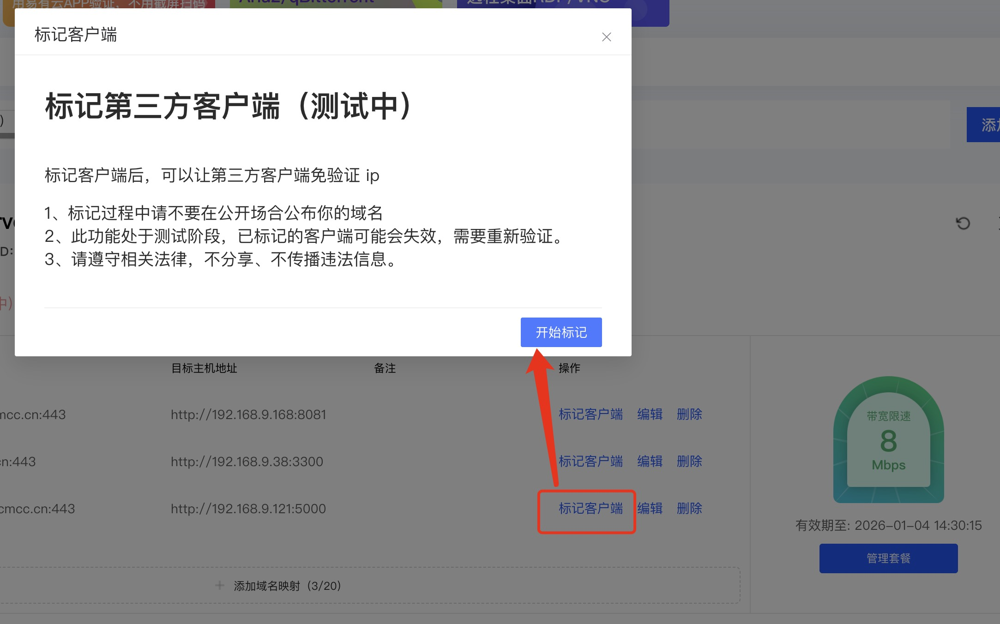

* 点击开始标记，在限定时间内使用第三方客户端进行访问,界面显示「已标记客户端」时，即成功。
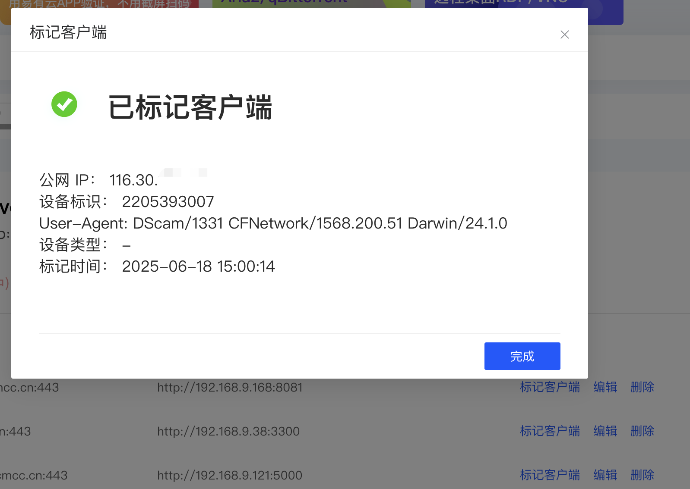

#### C. 使用易有云APP验证DDNSTO。
[易有云APP下载地址](https://doc.linkease.com/downloads/)

|平台|支持验证DDNSTO的版本|
| :----: | :----: |
| 安卓 | v2.8.2及更高版本 |
| iOS | v1.1.5及更高版本 |

PS：若是易有云APP新用户，下载最新版，然后注册登录；老用户直接更新最新版本即可。

打开易有云APP——我的——验证DDNSTO。

   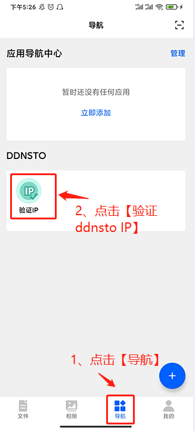
   
* #### 如何设置易有云APP验证DDNSTO：

1.登录到DDNSTO控制台，登录后点击右上角用户头像，选择“个人资料——易有云绑定——立即绑定”，会出现一个二维码界面；

   
 
   
   
2.打开易有云APP——右上角扫一扫，按照操作绑定成功；

  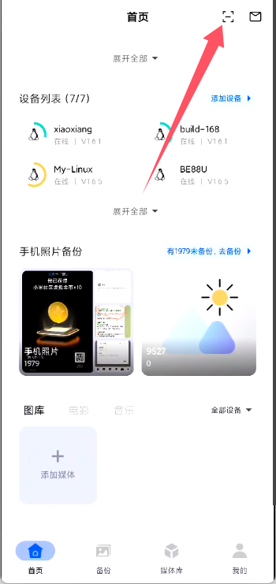

   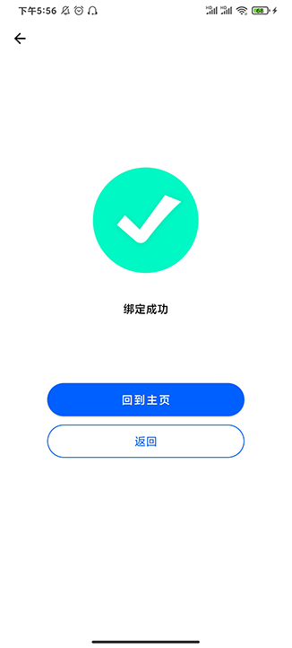

   **注意：如果已经绑定成功，再重新扫码，会提示绑定成功，绑定其他DDNSTO帐号需要先解除当前DDNSTO账号绑定**

3.绑定成功后，以后需要DDNSTO身份验证的时候，直接打开“易有云APP——我的——验证DDNSTO——验证IP，即可。

   

   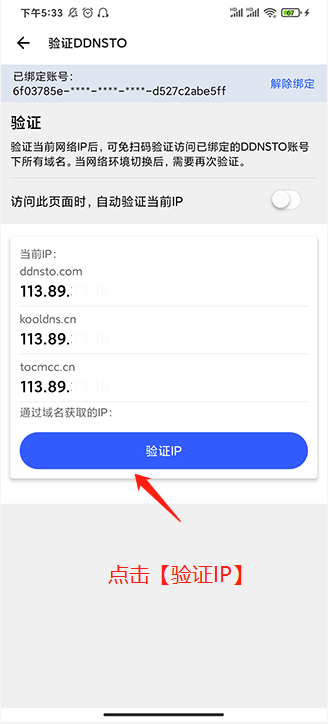

4.如果要解除绑定，打开“易有云APP——我的——验证DDNSTO——解除绑定，即可。

  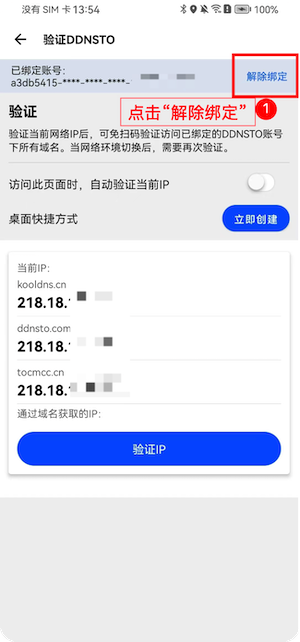

* #### 易有云APP快速验证DDNSTO

易有云APP绑定DDNSTO验证后可以不用每次先打开APP来验证，在手机桌面即可快速验证。

首先打开“验证DDNSTO“界面，打开“访问此页面时，自动验证当前IP”。

  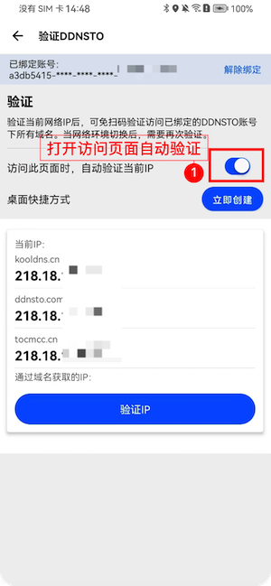

* **iOS快速验证DDNSTO。**

1. 长按桌面易有云APP图标——验证DDNSTO。

  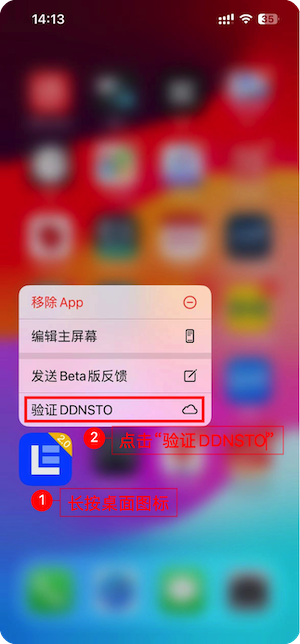

* **Android快速验证DDNSTO。**

1. 打开“验证DDNSTO“界面，点击“立即创建”，创建桌面快捷方式。

  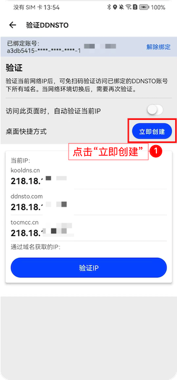

2. 创建成功后，在桌面会生成一个“验证DDNSTO”的快捷方式，每次验证打开这个快捷方式即可。

  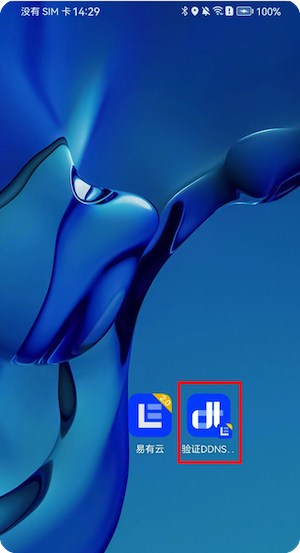

   **注意：安卓创建桌面快捷方式需要用户手动授权，部分手机（华为、荣耀等）可以直接创建快捷方式，部分手机（小米、vivo等）则需要手动去打开权限再创建。**

   点击“去授权”。

  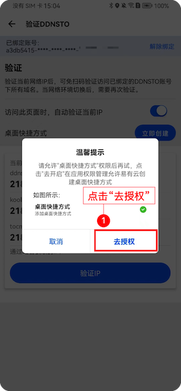

   找到应用管理——易有云——权限管理，授权“桌面快捷方式”权限即可，授权后回到“验证DDNSTO”界面就可以创建快捷方式了。

  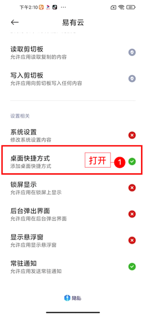

   
