## 界面切换

DDNSTO控制台目前有两套UI界面，如何切换呢？

* 新UI如下图：

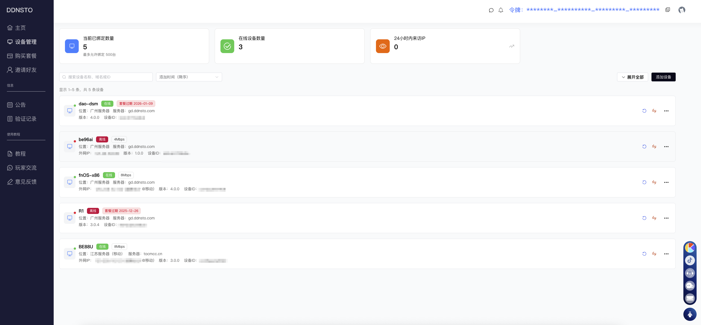

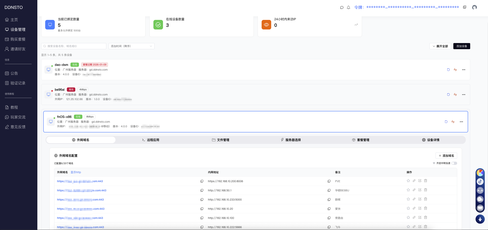

* 触碰控制台右上角——账号头像——「回到旧版」，即可切换到经典旧版UI。

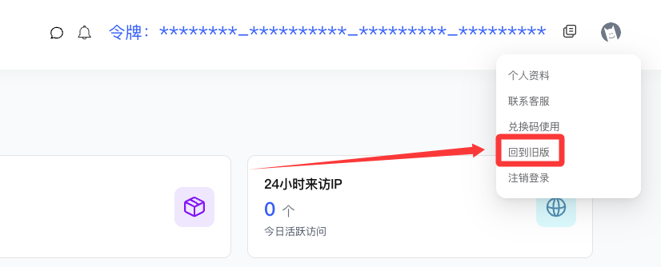

* 经典旧版UI如下图：

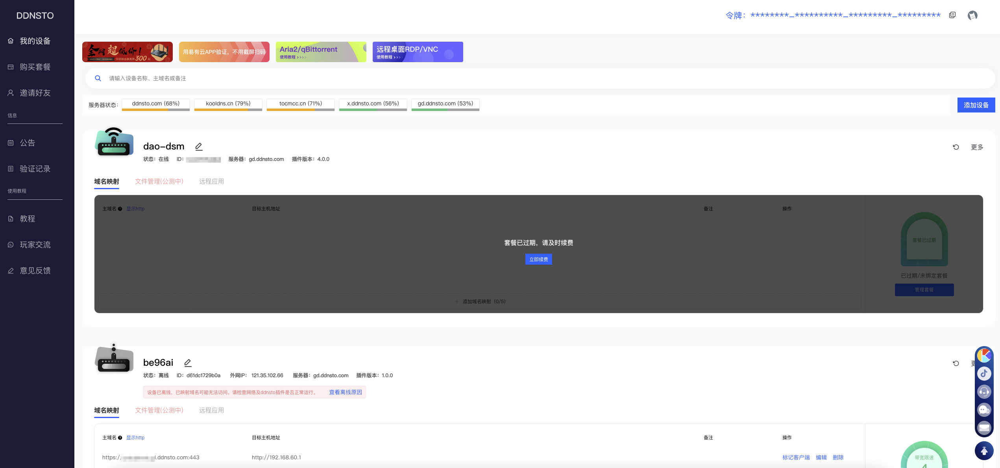

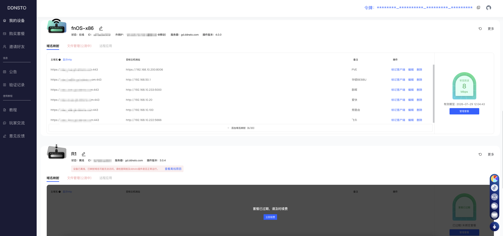

* 触碰控制台右上角——账号头像——「使用新控制台」，即可切换到新版UI。

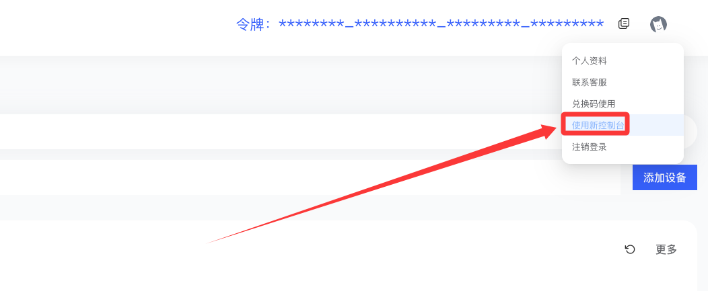

## 服务器切换

为DDNSTO添加的设备选择合适的服务器，让你的DDNSTO远程访问更快！

* DDNSTO控制台——设备管理——「设备」——服务器选择——>选择合适的服务器：

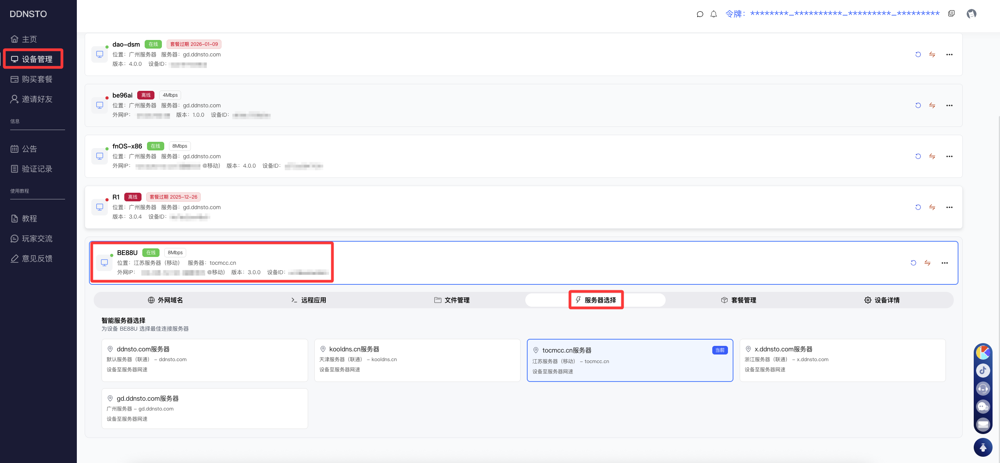

* 切换服务器后，外网域名(域名映射)地址后缀会切换为所选服务器的域名。

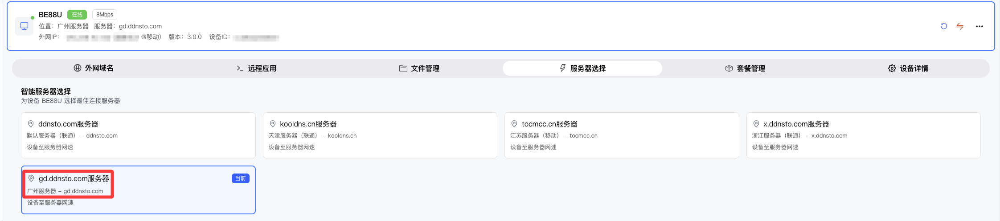

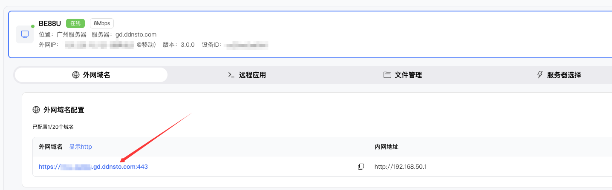

* 经典旧版UI——我的设备——「设备」——更多——切换服务器——>选择合适的服务器：

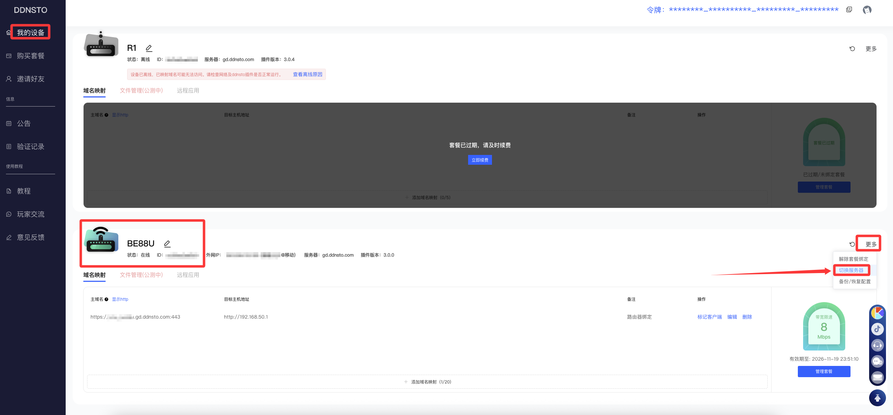

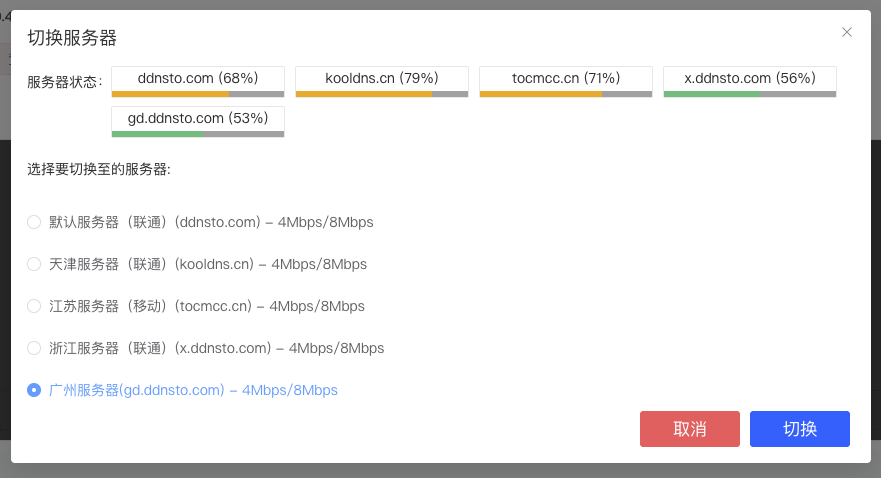

