### 拓展功能

DDNSTO迎来改版，带来更加实用的功能，让我们一起来拓展！

* #### 目前OpenWrt设备已经上线拓展功能，其他设备静待发布！！！

* #### 包含三大功能：文件管理、WebDav服务和远程开机

* 插件版面大更新


### 如何拓展：

* 首先确认ddnsto插件版本已经更新到v3.0.0及以上

* 已经启用基本功能(设置好Token并启动)
  
  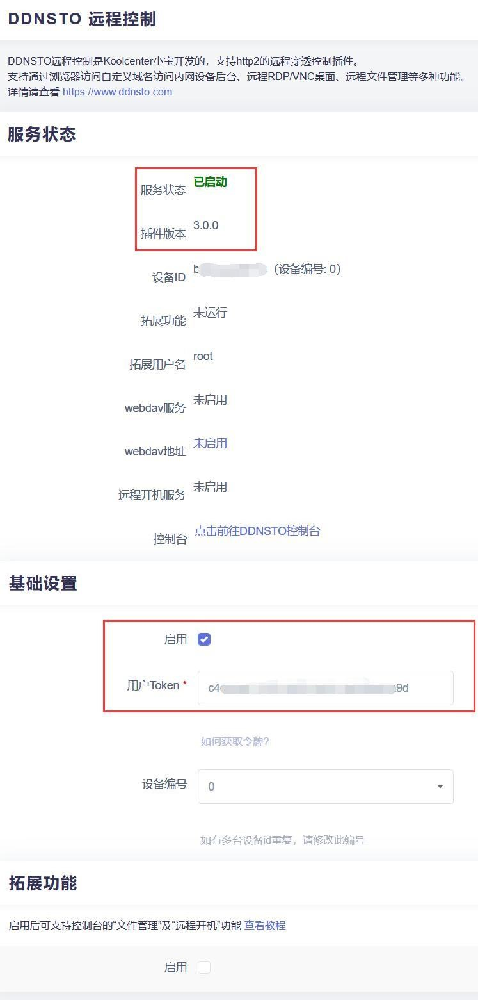  
 
* 插件拉到——拓展功能，按照下列说明填写完整，插件保存并应用
 
```
扩展功能目前开关就一个，包含三大功能：文件管理、WebDav服务和远程开机。
```

    
```
启用：勾选
端口：自行设置，只要不冲突
授权用户名：自行设置
授权用户密码：自行设置
共享磁盘：如果挂载了硬盘，可选硬盘(例如/mnt/sda1)，若没挂载硬盘，选/boot或者/overlay都成
```
  
* 回到插件的服务状态，就会看到扩展功能已经启用

  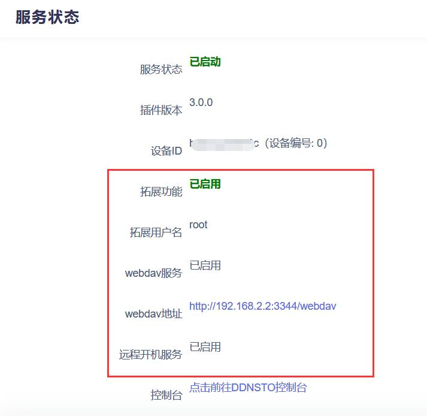  

* 下面开始分别讲解文件管理、WebDav服务、远程开机


## 文件管理

* 远程文件管理支持访问DDNSTO设备所在局域网内的设备的所有的samba、sftp、webdav协议。
  
#### 要使用本功能的先决条件： 

* 开通了会员通道

* 启用ddnsto的拓展功能

* 文件管理目前仅支持PC端的浏览器


#### 如何使用：

* 已经启用了ddnsto拓展功能

* 登录到[DDNSTO控制台](https://www.ddnsto.com/app/#/login)

* 购买会员通道，然后把当前绑定的通道切换成会员通道

  

* 上诉步骤完成后，就能立即添加使用了

  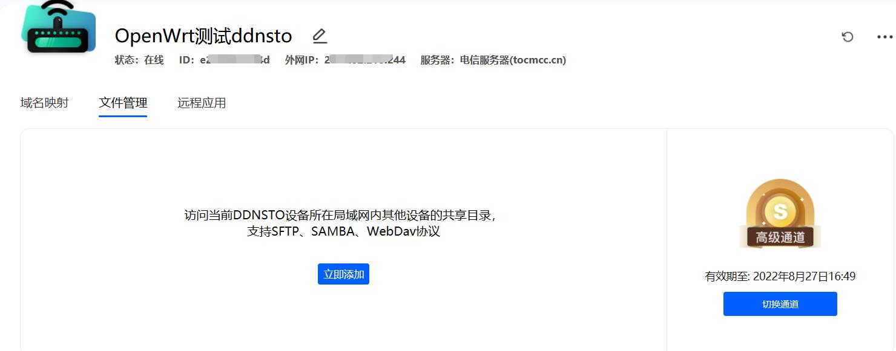

* 目前自动扫码不可用，点击“手动添加”就能出现添加协议的界面

  
 


 
### 1、Samba协议

现在开始添加samba协议。

#### 1.首先确认DDNSTO设备所在局域网内，有设备已经开启了Samba，且能正常访问；

* openwrt系统如何开启samba可参考[教程](https://doc.linkease.com/zh/guide/easepi/common.html#samba共享)；其余设备/系统如何开samba，自行科普，设备/系统太多，不一一举例。

#### 2.然后ddnsto文件管理，添加samba协议；

  

```
类型：选samba

名称：随意，中英文皆可

IP：开启了samba设备的ip

端口：一般默认即可，若自己自定义，需要更改

账号：samba的访问用户名，若没设置，一般是设备系统默认的用户名，比如openwrt是root

密码：samba的访问密码，若没设置，一般是设备系统的登录密码

记住密码：ddnsto不会记录你的密码，若选“不保存”，后面登录的时候需要自行输入，若选“保存至当前浏览器”，设置完成后，你的浏览器会提示保存密码

工作组：一般默认即可，若自己自定义，需要更改

目标路径：samba共享名(不是具体路径，比如电脑文件管理输入 \\192.168.2.2 进入后看到的文件夹名)
```

#### 3.上述参数设置完成后，点击右下角“保存”，会出现数据验证界面，若填写参数没问题，会自动保存。

  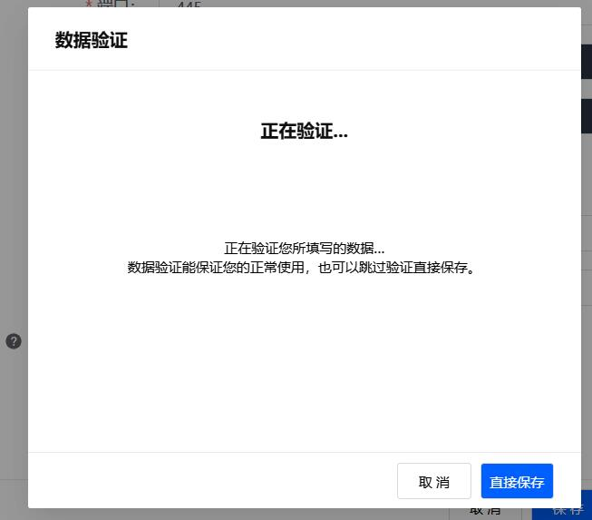

#### 4.关掉添加界面，回到主界面，就看到samba协议已经添加完成。

  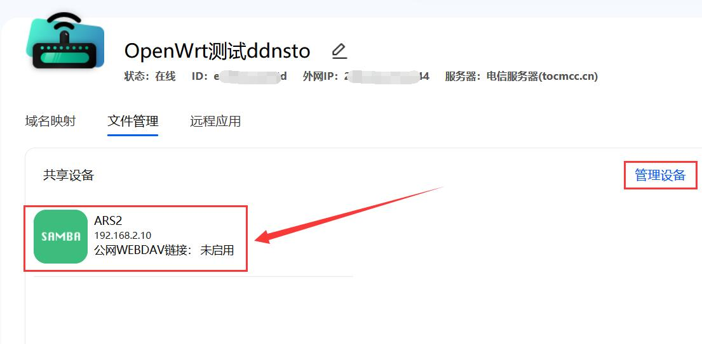

* 若需要继续添加/编辑/删除协议，点击右边的“管理设备”。

* 添加好的samba协议图标，就能直接访问到文件管理，若之前填写参数的时候“记住密码”，选的不保存，会提示需要输入密码。

  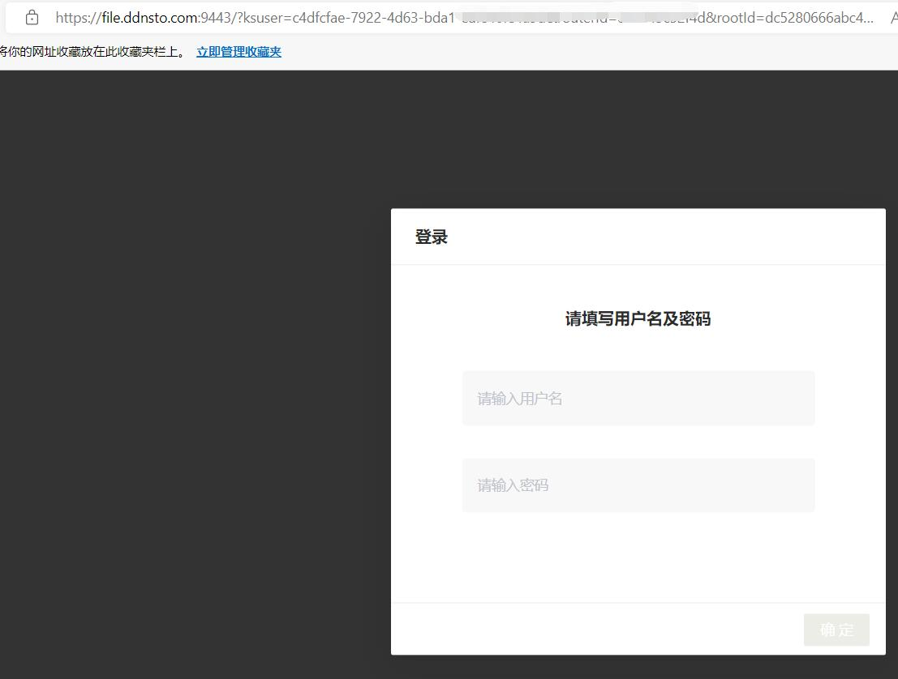
  
  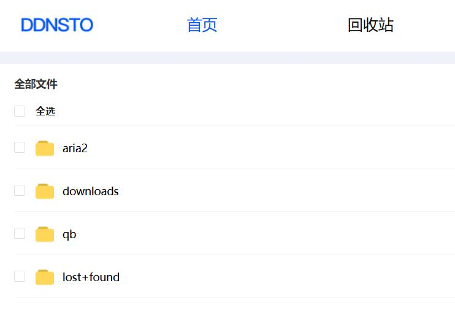


### 2、sftp协议

现在开始添加sftp协议。

#### 1.首先确认DDNSTO设备所在局域网内，有设备已经开启了sftp，且能正常访问；

#### 2.然后ddnsto文件管理，添加sftp协议；

  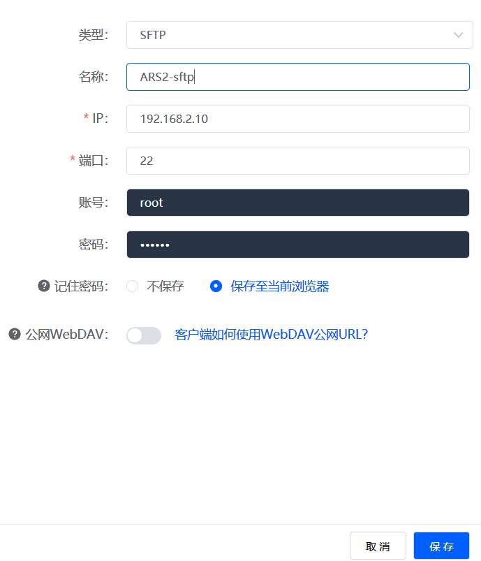

```
类型：选sftp

名称：随意，中英文皆可

IP：开启了sftp设备的ip

端口：一般默认即可，若自己自定义，需要更改

账号：sftp的访问用户名，若没设置，一般是设备系统默认的用户名，比如openwrt是root

密码：sftp的访问密码，若没设置，一般是设备系统的登录密码

记住密码：ddnsto不会记录你的密码，若选“不保存”，后面登录的时候需要自行输入，若选“保存至当前浏览器”，设置完成后，你的浏览器会提示保存密码
```

#### 3.上述参数设置完成后，点击右下角“保存”，会出现数据验证界面，若填写参数没问题，会自动保存。

  

#### 4.关掉添加界面，回到主界面，就看到sftp协议已经添加完成。

  
  
* 若需要继续添加/编辑/删除协议，点击右边的“管理设备”。

* 点击添加好的sftp协议图标，就能直接访问到文件管理，若之前填写参数的时候“记住密码”，选的不保存，会提示需要输入密码。
  
  
  
  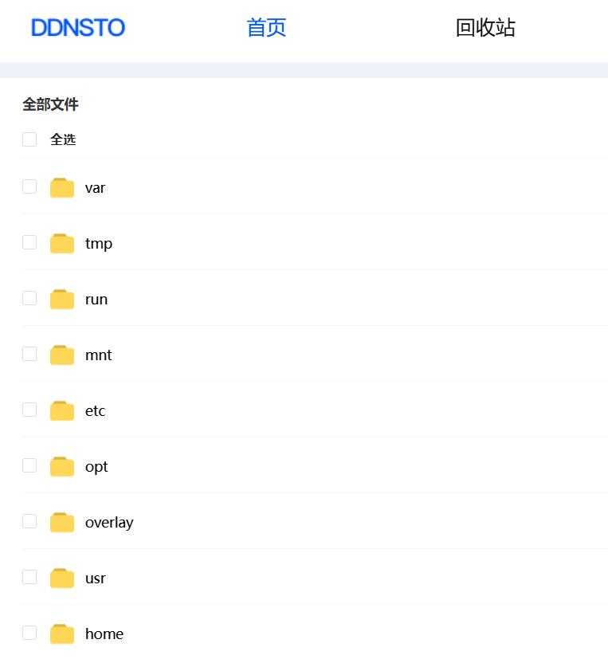


### 3、WebDav协议

现在开始添加webdav协议。

#### 1.首先确认DDNSTO设备所在局域网内，有设备已经开启了webdav，且能正常访问；

#### 2.然后ddnsto文件管理，添加webdav协议；

  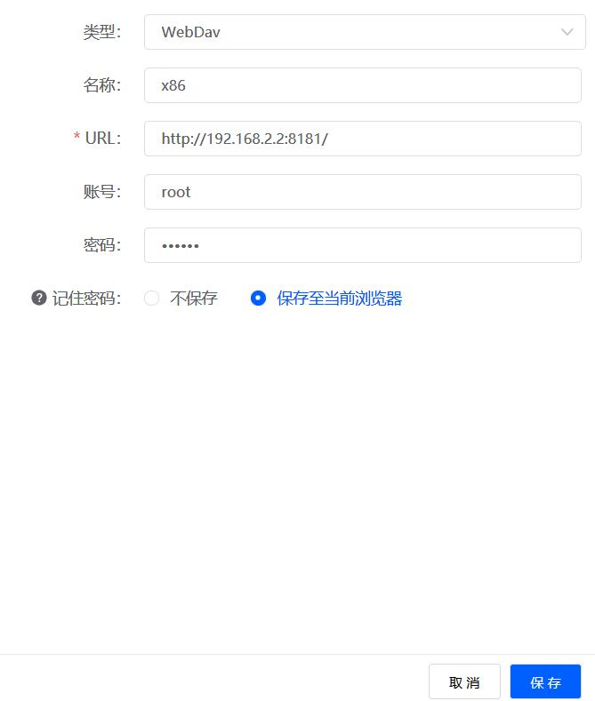

```
类型：选webdav

名称：随意，中英文皆可

URL：开启了webdav设备的ip+端口的完整地址，必须带http://

账号：webdav的访问用户名

密码：webdav的访问密码

记住密码：ddnsto不会记录你的密码，若选“不保存”，后面登录的时候需要自行输入，若选“保存至当前浏览器”，设置完成后，你的浏览器会提示保存密码
```

#### 3.上述参数设置完成后，点击右下角“保存”，会出现数据验证界面，若填写参数没问题，会自动保存。

  
  
#### 4.关掉添加界面，回到主界面，就看到webdav协议已经添加完成。

  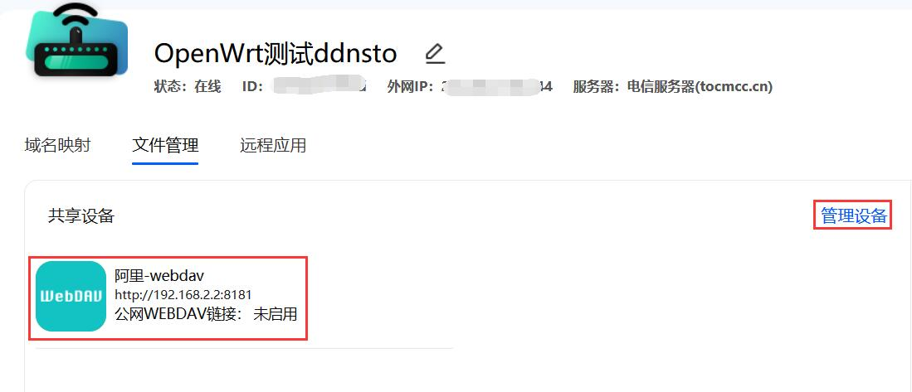
  
* 若需要继续添加/编辑/删除协议，点击右边的“管理设备”。

* 点击添加好的webdav协议图标，就能直接访问到文件管理，若之前填写参数的时候“记住密码”，选的不保存，会提示需要输入密码。
 
  
  
  
  

  
  
## WebDav服务


## 远程开机


