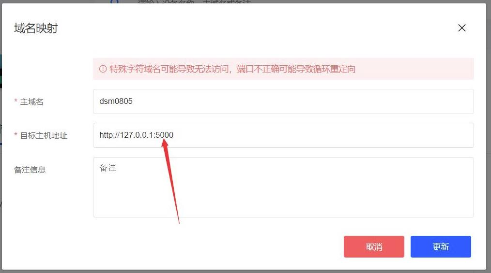

### 添加域名

1. 用户中心出现设备后，点击添加域名映射"+"。

   

2. 添加域名前缀，请使用小写字母或数字，并且大于6个字符。如前缀是"kool666666"，那么访问路由器的地址就是https://kool666666.ddnsto.com:443 ,在目标主机一栏填入路由器LAN口IP地址，如http://192.168.50.1:80 ( 端口如果是80，可以省略端口如：http://192.168.50.1 。非80端口则不能省略，如http://192.168.50.11:5000 ，请根据实际情况填写！)，填写完毕后点击"添加"。

   

   提交后可以看到完整的访问地址"https://kool666666.ddnsto.com:443"已经录入了！

   

**群晖穿透设置有点不一样：**

假如我群晖主机IP是http://127.0.0.1/，那就后面就加个5000端口，那么就是http://127.0.0.1:5000/；

* 群晖若遇到IP+5000端口穿透不过去的，建议改成http://127.0.0.1:5000/

   

这样设置成功，访问域名就能正常访问NAS了。
  
   
  
  

3. 成功添加后请稍等1分钟左右即可正常访问。如果提交后立刻访问，可能会看到下面的错误页面，此时插件还正在重启。

   

4. 通过访问绑定的域名即可访问路由器，首次访问可能需要微信登录验证。

   

补充几种特殊设置说明：

- merlin shellinabox插件设置

  shellinabox插件域名前缀的格式是固定的，是在你路由器的域名前缀后面添加“-cmd”，映射地址填路由器LAN口IP加端口4200。像我们前面设置的路由器前缀是kool666666，则shellinabox插件域名前缀就是“kool666666-cmd”，目标主机地址为http://192.168.50.1:4200

  

  

  成功！

  

