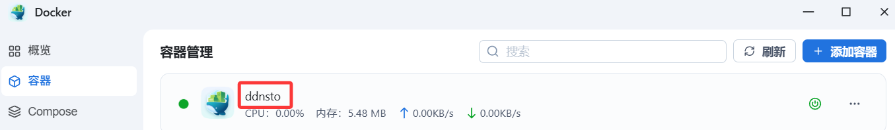

### 飞牛

[视频教学：飞牛外网访问利器-DDNSTO，安装及注意事项！](https://www.bilibili.com/video/BV1YMSQYAE84/)

**飞牛终端命令部署安装Docker版ddnsto教程开始：**

* 电脑利用putty、xshell等工具登录飞牛的终端；

**终端运行以下命令：(先不要直接复制，看下面的说明)**
```
docker run -d \
    --name=ddnsto \
    --restart always \
    --network host \
    -e TOKEN=<填入你的token> \
    -e DEVICE_NAME=<自定义设备名称ID> \
    -v /etc/localtime:/etc/localtime:ro \
    linkease/ddnsto:3.1.0
```

* <填入你的token>: 填写从DDNSTO控制台拿到的TOKEN。
* <自定义设备名称ID>: 必须是英文字母、数字，不能为中文；比如：abc9527。

```
* 注意要替换 "<>" 里面的内容，且不能出现 "<>"。
* 比如我的TOKEN为abcd-8888-7777-6666-efgh，设备名称ID为abc9527，那么最终的终端命令就是：
```

* 飞牛用终端命令安装Docker，需要“sudo”提权，按提示输入飞牛的密码，命令如下：
```
sudo docker run -d \
    --name=ddnsto \
    --restart always \
    --network host \
    -e TOKEN=abcd-8888-7777-6666-efgh \
    -e DEVICE_NAME=abc9527 \
    -v /etc/localtime:/etc/localtime:ro \
    linkease/ddnsto:3.1.0
```
* 进入飞牛系统管理页面，找到“Docker”，会看到“ddnsto”已经运行。

   
