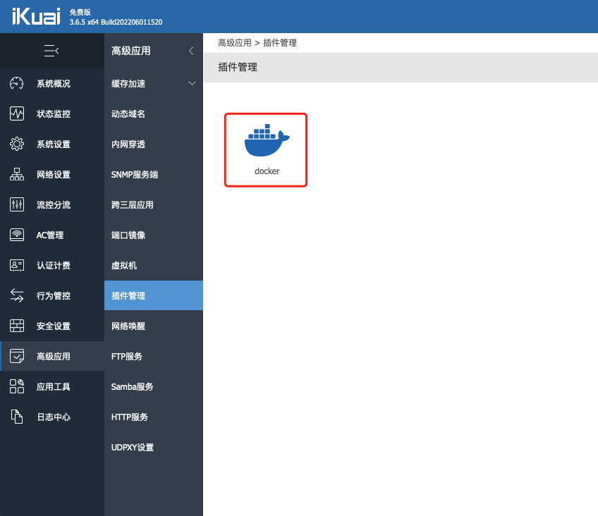
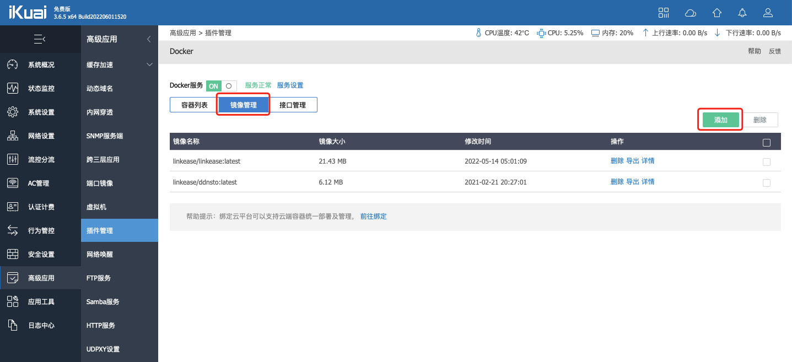
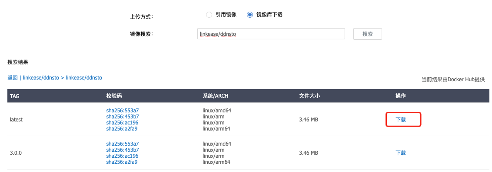
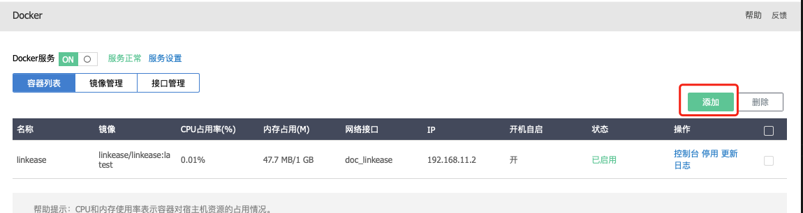
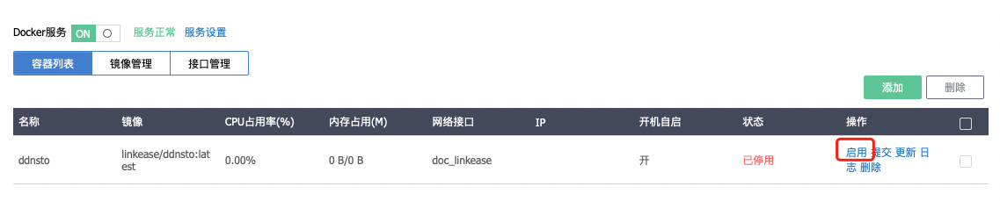

### 爱快

#### [点击查看视频教程](https://www.bilibili.com/video/BV1tt4y157W5?spm_id_from=333.999.0.0)

1.在ikuai后台安装配置好docker；

  * [ikuai官方docker安装教程](https://bbs.ikuai8.com/thread-121904-1-1.html) -->

2.通过docker方式安装DDNSTO，首先打开“高级应用-插件管理”的docker；

3.点击“镜像管理”，然后点击“添加”；

4.上传方式选择“镜像库下载”，然后镜像搜索“linkease/ddnsto”，在镜像列表选择中点击“进入下载页”，选择第一个最新的点击“下载”后等待下载完成即可；

5.回到docker页面容器列表，点击“添加”，填写相关信息后保存后启用。

* 容器名称：给容器设置一个名称。
* 内存占用：给容器设置内存大小，这里可填64M及以上内存。
* 选择镜像文件：这里选择“linkease/ddnsto”镜像。
* 选择网络接口：选择在接口管理中创建的网络接口。
* 开启自启：勾选后开机后会自动启动此容器。

高级设置：

* 环境变量：添加一个环境变量，变量名填入“TOKEN”，值填入从DDNSTO控制台获取的令牌（token）。

6.最后“启用”。

