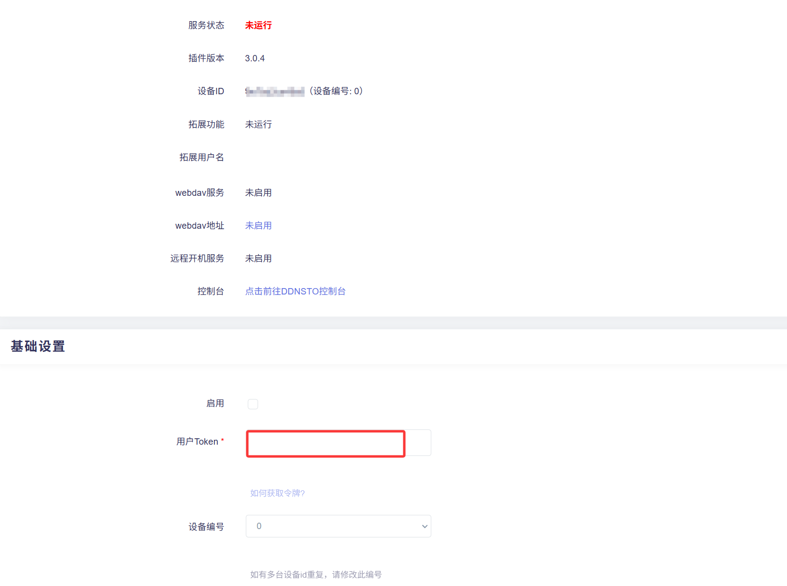
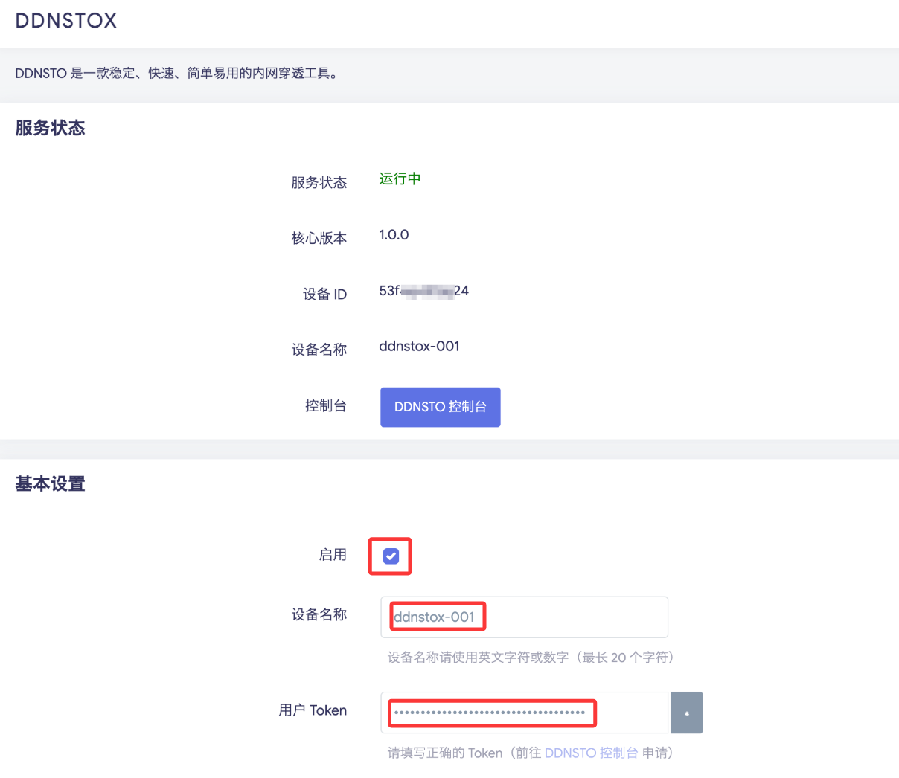

### OpenWrt

   OpenWrt固件开发者众多，部分固件不自带ddnsto，可通过以下任一脚本轻松安装：

#### DDNSTO：
```
sh -c "$(curl -sSL http://fw.koolcenter.com/binary/ddnsto/openwrt/install_ddnsto.sh)"
```
```
sh -c "$(wget --no-check-certificate -qO- http://fw.koolcenter.com/binary/ddnsto/openwrt/install_ddnsto.sh)"
```
```
cd /tmp; wget --no-check-certificate http://fw.koolcenter.com/binary/ddnsto/openwrt/install_ddnsto.sh; sh ./install_ddnsto.sh
```

#### DDNSTOX：
* 解决了之前DDNSTO插件存在的一些问题：

之前设备ID会随着mac地址变化而变化，现在改为通过指定设备名称来生成唯一设备ID。

* DDNSTOX插件使用 golang 编写，相对之前的 c 编写的程序对设备内存要求稍微高一点。低内存的硬路由建议继续使用旧版的DDDNSTO插件。
* DDNSTOX目前无扩展功能，若需要，请继续使用旧版的DDDNSTO插件。

```
sh -c "$(curl -sSL https://fw.koolcenter.com/binary/ddnsto/openwrt/ddnstox/install_ddnstox.sh)"
```
```
sh -c "$(wget --no-check-certificate -qO- https://fw.koolcenter.com/binary/ddnsto/openwrt/ddnstox/install_ddnstox.sh)"
```
```
cd /tmp; wget --no-check-certificate https://fw.koolcenter.com/binary/ddnsto/openwrt/ddnstox/install_ddnstox.sh; sh ./install_ddnstox.sh
```


   在OpenWrt TTYD终端中输入任一上述命令，会自动安装完成。

   
   
   

   或者putty、MobaXterm等软件登陆SSH，输入任一上述命令，会自动安装完成。

   
   
   
 
    

   然后找到DDNSTO远程控制，填写TOKEN并启用。

    

   或者找到DDNSTOX，填写TOKEN，和设置设备名称，并启用。
    


* DDNSTO相关扩展功能已经更新，参考 [扩展功能](/zh/guide/ddnsto/ddnstofile.html) -->。 
   
#### Openwrt 常见问题解决思路

* 安装好ddnsto之后无法启用配置，因为 Openwrt 15 版本跟最新的插件不兼容导致，解决办法尝试一：
  ```
  /etc/init.d/ddnsto disable
  /etc/init.d/ddnsto enable
  ```
  
  如果不行则尝试二：重启路由器。
