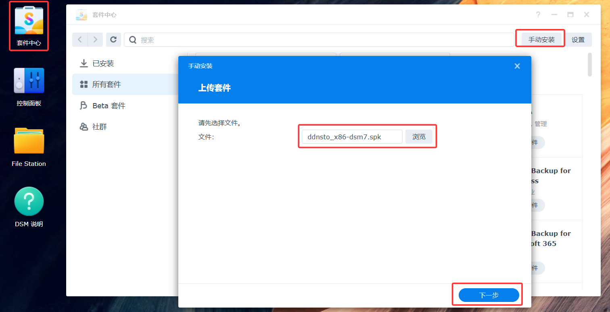
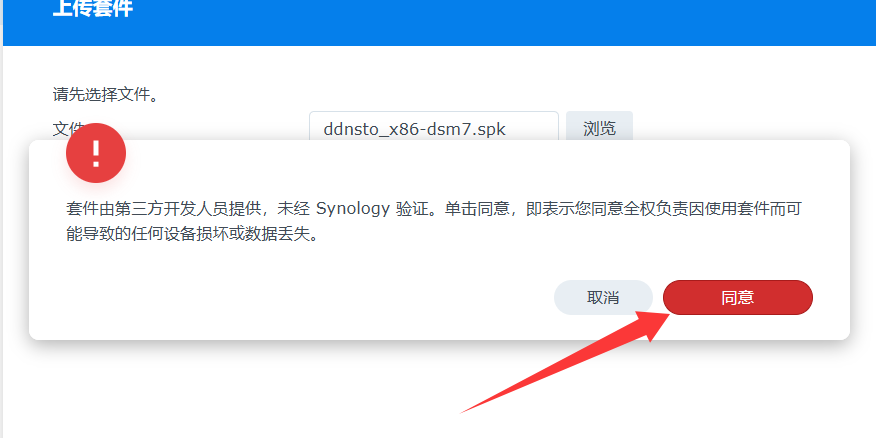
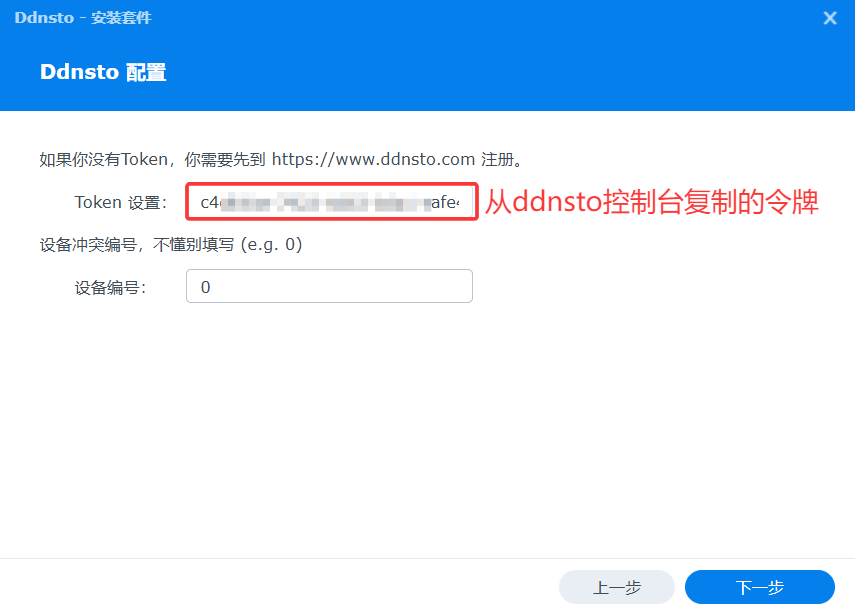
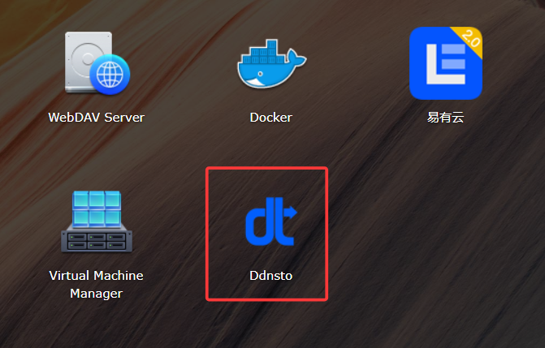

### 群晖

   1.下载对应自己版本的 [synology插件](https://www.linkease.com/rd/ddnsto-syonlogy/)并上传安装；
  
  * 请根据自己群晖的CPU型号以及DSM版本选择相对应的插件(DSM7.x用户，请先卸载旧版ddnsto套件)

   

   

   2.填入刚刚从官网复制的令牌(Token)，点击下一步完成安装；

   

   3.即可在面板看到ddnsto(ddnsto官网的快速访问链接)。

   
   
   * 若群晖发生下图错误，则必须通过docker安装。
         
   

   * Docker安装可以参考下面的[Docker教程](/zh/guide/ddnsto/install/device/docker.html)。

   * 群晖系统不要将 “自动将DSM桌面的HTTP连接重定向到HTTPS” 打开。

   DSM6：
   
   

   DSM7：
   