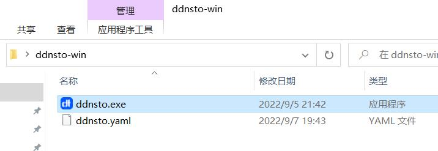
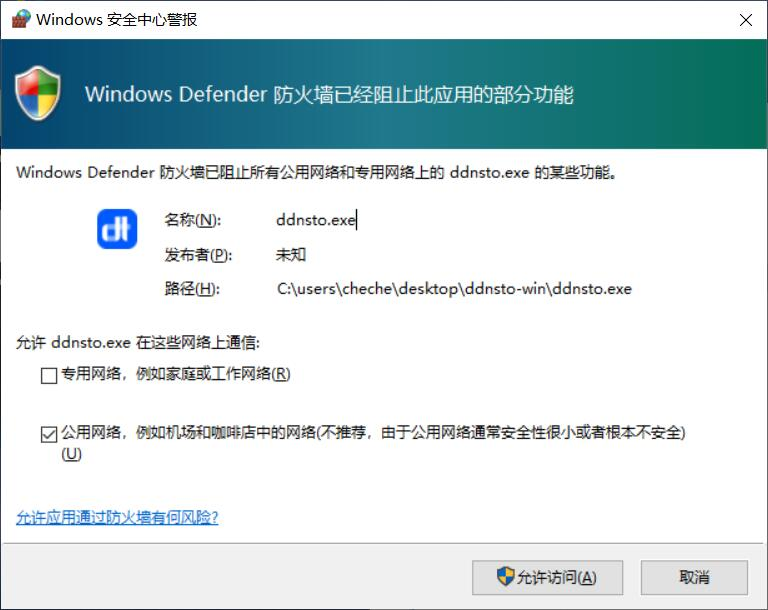
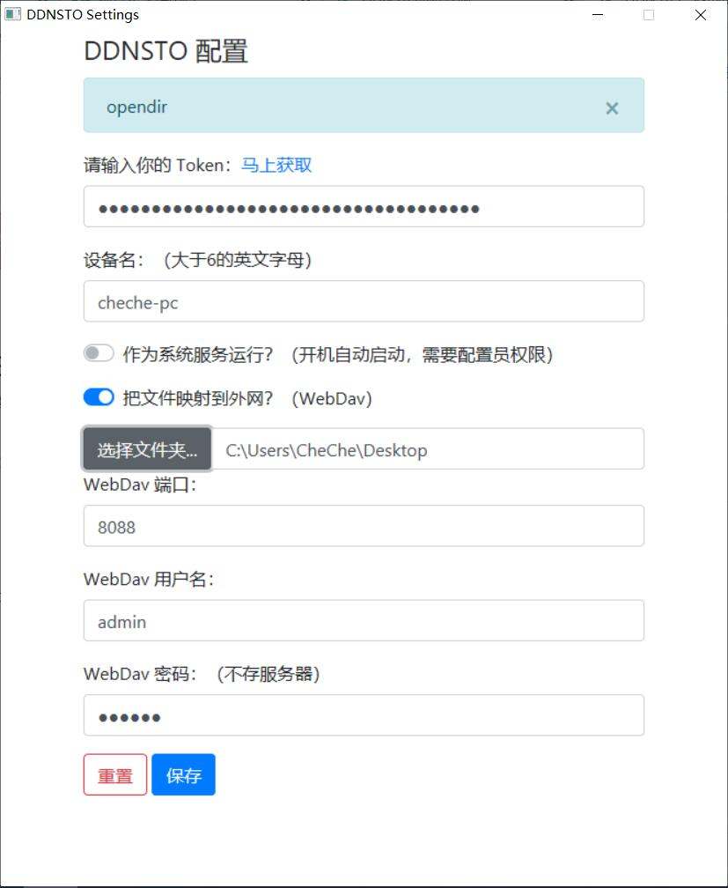

### Windows

PC端目前已有客户端，处于公测阶段，可能难免有些bug等，大家见谅，请期待后续更新！

1.下载windows客户端[下载地址](http://fw.koolcenter.com/binary/ddnsto/pc/)，下载后解压，执行`ddnsto.exe`;

如果遇到网络警报，请允许访问：

2.ddnsto程序界面如图：

设置好Token，按需开启Webdav，然后保存即可。

* 参考 [wendav服务](/zh/guide/ddnsto/ddnstofile.html#本机webdav服务) -->

3.目前ddnsto的PC客户端是绿色程序，点右上角的`X`，就直接关闭了，若需要后台运行，点击`—`。
