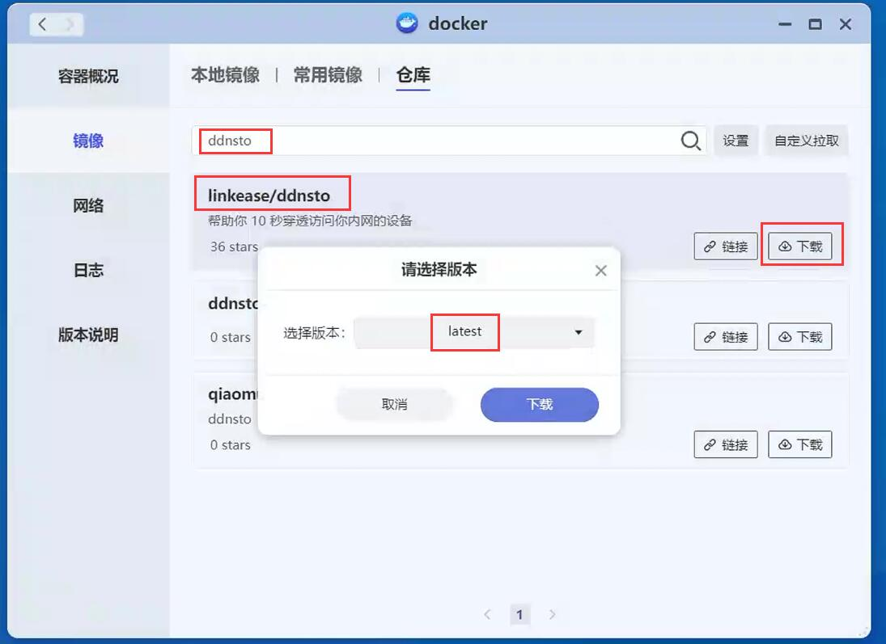
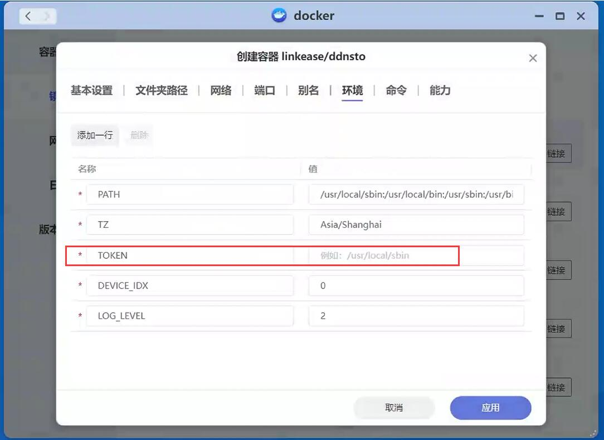

### 极空间

**1.极空间系统中，打开docker，并搜索“ddnsto”；**

**2.找到“ddnsto”，并下载，选择“latest”下载最新镜像；**




**3.下载完成后，并创建“ddnsto”容器，配置文件夹路径；**

```
装载路径：
/ddnsto-config

真实路径：(可以自定义，只要能映射装载路径就可以)
/高速存储/config/ddnsto-config
```


**4.配置环境，TOKEN处填入之前获取的ddnsto的token；**



**5.配置完成后，启动“ddnsto”容器。**
