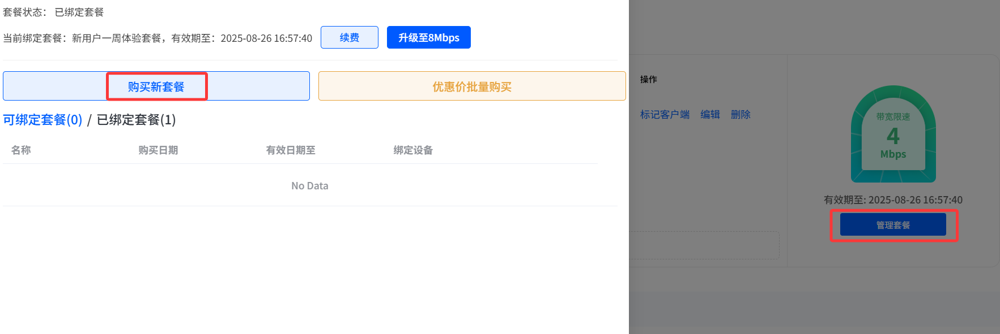
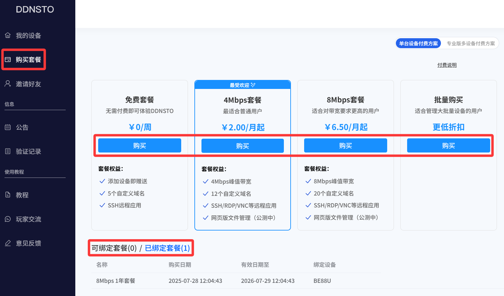
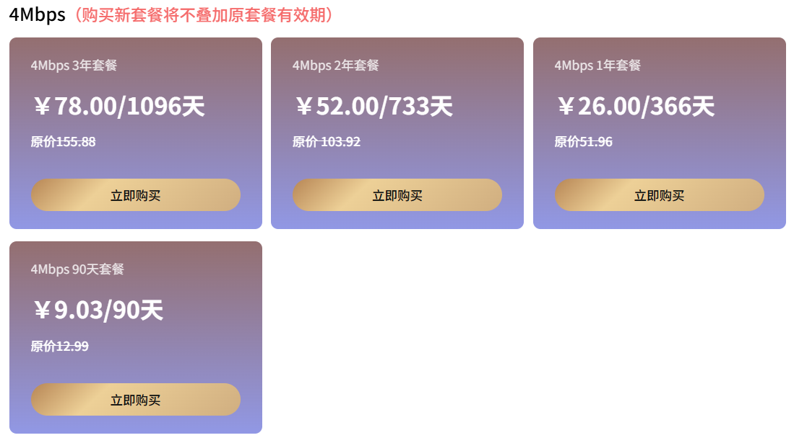
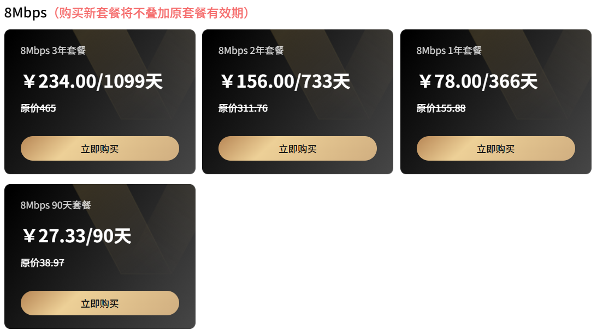
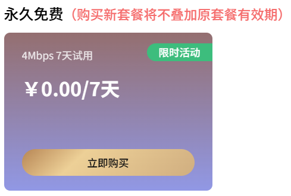

## 收费标准
 
### 购买方法

1. 先绑定设备

* [开始体验，快速入门](/zh/guide/ddnsto/start.md) -->

2. 在控制台出现的对应设备区域选择：**“管理套餐” -> “购买新套餐”**

   

或者从DDNSTO控制台——左侧 **“购买套餐”**

   

### 套餐价格

**4Mbps套餐：4.33元/月，年付5折优惠（26元/年、78元3年）**

   

**8Mbps套餐：12.99元/月，年付5折优惠（78元/年、234元3年）**

   

**免费试用： 每个用户可以同时使用1个免费的试用套餐，有效期为7天，不可叠加。试用到期后可继续申请试用。**

   

* **以上价款为不含税金额，若需要开具发票请联系用户群群主另行议价。**

### 域名映射数量

| 免费套餐 | 4Mbps套餐 | 8Mbps套餐 |
|:--:|:--:|:--:|
| 5个 | 12个 | 20个 |

## 套餐详情

在付款购买DDNSTO套餐前，请仔细阅读本规则。

| 免费套餐 | 付费4Mbps套餐 | 付费8Mbps套餐 |
|:--:|:--:|:--:|
| 添加设备即赠送 | 4Mbps峰值带宽 | 8Mbps峰值带宽 |
| 5个域名映射 | 12个域名映射 | 20个域名映射 |
| SSH远程应用 | SSH/RDP/VNC等远程应用 | SSH/RDP/VNC等远程应用 |
|  | 网页版文件管理(公测中) | 网页版文件管理(公测中) |

## 用户交流
* DDNSTO目前有免费用户QQ频道和付费用户微信群，请在控制台 - “玩家交流”查看。

* 群内反馈问题时，请尽可能附带网络环境、运行日志、相关设置、程序版本等信息，以方便更有效率的相互协助。
 
* 官方工作人员会不定期的查看群内消息（付费用户交流群优先），并选择有效问题进行答复，非DDNSTO自身问题不保证作答。

* 如果交流群内无法获得及时回复，可以发邮件至support@linkease.com

* [提问的智慧](https://github.com/ryanhanwu/How-To-Ask-Questions-The-Smart-Way/blob/main/README-zh_CN.md)

## 套餐 

* 每台设备都需要绑定一个有效套餐才能正常使用。

* 每台设备初次绑定令牌并成功连接服务器后，都会赠送一个免费试用套餐，请在使用期内体验各项功能。

* 如套餐过期，穿透服务将中断且无法添加新域名或访问、编辑已有域名。

* 长期未绑定套餐的设备，关联域名将被回收。

### 套餐类型  

目前套餐分为4Mbps/8Mbps两种带宽限制。
 
### 升级
已付费并未过期的4Mbps的套餐可以升级至8Mbps，请在设备对应“套餐管理”页面进行操作

升级方式为补交套餐差价，升级后套餐有效时间将按所选升级套餐有效时长重新计算。

### 续费
已付费并未过期的套餐，最长可续费至剩余2年有效期，请在设备对应“套餐管理”页面进行操作。

注意：仅可选择与相同带宽的套餐

### 带宽及流量限制

购买套餐带宽将决定当前设备穿透时各功能的限速带宽。

由于不同用户的设备性能、网络情况、服务器繁忙时段等多种原因，DDNSTO不保证7*24小时都能达到4Mbps/8Mbps传输速度，请提前试用后再购买。

目前还没有对用户进行流量限制，但对于超大流量使用的用户将进行限速处理。

### 有效期

如在设备当前绑定的套餐的有效期结束前购买了新套餐，新套餐将替换原套餐绑定至相应设备。

原套餐将会自动解除绑定，作为闲置套餐，可以绑定至其他设备。

套餐到期后将自动解除与设备的绑定。
  
### 设备数量限制

每个用户限制最大500台设备，如有更高数量的需求请在微信群联系群主。

### 切换服务器

付费套餐可切换不同地区的服务器，请试用并根据网络情况选择最优服务器

###  解除绑定
解除设备绑定后，将会从控制台删除该设备以及关联的域名、远程应用。

该设备原绑定的未过期的套餐将保留，可重新绑定至其他设备，请在“管理套餐”页面查看。

如误操作解除绑定，在设备端填写正确令牌并重启插件即可重新绑定该设备。

 
## 注意事项
* 禁止使用DDNSTO搭设网站传播分享违法信息；

* 如发现域名出现大量异常访问，会暂时停止该用户域名服务；

* 部分情况无法使用DDNSTO穿透（如：部分路由器管理后台限制非IP访问、群晖Drive客户端使用非HTTP协议等），故请在购买前先试用。

## 客服   
* 如使用中遇到问题请优先认真查看文档。

* 如您的问题在文档中没有覆盖，请发邮件至support@linkease.com反馈，或者加入我们付费群反馈。

* 在付款购买DDNSTO套餐前，请仔细阅读本规则。

## 产品退款的规则说明

- 请发送邮件至 support@linkease.com 进行退款申请，并附带账号及微信付款截图信息，如信息不全将无法退款； ； 
- 仅接受付款14天内的订单，逾期不接受申请； 
- 退款申请批准后可能最多需要 7 天的处理时间，退还款项将原支付路径返还。
- 不接受如下退款原因： 不支持 TCP、 无法取消 ip验证
- 收到邮件后将在 7 个工作日内处理
