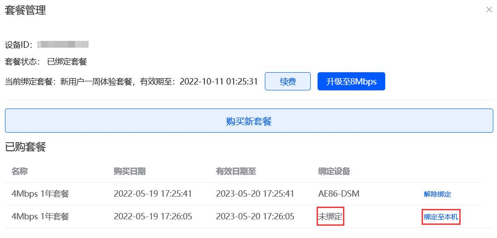
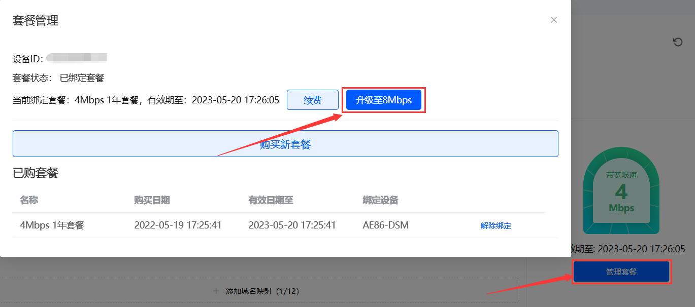
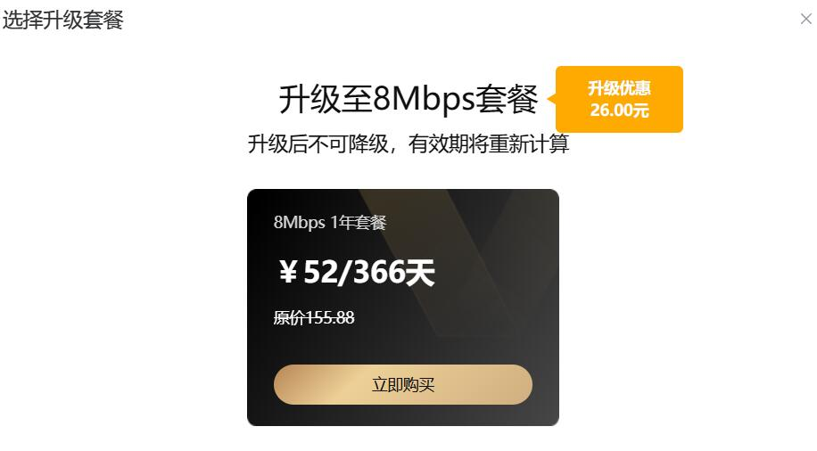

## * 控制台显示设备离线
如果控制台显示设备状态为离线，有以下可能几种原因：

### A. 刚刚操作了切换服务器、编辑域名、更换套餐等操作，需要等待1分钟插件重新初始化，如果5分钟后仍未在线，请参照第三条

### B. 服务器升级中，这种情况比较少，可以查看公告看最近的服务器升级安排，看当前是否处在服务器维护时段。

### C. 插件异常

请先检查以下情况
   1. 检查插件是否正常运行
      - 令牌是否填写正确
      - 如已离线，请重新运行。
      - 如插件版本过低，请升级至最新版本插件。
   2. 确认设备能正常访问网络，尝试ping ddnsto.com 或kooldns.cn
   3. 确认是否令牌对应的微信账号登录当前浏览器，或控制台内是否有其他新设备产生
## * 访问域名失败

请先检查以下情况
1. 确认插件是否在线
2. 确认插件所在设备与目标IP是否在同一网段，或该设备能否访问对应IP及端口，可以尝试ping目标IP
3. 尝试访问该设备下其他域名
4. 如刚编辑域名，请等待生效，在1分钟后尝试
## 域名类

### Q：ddnsto可以用自己的域名吗？

A：不可以，ddnsto会提供域名。


### Q：域名http和https能同时访问吗？

A：可以，如果要同时访问，https和http地址端口不一样，可点击"显示http/https"切换查看。

     
      

   
### Q：特殊设备访问需要填写端口？

A：是的，比如PVE虚拟机，默认端口是8006，就必须加上端口。

   


### Q：域名绑定后无法访问内网服务，显示错误？

A: 配置域名、切换套餐后需要等待1分钟左右，如长时间后仍然无法访问，请检查内网服务是否正常运行。


## 验证类
### Q：易有云APP验证后，每个手机在登陆的时候都要验证还是， 有一个手机验证就可以了？

A: 只要访问域名的设备的公网ip未验证就需要验证。举例：如果验证了家里宽带的ip，那么家里wifi下所有设备都不需要验证。

### Q：为何我连着wifi可以用DDNSTO访问群晖，用流量却不可以

A: 因为你的手机在试用wifi的时候和流量时，用的ip不一样。用流量时，再验证一次IP即可。
### Q：APP验证了，为什么还要扫码登录

A: 验证IP只是给访问域名用的，登录控制台还是需要扫码

### Q：如何验证

A: [验证方法](/zh/guide/ddnsto/Authentication.md)  

## 网络类

### Q：提示域名无法访问？

   
   
A: 网络各方面都没问题，但是就是提示域名无法访问。

可能是路由器中某些插件会改变网络规则，需要添加以下地址到白名单。

```
tunnel.ddnsto.com
tunnel.kooldns.cn
tunnel.tocmcc.cn
www.kooldns.cn
www.tocmcc.cn
www.ddnsto.com
```


## 套餐类

### Q：解除设备的套餐？

A：登录进ddnsto控制台，绑定的设备的右边有三个点，点击解除套餐绑定。

   


### Q：切换套餐服务器？

 A：登录进ddnsto控制台，绑定的设备的右边有三个点，点击切换服务器，出来的弹窗就可以切换了。

   
   
  
  
### Q：购买新套餐？

 A：登录进ddnsto控制台，绑定设备后，右边会有“管理套餐”的图标，点击出现弹窗，点击购买新套餐，按需购买套餐。
 
   

   

 * 购买完成后，再次点击“管理套餐”，弹窗“已购套餐”里点击新套餐绑定即可。
 
   
    
### Q：切换套餐？

 A：帐号已经买过套餐，要绑定新设备，请先解除旧设备的套餐。
 
 登录进ddnsto控制台，绑定好新设备后，右边会有“管理套餐”的图标，弹窗“已购套餐”未绑定设备的套餐，就可以绑定至本机。 
   
   


 
 
### Q：套餐续费？

    套餐快到期了，怎么续费呢。
    
    
    
   A：快要过期的时候的，直接续费。
   
* 点击“管理套餐”的图标，弹窗菜单选择“续费”，然后购买套餐。

   
   
   

 * 如果已经过期，就只能购买新套餐。点击“立即购买”——购买新套餐，选择合适的套餐套餐。
 
    
   
   
   
   
 
 * 然后，“管理套餐”的图标，弹窗“已购套餐”未绑定设备的套餐，就可以绑定至本机。
 
   
   
   


### Q：套餐升级？

现在已推出8Mbps的套餐，可从4Mbps套餐升级。

A：点击“管理套餐”的图标，弹窗菜单选择“升级至8Mbps”，然后购买套餐。

   
   
    
   

### Q：套餐兑换码怎么使用？

A: 登录ddnsto控制台，点击头像——兑换码使用，弹窗输入兑换码激活，即可绑定套餐正常使用。。

   
   
 
### Q：已购买套餐的设备不小心删除了怎么办？

A: 即使删除了设备，套餐依然还在。重新添加设备后就可以绑定已购买套餐。 
 
 
 
   
## 操作类

### Q：ddnsto插件已配置，但用户中心一直没有出现？

A: 请检查token(令牌)是否配置正确，或设备是否正常连接网络。或检查设备时间，时间不正确会导致连接失败，请同步时间后等待一分钟或重启插件。


### Q：Aria2远程下载无法设备正确？

A: 如果是www.kooldns.cn服务器，则设置为wss www.kooldns.cn。 


### Q：旁路路由无法使用DDNSTO？

A: 确认您旁路路由的内部是否能上网，试着ping www.baidu.com试试。


### Q：设备域名无法转发到小米路由器？

A: 是的，目前还无法解决。小米路由器的网页有特殊性导致无法转发WEB。 


### Q：WordPress访问异常？

A: wordpress需要配置“站点地址”和ddnsto域名相同。

   


### Q: Exsi 无法使用远程应用里的SSH？

A: 要在/etc/ssh/sshd_config里把PasswordAuthentication 设为yes


## 插件类

### Q: Merlin 路由器重启后ddnsto插件未运行
Merlin 路由器如果是 AP 模式，服务不会跟随系统启动

### 还有任何问题都可以跟帖提问！


