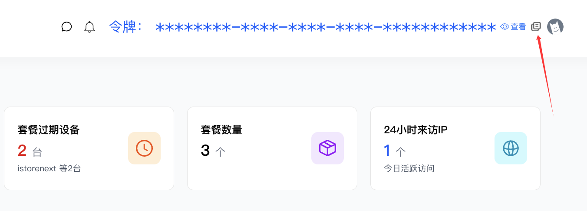
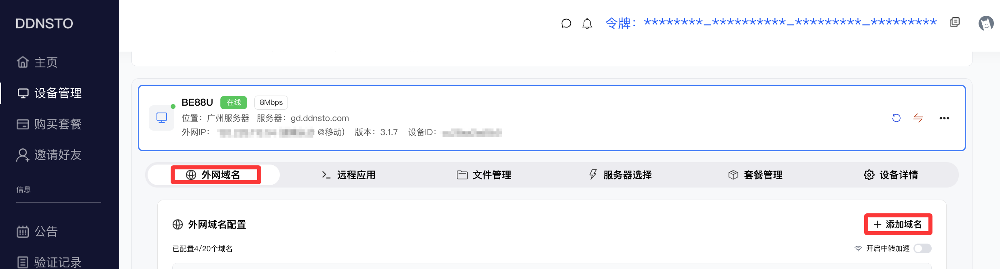
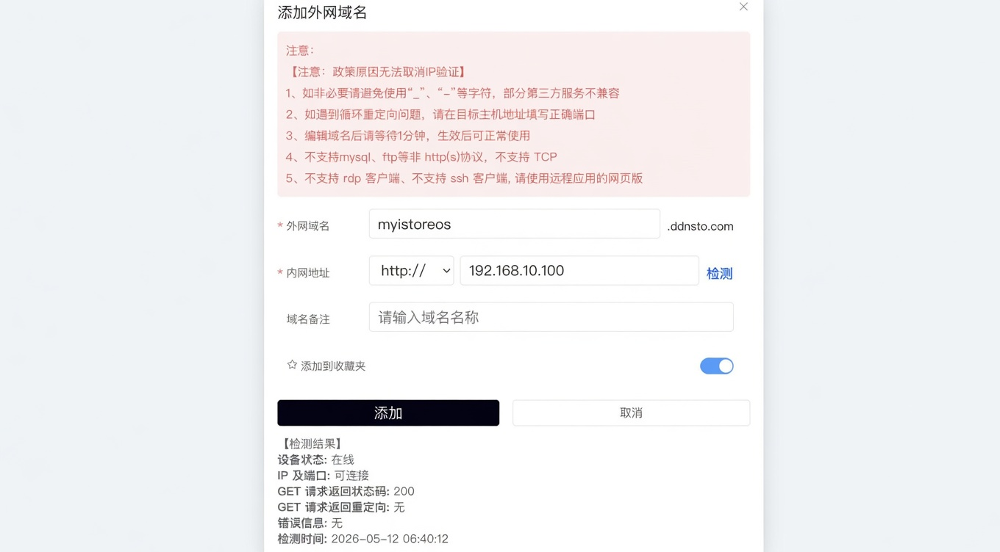
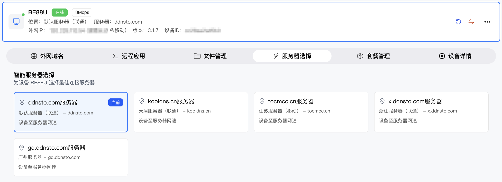

# 🟢 3分钟上手

> **专为小白用户设计** —— 无需技术背景，跟着图文步骤，3分钟搞定内网穿透

---

## DDNSTO 是什么？

DDNSTO 是一款**内网穿透工具**，让你在外网也能访问家里的设备：

- 📱 手机远程查看 NAS 照片、视频
- 💻 公司访问家里的路由器管理界面
- 🎬 外出时远程控制下载任务
- 🖥️ 远程连接家里电脑桌面

**核心优势：**
- ✅ 无需公网 IP
- ✅ 无需购买域名和服务器
- ✅ 全部操作在浏览器完成，无需敲代码
- ✅ 支持 HTTPS，访问更安全

---

## 3步快速开始

## 第 1 步：获取令牌(Token)

1. 打开 [DDNSTO 控制台](https://www.ddnsto.com/app/#/login)
2. 微信扫码登录
3. 右上角"令牌" → 点击「复制」令牌

---

## 第 2 步：在设备上安装 DDNSTO

根据你的设备选择对应的安装方式：

#### NAS 设备

| 设备类型 | 难度 | 推荐度 |
|---------|------|--------|
| [群晖 NAS](./install-guide/synology.md) | ⭐⭐ 简单 | ⭐⭐⭐ 强烈推荐 |
| [威联通 NAS](./install-guide/qnap.md) | ⭐⭐ 简单 | ⭐⭐⭐ 推荐 |
| [极空间 NAS](./install-guide/zspace.md) | ⭐⭐ 简单 | ⭐⭐⭐ 推荐 |
| [飞牛 NAS](./install-guide/fn.md) | ⭐⭐⭐ 中等 | ⭐⭐⭐ 推荐 |
| [绿联 NAS](./install-guide/ugreen.md) | ⭐⭐⭐ 中等 | ⭐⭐ 推荐 |
| [铁威马 NAS](./install-guide/terra_master.md) | ⭐⭐⭐ 中等 | ⭐⭐ 推荐 |
| [海纳思 NAS](./install-guide/histb.md) | ⭐ 超简单 | ⭐⭐⭐ 推荐 |
| [ReadyNAS](./install-guide/ready_nas.md) | ⭐⭐⭐ 中等 | ⭐⭐ 推荐 |
| [Unraid](./install-guide/unraid.md) | ⭐⭐⭐ 中等 | ⭐⭐ 推荐 |

#### 路由器 / 软路由

| 设备类型 | 难度 | 推荐度 |
|---------|------|--------|
| [iStoreOS](./install-guide/istoreos.md) | ⭐ 超简单 | ⭐⭐⭐ 强烈推荐 |
| [EasePi](./install-guide/easepi.md) | ⭐ 超简单 | ⭐⭐⭐ 强烈推荐 |
| [OpenWrt](./install-guide/openwrt.md) | ⭐⭐ 简单 | ⭐⭐⭐ 推荐 |
| [爱快路由器](./install-guide/ikuai.md) | ⭐⭐ 简单 | ⭐⭐⭐ 推荐 |
| [ASUSGO 官改/梅林](./install-guide/koolcenter_merlin.md) | ⭐⭐ 简单 | ⭐⭐⭐ 推荐 |
| [KoolCenter LEDE](./install-guide/koolcenter_lede.md) | ⭐⭐ 简单 | ⭐⭐⭐ 推荐 |
| [Padavan](./install-guide/padavan.md) | ⭐⭐ 简单 | ⭐⭐ 推荐 |

#### 其他设备

| 设备类型 | 难度 | 推荐度 |
|---------|------|--------|
| [Docker](./install-guide/docker.md) | ⭐⭐⭐ 中等 | ⭐⭐ 通用方案 |
| [Linux](./install-guide/linux.md) | ⭐⭐⭐ 中等 | ⭐⭐ 通用方案 |
| [Windows](./install-guide/windows.md) | ⭐⭐ 简单 | ⭐⭐ 临时使用 |

**💡 新手建议：** 如果你有群晖 NAS、iStoreOS 路由器或 EasePi，优先选择这些，安装最简单！

---

## 第 3 步：配置外网域名

1. 回到 [DDNSTO 控制台](https://www.ddnsto.com/app/#/login)
2. 等待你的设备出现在设备管理（约 1 分钟）
3. 点击设备 → 「外网域名」 → **"+添加域名"** 

4. 编辑域名信息：
   - **外网域名**：自定义，如 `myistoreos`（最终访问地址为 `https://myistoreos.ddnsto.com`）
   - **内网地址**：填写内网服务的 IP 或 IP + 端口，如 `http://192.168.10.100` 
   - 群晖http默认5000端口 `http://127.0.0.1:5000`
   - 群晖https默认5001端口 `https://127.0.0.1:5001`
   - QNAP域名默认端口8080 `hhttp://127.0.0.1:8080`
   - 极空间默认端口5055 `hhttp://127.0.0.1:5055`

   - 因所选服务器不同，最终域名后缀也不同；可在「服务器选择」中选择适合自己的服务器。

5. 点击"添加"，等待 1 分钟后即可访问 `https://myistoreos.ddnsto.com`！

---

## 🎉 恭喜！你已经完成了

现在你可以：
- 在浏览器输入 `https://你的前缀.ddnsto.com` 访问内网服务
- 手机、电脑、平板等都能访问
- 首次访问需要「微信/账号密码」验证，验证后该网络下的设备都无需再次验证(浏览器记录 cookie ，下次访问则不需要验证。)

---

## 下一步

- 🔵 [查看场景指南](../scenarios/README.md) —— 实现远程下载、远程桌面等高级功能
- 🔴 [遇到问题？](../troubleshooting/README.md) —— 常见问题和解决方法
- 📺 [视频教程](./video-tutorials.md) —— 跟着视频一步步操作

---

## 常见问题速查

**Q: 设备一直不显示怎么办？** 

A: 检查 Token 是否填写正确，设备是否能正常上网，等待 1-2 分钟后刷新页面。

**Q: 域名添加后访问不了？** 

A: 等待 1 分钟让配置生效；检查目标 IP 和端口是否填写正确；确认内网服务正常运行。

**Q: 为什么需要微信验证？** 

A: 为了安全，首次从新网络访问需要验证。验证后，同一网络下的其他设备无需重复验证。

**更多问题 →** [故障排查](../troubleshooting/README.md)
