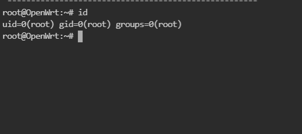
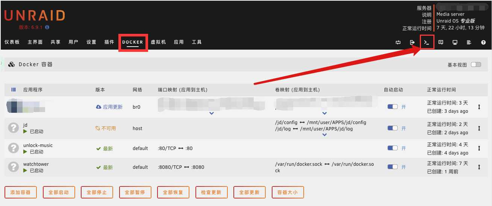
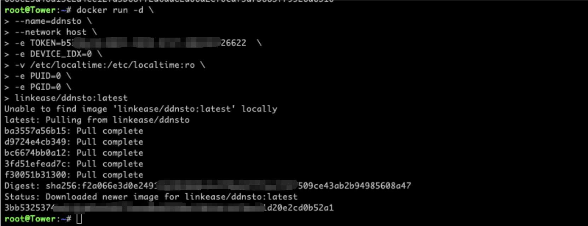

# Docker 安装指南

> ⏱️ 预计耗时：3 分钟  
> 📱 适用设备：任何支持 Docker 的设备（群晖、威联通、Unraid、Linux 服务器等）

---

## 安装步骤

### 1. 准备 Token

1. 打开 [DDNSTO 控制台](https://www.ddnsto.com/app/#/login)
2. 微信扫码登录
3. 点击右上角头像 → "令牌"，复制你的 Token

---

### 2. 运行 Docker 容器

#### 通用 Docker 命令

```bash
docker run -d \
    --name ddnsto \
    --restart always \
    --net host \
    -e TOKEN=你的Token \
    -e DEVICE_NAME=设备名称 \
    linkease/ddnsto
```

#### 参数说明

| 参数 | 说明 | 示例 |
|------|------|------|
| `TOKEN` | 你的 DDNSTO 令牌 | `abc123def456` |
| `DEVICE_NAME` | 设备显示名称（可选） | `MyNAS` |
| `--net host` | 使用主机网络模式 | - |

---

### 3. 群晖 Docker 安装

1. 打开群晖 DSM → 套件中心 → 安装 Docker
2. 打开 Docker 应用 → 注册表 → 搜索 `ddnsto`
3. 下载 `linkease/ddnsto` 镜像



4. 下载完成后，点击 "启动"
5. 在 "高级设置" 中：
   - 勾选 "使用与 Docker Host 相同的网络"
   - 添加环境变量：`TOKEN` = 你的 Token



6. 点击 "应用" → "下一步" → "启动"



---

### 4. 验证安装

1. 回到 [DDNSTO 控制台](https://www.ddnsto.com/app/#/login)
2. 刷新页面，等待设备出现（约 1 分钟）
3. 看到设备名称即表示安装成功！

---

## Docker Compose 配置

如果你使用 Docker Compose，可以使用以下配置：

```yaml
version: '3'
services:
  ddnsto:
    image: linkease/ddnsto:latest
    container_name: ddnsto
    restart: always
    network_mode: host
    environment:
      - TOKEN=你的Token
      - DEVICE_NAME=MyNAS
```

保存为 `docker-compose.yml`，然后运行：

```bash
docker-compose up -d
```

---

## 常见问题

### Q: 容器启动后设备不显示？
A: 检查：
- Token 是否填写正确
- 容器日志是否有错误：`docker logs ddnsto`
- 设备是否能正常访问外网

### Q: 如何更新容器？

```bash
# 停止并删除旧容器
docker stop ddnsto
docker rm ddnsto

# 拉取最新镜像
docker pull linkease/ddnsto

# 重新运行
docker run -d \
    --name ddnsto \
    --restart always \
    --net host \
    -e TOKEN=你的Token \
    linkease/ddnsto
```

### Q: 如何查看日志？

```bash
docker logs ddnsto
```

---

## 下一步

- 🔵 [添加域名映射](../README.md#第-3-步添加域名映射)
- 🔴 [遇到问题？](../../troubleshooting/README.md)
