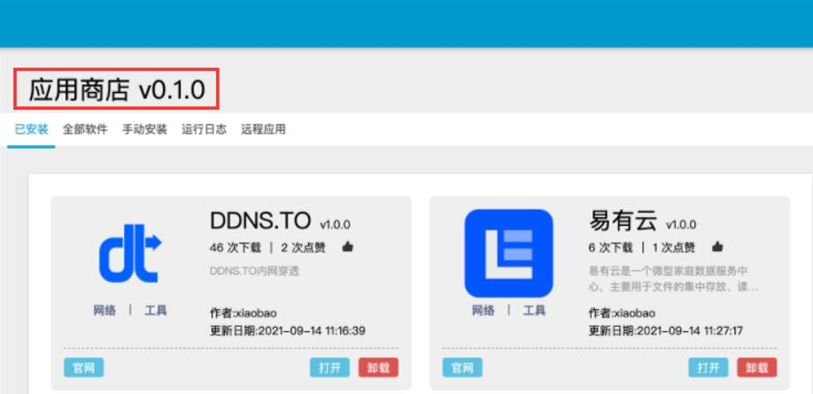
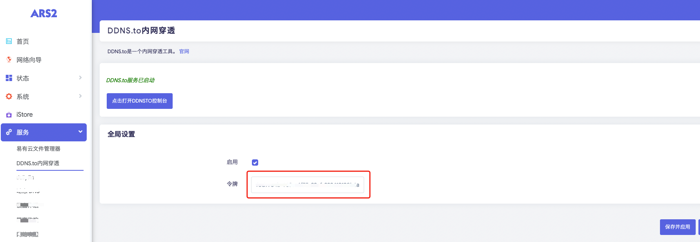

# EasePi 安装指南

> ⏱️ 预计耗时：1 分钟  
> 📱 适用设备：EasePi ARS2 / R1 / R2 / A2

---

## 安装步骤

EasePi 固件"iStore"应用商店，已默认安装 DDNSTO，直接就可使用。

打开服务中的 DDNSTO，勾选"启用"并填入令牌，保存并应用。

---

## 下一步

安装完成后，请前往 [DDNSTO 控制台](https://www.ddnsto.com/app/#/devices) 添加域名映射。
