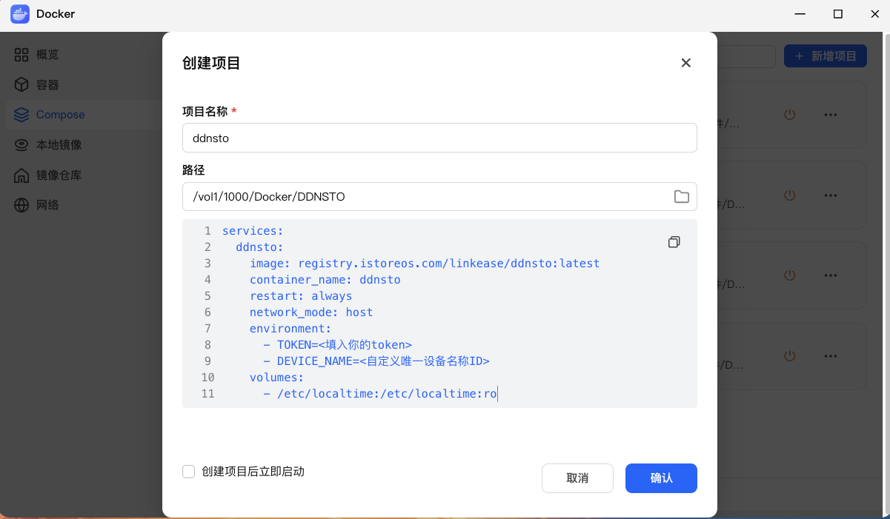

# 飞牛 NAS 安装指南

> ⏱️ 预计耗时：5 分钟
> 📱 适用设备：飞牛 FNOS NAS

---

## 视频教程

[视频教学：飞牛外网访问利器-DDNSTO，安装及注意事项！](https://www.bilibili.com/video/BV1YMSQYAE84/)

---

## 方案1：docker-compose

- ### <font color="#dd0000">首选方案！</font><br />

### 1. 登录飞牛系统：打开 Docker —— Compose —— 右上角 "新建项目"

- 项目名称：ddnsto
- 路径：选择一个存放 ddnsto 数据的位置
- 来源：选择 "创建docker-compose.yml"，填入以下脚本

```yaml
services:
  ddnsto:
    image: registry.istoreos.com/linkease/ddnsto:latest
    container_name: ddnsto
    restart: always
    network_mode: host
    environment:
      - TOKEN=<填入你的token>
      - DEVICE_NAME=<自定义唯一设备名称ID>
    volumes:
      - /etc/localtime:/etc/localtime:ro
```

- `<填入你的token>`: 填写从 [DDNSTO 控制台](https://www.ddnsto.com/app/#/login) 拿到的令牌
- `<自定义唯一设备名称ID>`: 必须是英文字母、数字，不能为中文；比如：`abc9527`
- 替换 "<>" 里面的内容，且不能出现 "<>"



---

### 2. 勾选 "创建项目后立即启动"，然后 "确认"，等待 "ddnsto" 容器运行。


---

## 方案2：常规 Docker

### 1. 登录飞牛终端

电脑利用 PuTTY、Xshell 等工具登录飞牛的终端。

---

### 2. 运行安装命令

**终端运行以下命令：**

```bash
docker run -d \
    --name=ddnsto \
    --restart always \
    --network host \
    -e TOKEN=<填入你的token> \
    -e DEVICE_NAME=<自定义唯一设备名称ID> \
    -v /etc/localtime:/etc/localtime:ro \
    registry.istoreos.com/linkease/ddnsto:latest
```

**参数说明：**
- `<填入你的token>`: 填写从 [DDNSTO 控制台](https://www.ddnsto.com/app/#/login) 拿到的令牌
- `<自定义唯一设备名称ID>`: 必须是英文字母、数字，不能为中文；比如：`abc9527`

**注意：**
- 替换 "<>" 里面的内容，且不能出现 "<>"
- 例如 TOKEN 为 `abcd-8888-7777-6666-efgh`，设备名称 ID 为 `abc9527`
- 飞牛用终端命令安装Docker，需要“sudo”提权，按提示输入飞牛的密码，命令如下：

```bash
sudo docker run -d \
    --name=ddnsto \
    --restart always \
    --network host \
    -e TOKEN=abcd-8888-7777-6666-efgh \
    -e DEVICE_NAME=abc9527 \
    -v /etc/localtime:/etc/localtime:ro \
    registry.istoreos.com/linkease/ddnsto:latest
```

---

### 3. 验证安装

进入飞牛系统管理页面，找到"Docker"，会看到"ddnsto"已经运行：


---

## 下一步

 🟢 [配置外网域名](/zh/guide/ddnsto/quickstart/#第-3-步-配置外网域名) 

### Q: 如何升级？
A: 升级需要先删除"ddnsto"容器，再按照之前的步骤部署"ddnsto"容器。
