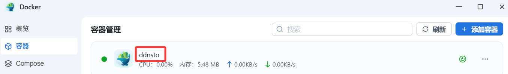

# 飞牛 NAS 安装指南

> ⏱️ 预计耗时：5 分钟
> 📱 适用设备：飞牛 FNOS NAS

---

## 视频教程

[视频教学：飞牛外网访问利器-DDNSTO，安装及注意事项！](https://www.bilibili.com/video/BV1YMSQYAE84/)

---

## 安装步骤

### 1. 登录飞牛终端

电脑利用 PuTTY、Xshell 等工具登录飞牛的终端。

---

### 2. 运行安装命令

**终端运行以下命令：**

```bash
docker run -d \
    --name=ddnsto \
    --restart always \
    --network host \
    -e TOKEN=<填入你的token> \
    -e DEVICE_NAME=<自定义唯一设备名称ID> \
    -v /etc/localtime:/etc/localtime:ro \
    registry.istoreos.com/linkease/ddnsto:4.0.5
```

**参数说明：**
- `<填入你的token>`: 填写从 [DDNSTO 控制台](https://www.ddnsto.com/app/#/login) 拿到的 TOKEN
- `<自定义唯一设备名称ID>`: 必须是英文字母、数字，不能为中文；比如：`abc9527`

**注意：**
- 替换 "<>" 里面的内容，且不能出现 "<>"
- 例如 TOKEN 为 `abcd-8888-7777-6666-efgh`，设备名称 ID 为 `abc9527`
- 飞牛用终端命令安装Docker，需要“sudo”提权，按提示输入飞牛的密码，命令如下：

```bash
sudo docker run -d \
    --name=ddnsto \
    --restart always \
    --network host \
    -e TOKEN=abcd-8888-7777-6666-efgh \
    -e DEVICE_NAME=abc9527 \
    -v /etc/localtime:/etc/localtime:ro \
    registry.istoreos.com/linkease/ddnsto:4.0.5
```

---

### 3. 验证安装

进入飞牛系统管理页面，找到"Docker"，会看到"ddnsto"已经运行：



---

## 下一步

 🟢 [配置外网域名](/zh/guide/ddnsto/quickstart/#第-3-步-配置外网域名) 
