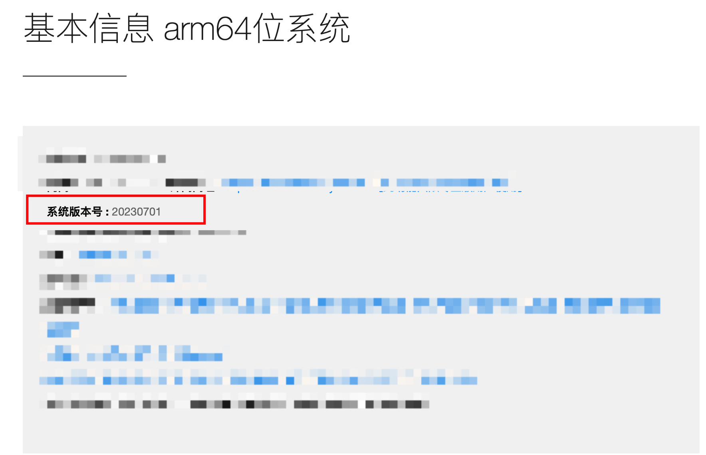
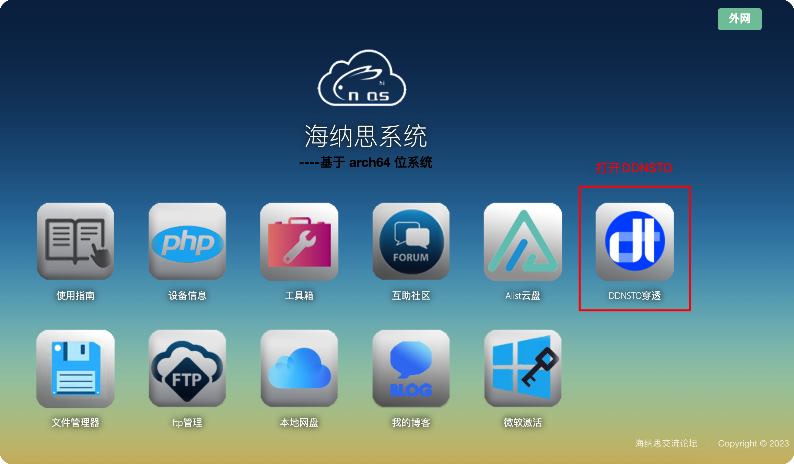
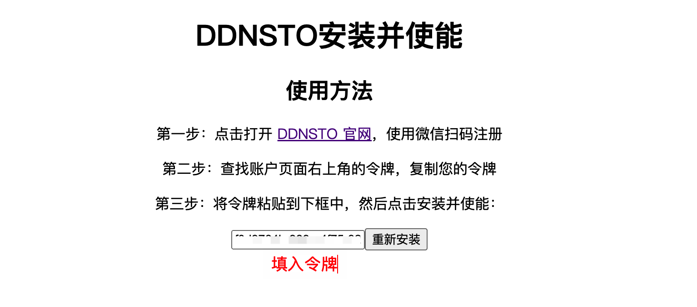

# 海纳思 NAS 安装指南

> ⏱️ 预计耗时：2 分钟  
> 📱 适用设备：海纳思（HiSTB）NAS

---

## 系统要求

- 系统版本需更新到至少 **"20230701"** 版本

---

## 安装步骤

### 1. 打开 DDNSTO

海纳思系统从 **"20230701"** 版本开始已经内置了 DDNSTO，无需另外安装，直接打开即可配置。

### 2. 配置 Token

打开 DDNSTO 配置界面，根据提示填入您的 Token

---

## 低版本系统

如果系统版本低于 "20230701"，请参考 [Linux 通用安装教程](./linux.md) 进行安装。

---

## 下一步

安装完成后，请前往 [DDNSTO 控制台](https://www.ddnsto.com/app/#/devices) 添加域名映射。
