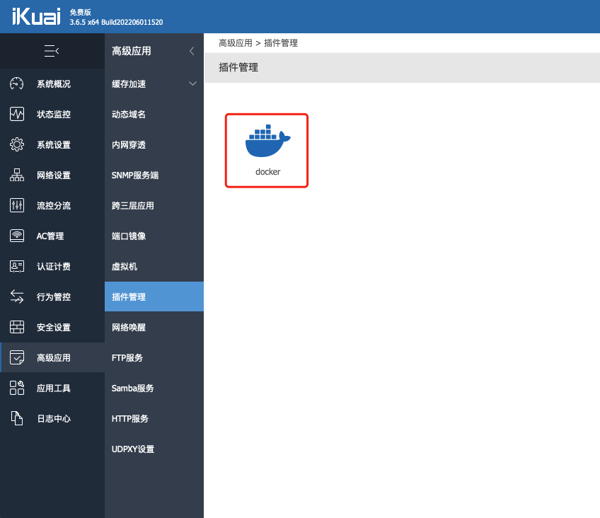
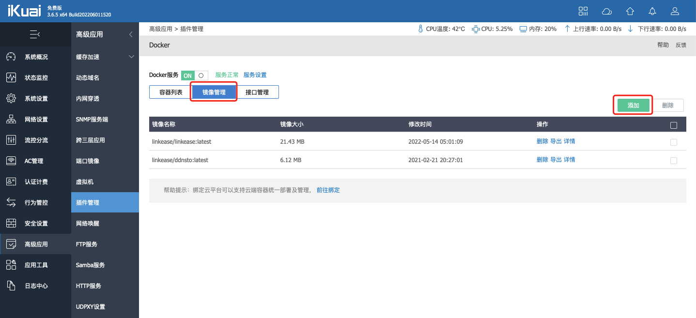
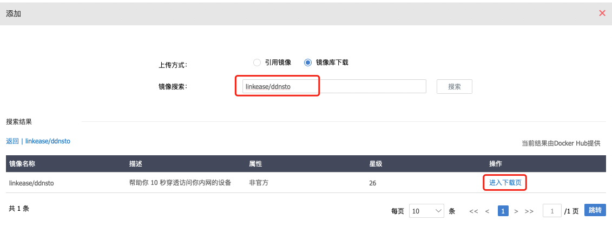
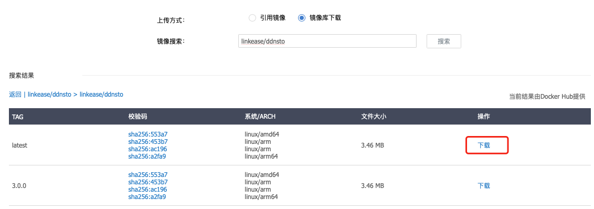
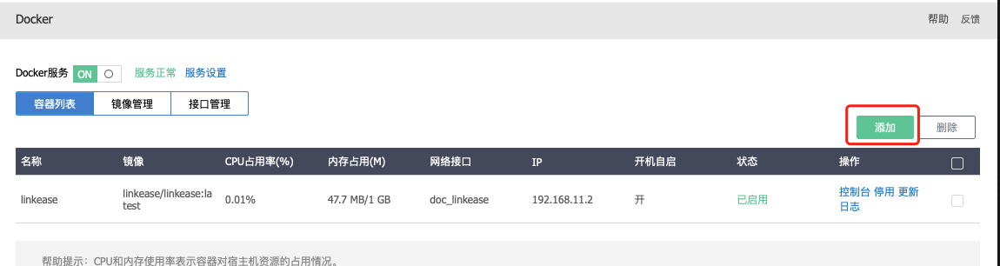
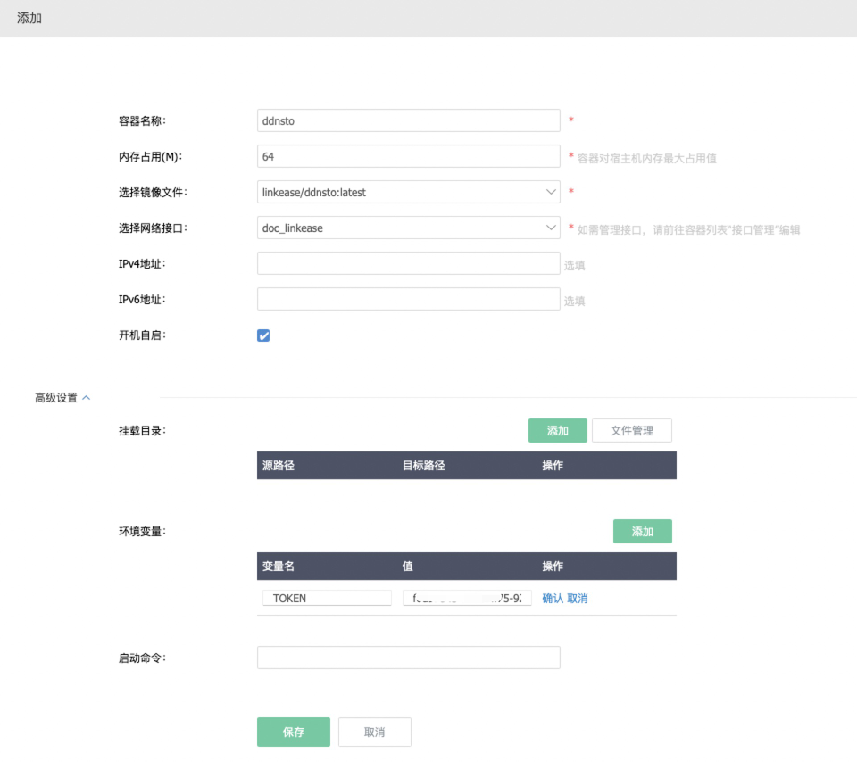
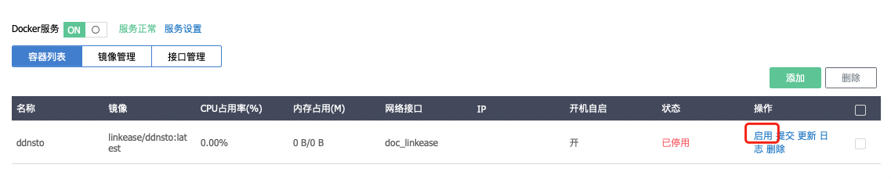

# 爱快路由器安装指南

> ⏱️ 预计耗时：10 分钟  
> 📱 适用设备：爱快 iKuai 路由器

---

## 视频教程

[点击查看视频教程](https://www.bilibili.com/video/BV1tt4y157W5?spm_id_from=333.999.0.0)

---

## 安装步骤

### 1. 安装 Docker

在 iKuai 后台安装配置好 Docker：

* [iKuai 官方 Docker 安装教程](https://bbs.ikuai8.com/thread-121904-1-1.html)

---

### 2. 打开 Docker 管理

通过 Docker 方式安装 DDNSTO，首先打开"高级应用-插件管理"的 Docker：

---

### 3. 添加镜像

点击"镜像管理"，然后点击"添加"：

---

### 4. 下载 DDNSTO 镜像

上传方式选择"镜像库下载"，然后镜像搜索"linkease/ddnsto"，在镜像列表选择中点击"进入下载页"，选择第一个最新的点击"下载"后等待下载完成即可：

---

### 5. 创建容器

回到 Docker 页面容器列表，点击"添加"，填写相关信息后保存后启用：

**基础设置：**
* **容器名称**：给容器设置一个名称
* **内存占用**：给容器设置内存大小，这里可填 64M 及以上内存
* **选择镜像文件**：选择"linkease/ddnsto"镜像
* **选择网络接口**：选择在接口管理中创建的网络接口
* **开启自启**：勾选后开机后会自动启动此容器

**高级设置：**
* **环境变量**：添加一个环境变量，变量名填入"TOKEN"，值填入从 DDNSTO 控制台获取的令牌（token）

---

### 6. 启用容器

最后点击"启用"：

---

## 下一步

- 🔵 [配置远程文件管理](../../scenarios/file-management.md)
- 🔵 [设置远程下载](../../scenarios/remote-download.md)
