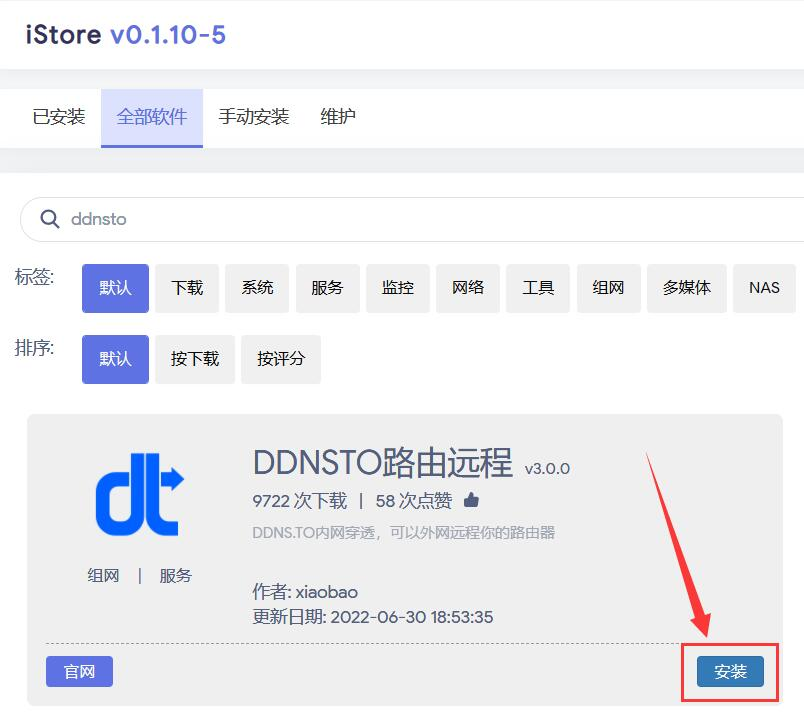
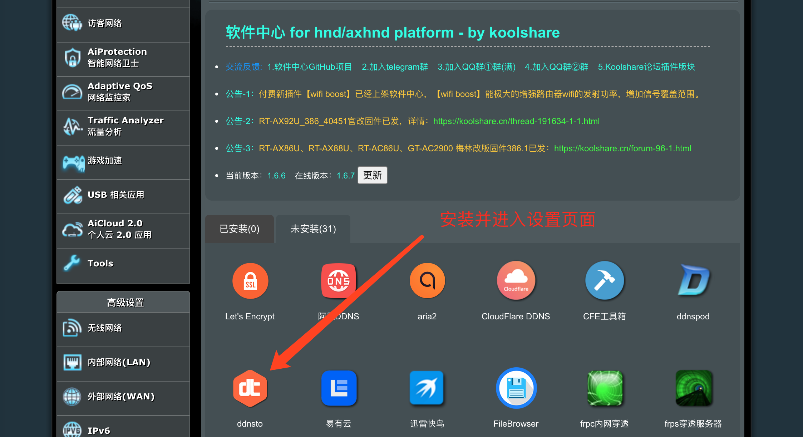
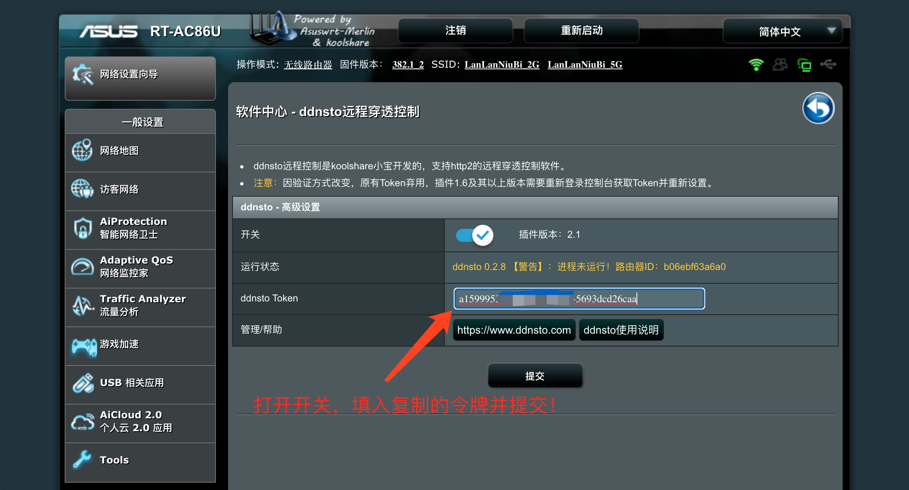
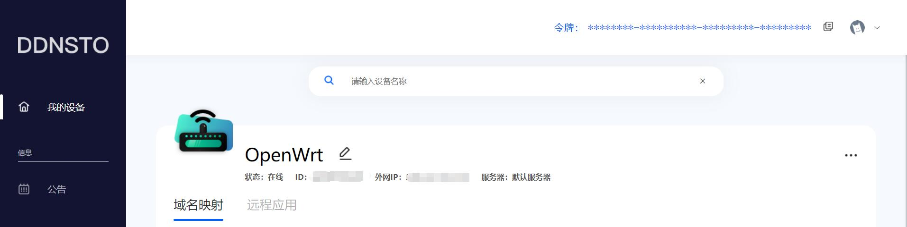
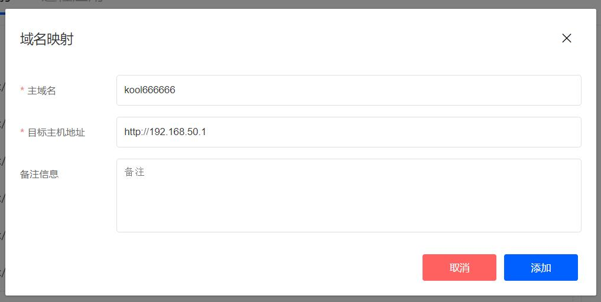

# iStoreOS 安装指南

> ⏱️ 预计耗时：1 分钟  
> 📱 适用设备：iStoreOS / OpenWrt 衍生版

---

## 安装步骤

### 1. 进入 iStore 应用商店

1. 登录 iStoreOS 管理界面（默认 `http://192.168.1.1`）
2. 点击顶部菜单 **"iStore"** 进入应用商店

---

### 2. 安装 DDNSTO

1. 在应用商店搜索 "DDNSTO"
2. 点击 "安装" 按钮
3. 等待安装完成（约 10 秒）

---

### 3. 配置 Token

1. 安装完成后，点击 "打开" 或进入 **"服务" → "DDNSTO"**
2. 启用 DDNSTO
3. 填入你的 Token（从 [DDNSTO 控制台](https://www.ddnsto.com/app/#/login) 获取）
4. 点击 "保存&应用"

---

### 4. 验证安装

1. 回到 [DDNSTO 控制台](https://www.ddnsto.com/app/#/login)
2. 刷新页面，等待设备出现（约 30 秒）
3. 看到设备名称即表示安装成功！

---

## 添加域名映射

### 映射路由器管理界面

1. 点击设备右侧的 **"+"** 号
2. 填写映射信息：
   - **域名前缀**：自定义，如 `myrouter`
   - **目标主机**：`http://192.168.1.1`（路由器管理地址）

3. 点击"添加"，等待 1 分钟后访问 `https://myrouter.ddnsto.com`

---

## 扩展功能（可选）

iStoreOS 完整支持 DDNSTO 扩展功能：

- 📁 **文件管理** —— 远程访问 Samba/SFTP/WebDAV
- 🌐 **WebDAV 服务** —— 开启本机 WebDAV 共享
- ⚡ **远程开机** —— 远程唤醒局域网内电脑

配置方法：
1. 进入 DDNSTO 插件 → 扩展功能
2. 勾选 "启用扩展功能"
3. 设置 WebDAV 端口、用户名、密码
4. 选择共享磁盘路径
5. 保存并应用

---

## 常见问题

### Q: 应用商店找不到 DDNSTO？
A: 尝试更新 iStore 应用商店列表，或检查网络连接。

### Q: 保存后设备不显示？
A: 检查：
- Token 是否填写正确
- iStoreOS 是否能正常访问外网（尝试 ping 百度）
- 等待 1-2 分钟后刷新控制台

### Q: 如何升级？
A: 在 iStore 应用商店直接点击 "更新" 即可。

---

## 下一步

- 🔵 [配置远程文件管理](../../scenarios/file-management.md)
- 🔵 [设置远程下载](../../scenarios/remote-download.md)
- 🔵 [配置远程开机](../../scenarios/remote-wol.md)
