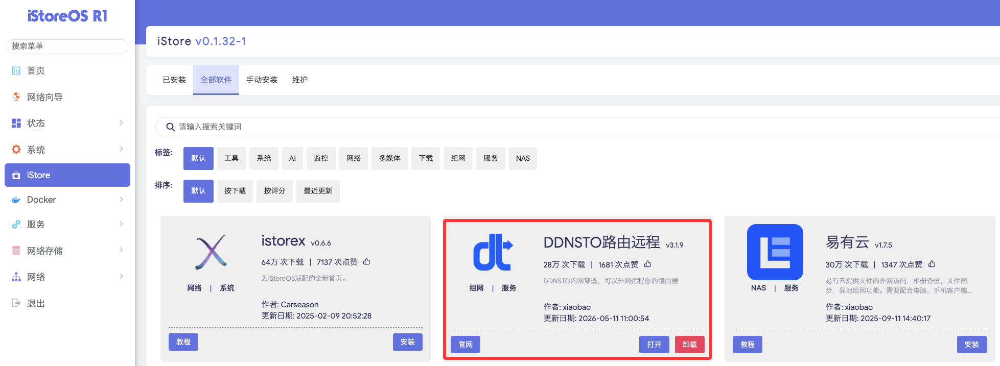

# iStoreOS 安装指南

> ⏱️ 预计耗时：1 分钟
> 📱 适用设备：iStoreOS / OpenWrt 衍生版

---

## 安装步骤

- iStoreOS 固件，已默认安装 DDNSTO，直接就可使用。

打开服务中的 DDNSTO，快速向导或者手动勾选"启用"并填入令牌，保存配置并应用。

- 如果需要更新，直接在 iStore 商店中安装最新的 DDNSTO 即可。

---

## 扩展功能（可选）

iStoreOS 完整支持 DDNSTO 扩展功能：

- 📁 **文件管理** —— 远程访问 Samba/SFTP/WebDAV
- 🌐 **WebDAV 服务** —— 开启本机 WebDAV 共享
- ⚡ **远程开机** —— 远程唤醒局域网内电脑

配置方法：
1. 进入 DDNSTO 插件 → 高级功能 → 启用拓展功能
2. 勾选 "启用扩展功能"
3. 设置 WebDAV 可访问目录、端口、用户名、密码
4. 选择共享磁盘路径
5. 保存并应用

---

## 下一步

- 🟢 [配置外网域名](/zh/guide/ddnsto/quickstart/#第-3-步-配置外网域名) 
- 🔵 [配置远程文件管理](../../scenarios/file-management.md)
- 🔵 [设置远程下载](../../scenarios/remote-download.md)
- 🔵 [配置远程开机](../../scenarios/remote-wol.md)

---

## 常见问题

### Q: 应用商店找不到 DDNSTO？
A: 尝试更新 iStore 应用商店列表，或检查网络连接。

### Q: 保存后设备不显示？
A: 检查：
- Token 是否填写正确
- iStoreOS 是否能正常访问外网（尝试 ping 百度）
- 等待 1-2 分钟后刷新控制台

### Q: 后续升级？
A: 若从 iStore 应用商店安装后，后续 ddnsto 更新，直接在 iStore 商店点击 "更新" 即可。

