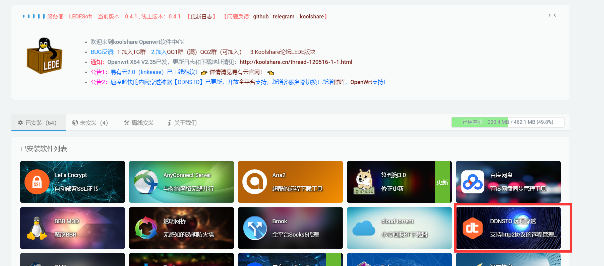
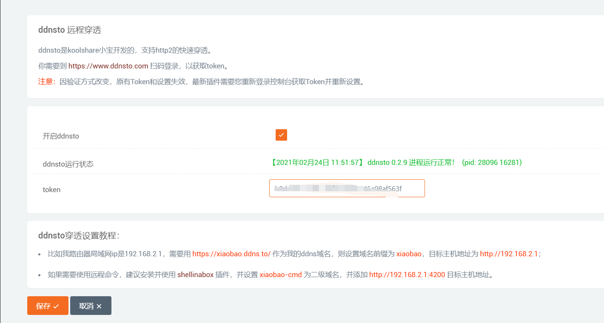
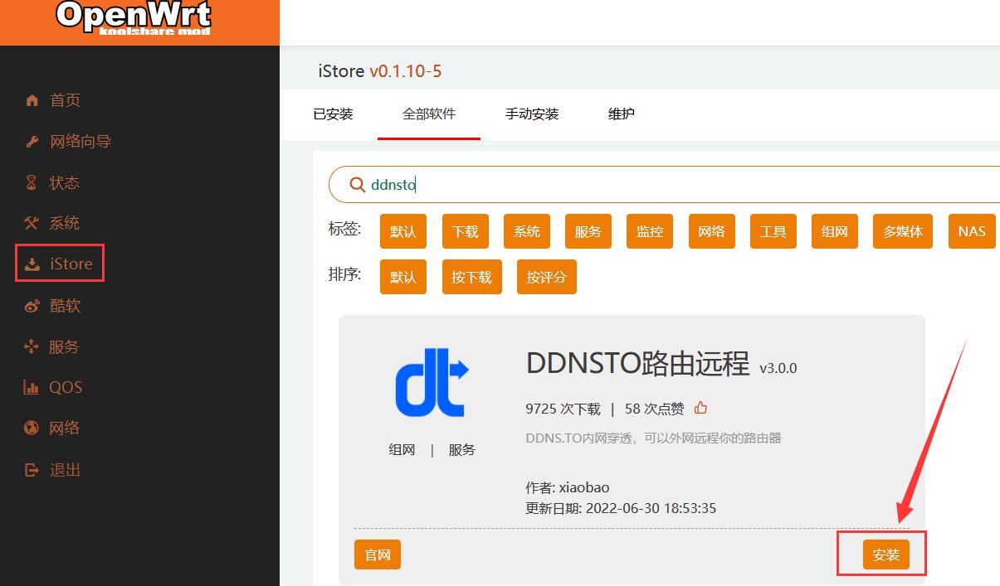

# KoolCenter LEDE 安装指南

> ⏱️ 预计耗时：3 分钟
> 📱 适用设备：KoolCenter LEDE 固件路由器

---

## 安装步骤

### KS LEDE v2.3.7 及以下版本

1. 在酷软中心搜索并安装 DDNSTO 插件

2. 安装后开启并设置 Token

### KS LEDE v3.2 及以上版本

1. 首先在**系统 → 软件包**里，搜索 DDNSTO，并卸载自带的 DDNSTO

2. 然后进入 **iStore → 维护**，把 iStore 商店升级为最新，然后在 iStore 里安装 DDNSTO

3. 新版的 DDNSTO 插件界面已经更新，配置更加便捷

---

## 下一步

- 🟢 [配置外网域名](/zh/guide/ddnsto/quickstart/#第-3-步-配置外网域名) 
