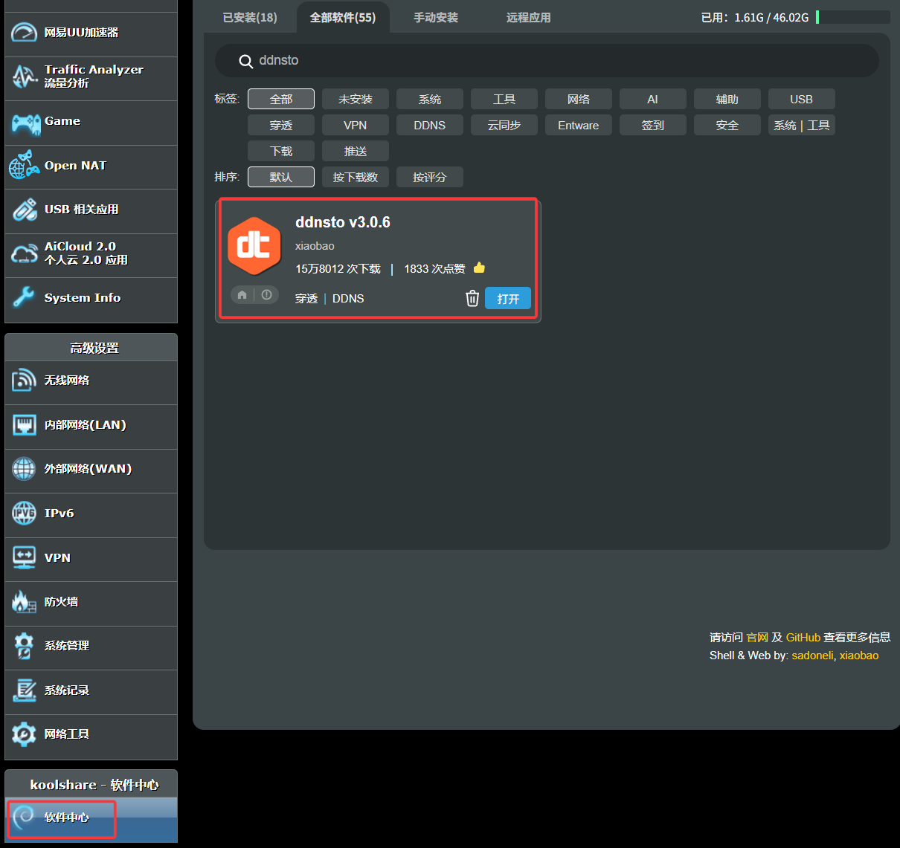

# ASUSGO / KoolCenter 梅林固件 安装指南

> ⏱️ 预计耗时：2 分钟  
> 📱 适用设备：华硕路由器（梅林固件）

---

## 安装步骤

### 1. 安装插件

ASUSGO 固件（KoolCenter 固件），在软件中心搜索并安装 DDNSTO 软件。

### 2. 配置令牌

安装后打开 DDNSTO，进入「DDNSTO 控制台」获取令牌 TOKEN 后填入，并启用。

---

## 离线安装

如软件中心无法更新最新版本，请下载[离线包进行安装](https://rogsoft.ddnsto.com/ddnsto/ddnsto.tar.gz)。

---

## 下一步

安装完成后，请前往 [DDNSTO 控制台](https://www.ddnsto.com/app/#/devices) 添加域名映射。
