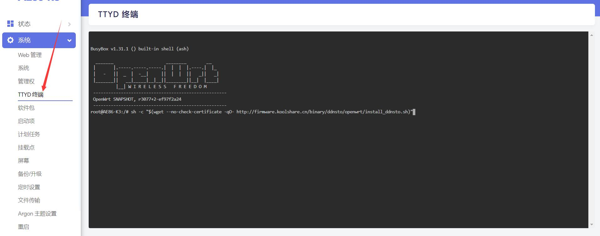
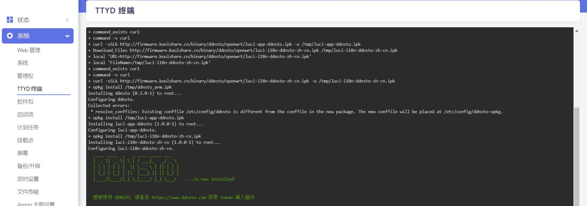
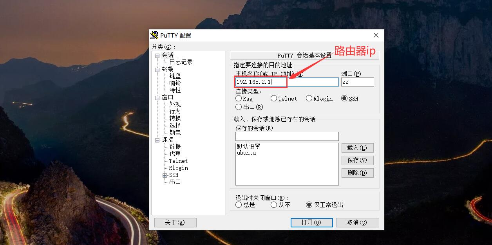
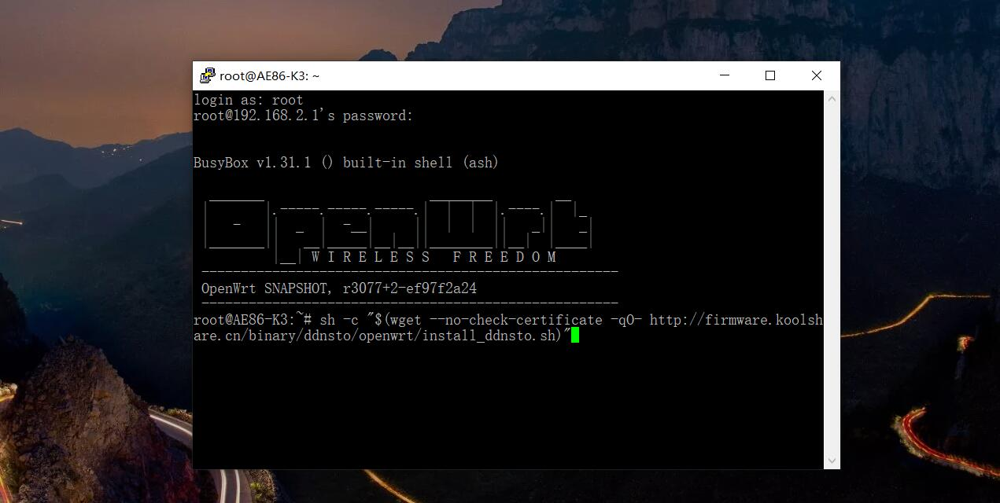
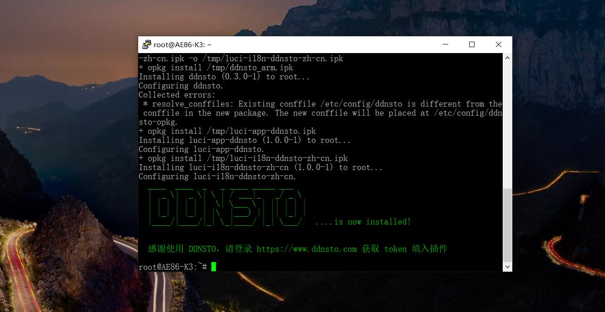
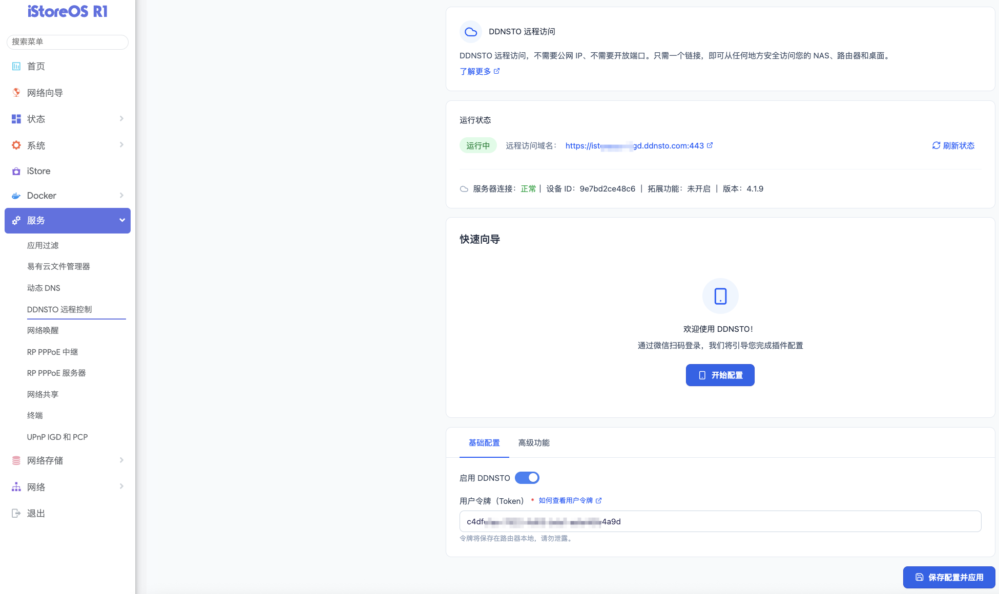
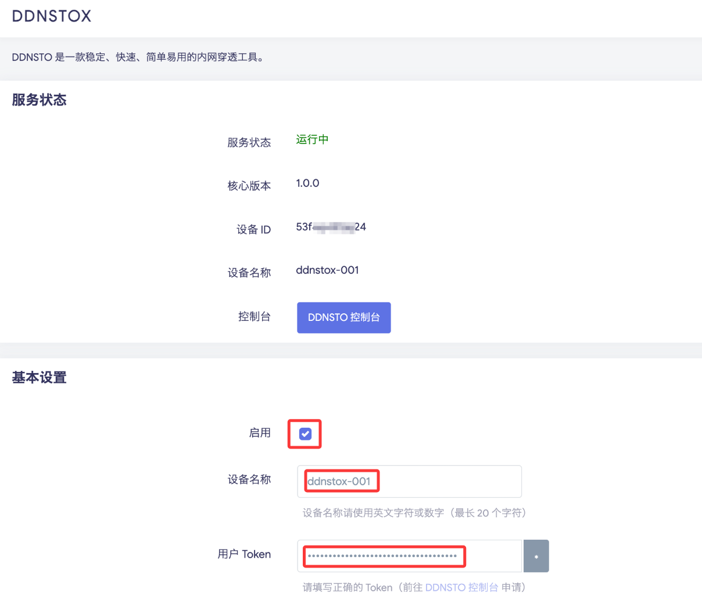

# OpenWrt 安装指南

> ⏱️ 预计耗时：3 分钟
> 📱 适用设备：OpenWrt 路由器

---

## 安装步骤

OpenWrt 固件开发者众多，部分固件不自带 DDNSTO，可通过以下任一脚本轻松安装：

### 安装 DDNSTO

```bash
sh -c "$(curl -sSL http://fw.koolcenter.com/binary/ddnsto/openwrt/install_ddnsto.sh)"
```

或

```bash
sh -c "$(wget --no-check-certificate -qO- http://fw.koolcenter.com/binary/ddnsto/openwrt/install_ddnsto.sh)"
```

或

```bash
cd /tmp; wget --no-check-certificate http://fw.koolcenter.com/binary/ddnsto/openwrt/install_ddnsto.sh; sh ./install_ddnsto.sh
```

---

### 安装 DDNSTOX（可选）

DDNSTOX 解决了之前 DDNSTO 插件存在的一些问题：

- 设备 ID 不再随 MAC 地址变化，改为通过指定设备名称生成唯一设备 ID
- 使用 Golang 编写，对内存要求稍高，低内存硬路由建议继续使用旧版 DDNSTO
- 目前无扩展功能，若需要请继续使用旧版 DDNSTO

```bash
sh -c "$(curl -sSL https://fw.koolcenter.com/binary/ddnsto/openwrt/ddnstox/install_ddnstox.sh)"
```

---

### 配置 Token

1. 在 OpenWrt TTYD 终端中输入上述命令，自动安装完成

   
   
   

2. 或者使用 PuTTY、MobaXterm 等软件登录 SSH，输入命令安装

   
   
   
 
   

3. 打开服务中的 DDNSTO，快速向导或者手动勾选"启用"并填入令牌，保存配置并应用。

   

4. 或者找到 DDNSTOX，填写 Token 和设置设备名称，并启用

   

---

## 下一步

- 🟢 [配置外网域名](/zh/guide/ddnsto/quickstart/#第-3-步-配置外网域名) 
- 🔵 [配置远程文件管理](../../scenarios/file-management.md)
- 🔵 [设置远程下载](../../scenarios/remote-download.md)
- 🔵 [配置远程开机](../../scenarios/remote-wol.md)

---

## 常见问题

### 安装后无法启用配置

OpenWrt 15 版本跟最新插件不兼容，尝试以下解决：

**尝试一：**
```bash
/etc/init.d/ddnsto disable
/etc/init.d/ddnsto enable
```

**尝试二：** 重启路由器

