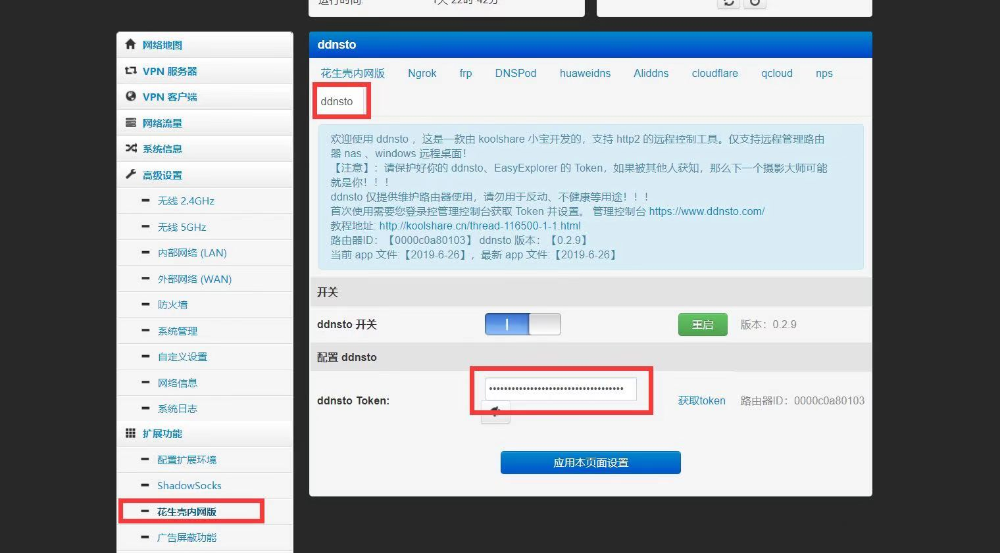
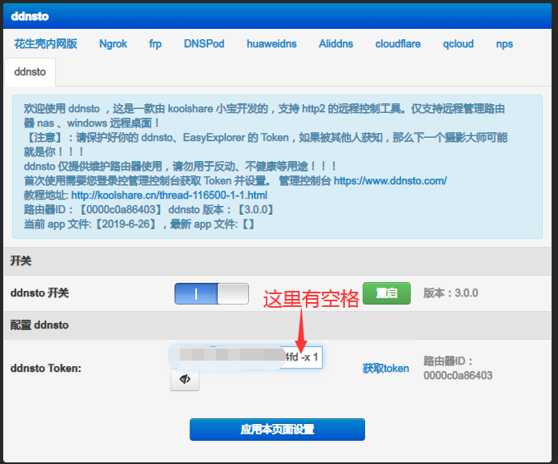

# Padavan 安装指南

> ⏱️ 预计耗时：2 分钟
> 📱 适用设备：Padavan 固件路由器

---

## 安装步骤

#### 注意：并不是所有的 Padavan 固件都会带 DDNSTO，这个要看固件作者是否加入 DDNSTO！ 

1. 进入路由器管理界面，找到**扩展功能 → 花生壳内网**

2. 右侧选择 **DDNSTO**，启用并设置 Token

---

## 常见问题

### 多台设备 ID 识别相同

如果多台设备 ID 识别相同，可以在令牌后加：(空格) + "-x" + 编号，来区别设备。

---

## 下一步

- 🟢 [配置外网域名](/zh/guide/ddnsto/quickstart/#第-3-步-配置外网域名) 
