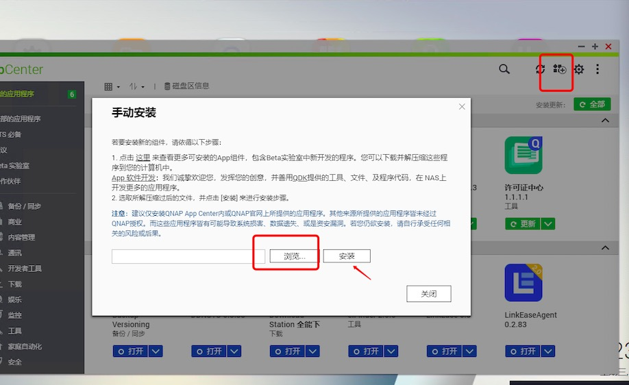
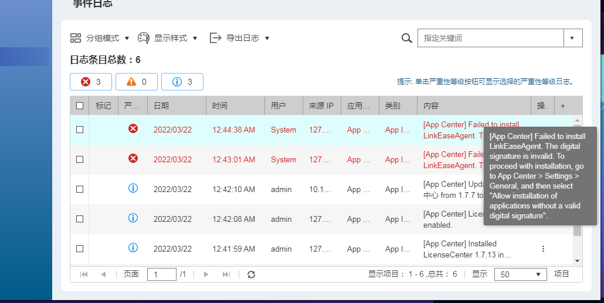
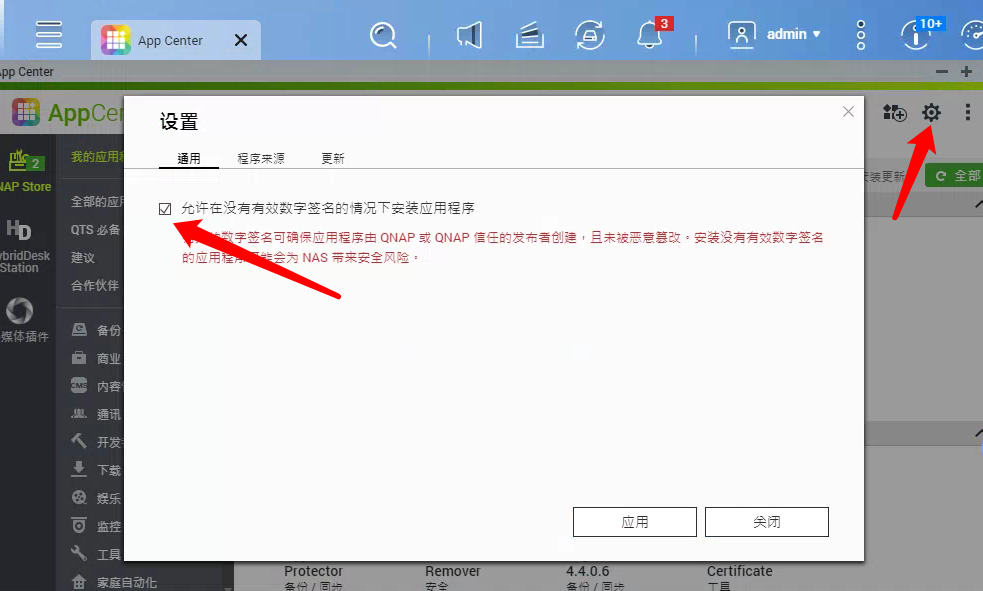
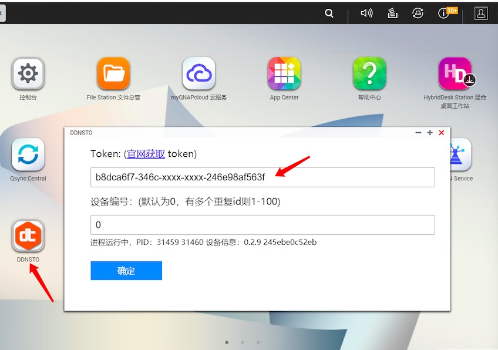
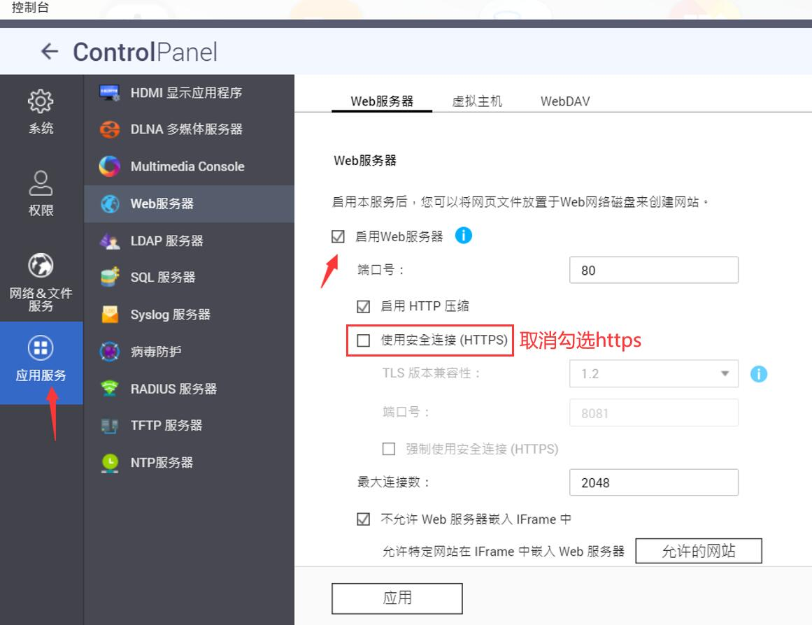

# 威联通 NAS 安装指南

> ⏱️ 预计耗时：5 分钟
> 📱 适用设备：威联通 QNAP NAS

---

## ⚠️ 重要提示

**请仔细看完本节教程再操作，以节约时间！**

- ### 注意：请开启 WEB 服务，并且取消勾选 HTTPS！ 

---

## 安装步骤

### 1. 下载 QNAP 插件

下载对应自己版本的 [QNAP 插件](https://www.linkease.com/rd/ddnsto-qnap/)进行手动安装。

* 如果不知道自己的平台，一般来说是 `DDNSTO_xxx_x86_64.qpkg`

   

---

### 2. 处理安装失败

若遇到安装失败，日志如图：

   

则开启允许未签名即可：

   

---

### 3. 配置 DDNSTO

安装好后，Token 处填入你的令牌（从 [DDNSTO 控制台](https://www.ddnsto.com/app/#/login) 获取），填入提交即可。

* QNAP 的域名端口是 8080，比如配置内网地址为：`http://127.0.0.1:8080`

   

**注意：**
- 威联通升级新系统后，DDNSTO 更换过 Token 后，需要停用插件后重新开启
- 如果安装失败，或者无法配置，请开启 WEB 服务，并且取消勾选 HTTPS（若之前勾选过，请卸载重装 DDNSTO）

   

---

## 下一步

- 🟢 [配置外网域名](/zh/guide/ddnsto/quickstart/#第-3-步-配置外网域名) 

### Q: 如何升级？
A: 升级需要先卸载旧版本，再安装新版本即可。
