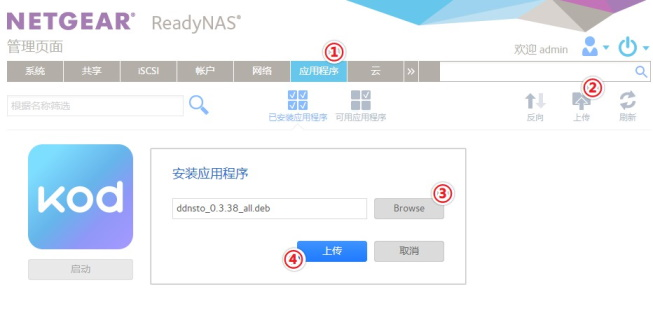
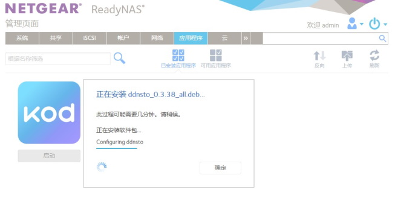
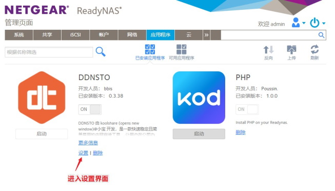
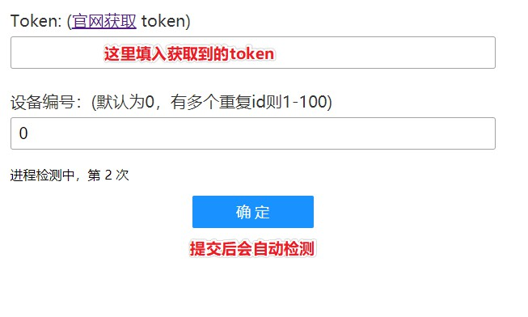

# ReadyNAS 安装指南

> ⏱️ 预计耗时：5 分钟  
> 📱 适用设备：NETGEAR ReadyNAS 系列

---

## 支持设备

| ARM 设备 | x86 设备 | x86 高端设备 |
|---------|---------|-------------|
| ReadyNAS 102 | ReadyNAS 312 | ReadyNAS 626X |
| ReadyNAS 104 | ReadyNAS 314 | ReadyNAS 628X |
| ReadyNAS 202 | ReadyNAS 316 | ReadyNAS 716X |
| ReadyNAS 204 | ReadyNAS 422 | ReadyNAS 2304 |
| ReadyNAS 212 | ReadyNAS 424 | ReadyNAS 2312 |
| ReadyNAS 214 | ReadyNAS 426 | ReadyNAS 3130 |
| ReadyNAS 2120 | ReadyNAS 428 | ReadyNAS 3138 |
| - | ReadyNAS 516 | ReadyNAS 3220 |
| - | ReadyNAS 524X | ReadyNAS 4220 |
| - | ReadyNAS 526X | ReadyNAS 3312 |
| - | ReadyNAS 528X | ReadyNAS 4312 |

---

## 安装步骤

### 1. 下载安装包

[下载](https://fw.koolcenter.com/binary/ddnsto/readynas/ddnsto_all.deb)以 **.deb** 结尾的安装程序

### 2. 安装应用

进入 ReadyNAS 管理界面，点击**应用程序**

选择**上传并安装应用程序**

上传下载的 .deb 文件

### 3. 配置 Token

安装完成后，打开 DDNSTO 应用，填入您的 Token

---

## 下一步

安装完成后，请前往 [DDNSTO 控制台](https://www.ddnsto.com/app/#/devices) 添加域名映射。
