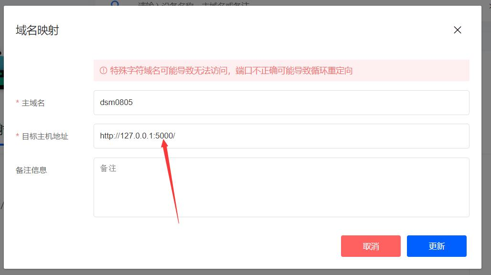
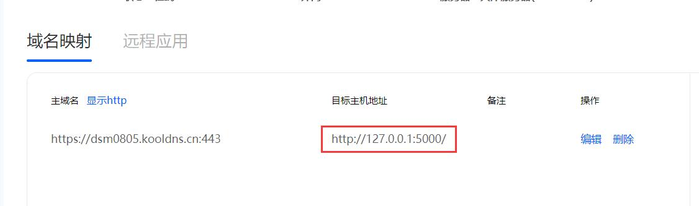
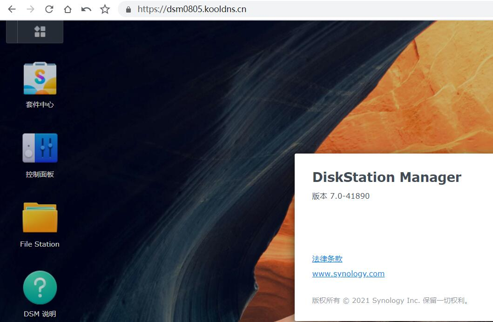
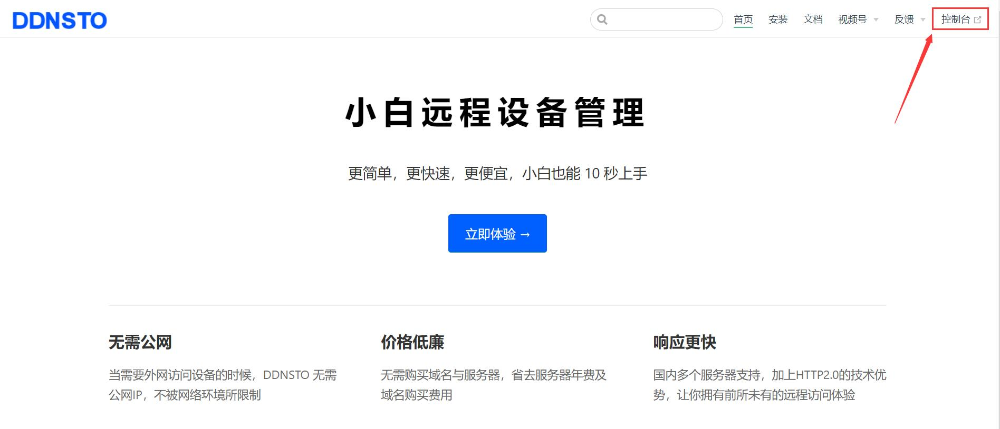

# 群晖 NAS 安装指南

> ⏱️ 预计耗时：2 分钟  
> 📱 适用设备：群晖 DSM 6.x / 7.x

---

## 安装步骤

### 1. 下载 DDNSTO 套件

1. 访问 [DDNSTO 固件下载页](https://fw.koolcenter.com/binary/ddnsto/synology/)
2. 根据你的 DSM 版本选择对应的套件包：
   - DSM 7.x → 下载 `ddnsto-x.x.x-7.x.spk`
   - DSM 6.x → 下载 `ddnsto-x.x.x-6.x.spk`

---

### 2. 手动安装套件

1. 打开群晖 DSM → 套件中心 → 手动安装

2. 点击"浏览"，选择下载的 `.spk` 文件
3. 点击"下一步"完成安装

---

### 3. 配置 Token

1. 安装完成后，在主菜单中找到 DDNSTO 图标，点击打开
2. 填入你的 Token（从 [DDNSTO 控制台](https://www.ddnsto.com/app/#/login) 获取）
3. 点击"保存"

---

### 4. 验证安装

1. 回到 [DDNSTO 控制台](https://www.ddnsto.com/app/#/login)
2. 刷新页面，等待设备出现（约 1 分钟）
3. 看到设备名称即表示安装成功！

---

## 添加域名映射

1. 点击设备右侧的 **"+"** 号
2. 填写映射信息：
   - **域名前缀**：自定义，如 `mynas`
   - **目标主机**：`http://127.0.0.1:5000`（群晖 DSM 默认端口）

3. 点击"添加"，等待 1 分钟后访问 `https://mynas.ddnsto.com`

---

## 常见问题

### Q: 安装失败提示"套件格式不正确"？
A: 请确认下载的套件版本与你的 DSM 版本匹配（DSM 6 和 7 的套件不通用）。

### Q: 设备一直不显示？
A: 检查：
- Token 是否填写正确（不要有多余空格）
- 群晖是否能正常访问外网
- 套件是否显示"正在运行"

### Q: 如何升级？
A: 群晖升级需要先卸载旧版本，再安装新版本（配置不会丢失）。

---

## 下一步

- 🔵 [配置远程文件管理](../../scenarios/file-management.md)
- 🔵 [设置远程下载](../../scenarios/remote-download.md)
