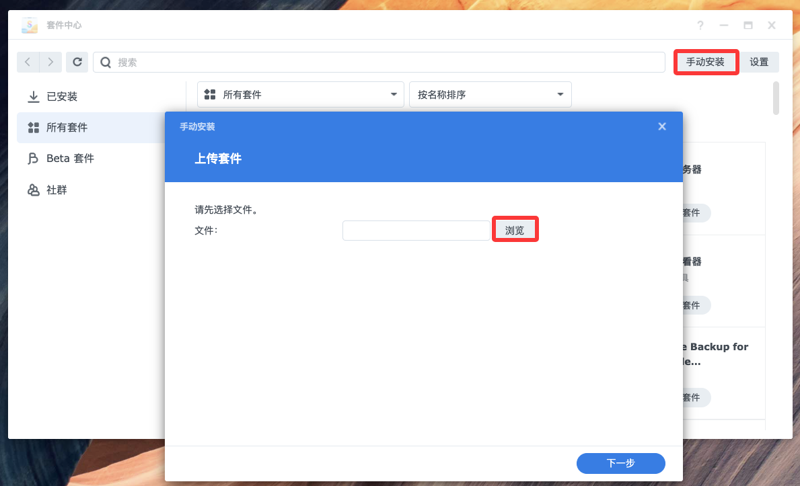
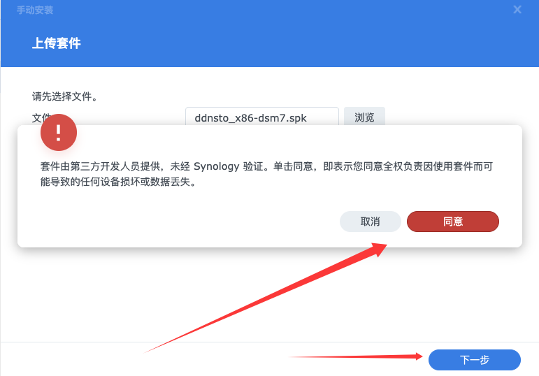
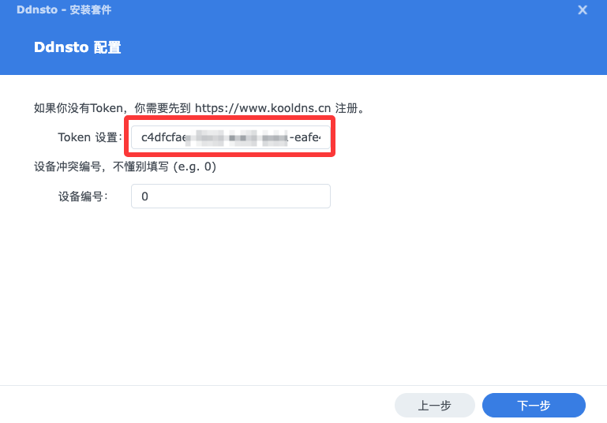

# 群晖 NAS 安装指南

> ⏱️ 预计耗时：2 分钟
> 📱 适用设备：群晖 DSM 6.x / 7.x

---

## 安装步骤

### 1. 下载 DDNSTO 套件

1. 访问 [群晖DDNSTO套件下载页](https://fw.koolcenter.com/binary/ddnsto/synology/)
2. 根据你的 DSM 版本选择对应的套件包：
   - DSM 7.x → 下载 `ddnsto-x.x.x-7.x.spk`
   - DSM 6.x → 下载 `ddnsto-x.x.x-6.x.spk`
   - X86 架构 → 下载 `ddnsto_x86-xxx.spk`
   - ARM 架构 → 下载 `ddnsto_arm-xxx.spk` （DS223、DS124等）

---

### 2. 手动安装套件

1. 打开群晖 DSM → 套件中心 → 手动安装

2. 点击"浏览"，选择下载的 `.spk` 文件
3. 点击"下一步"完成安装

4. 填入你的 Token（从 [DDNSTO 控制台](https://www.ddnsto.com/app/#/login) 获取）

5. 下一步，完成。

---

## 下一步

#### 不要开启“自动将DSM桌面的HTTP连接重定向到HTTPS”

DSM6——控制面板——网络——DSM设置

DSM7——控制面板——登录门户——DSM

- 🟢 [——>配置外网域名](/zh/guide/ddnsto/quickstart/#第-3-步-配置外网域名) 

---

## 常见问题

### Q: 安装失败提示"套件格式不正确"？
A: 请确认下载的套件版本与你的 DSM 版本匹配（DSM 6 和 7 的套件不通用）。

### Q: 设备一直不显示？
A: 检查：
- Token 是否填写正确（不要有多余空格）
- 群晖是否能正常访问外网
- 套件是否显示"正在运行"

### Q: 如何升级？
A: 群晖升级需要先卸载旧版本，再安装新版本（配置不会丢失）。

