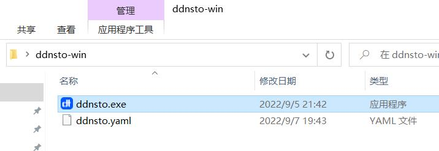
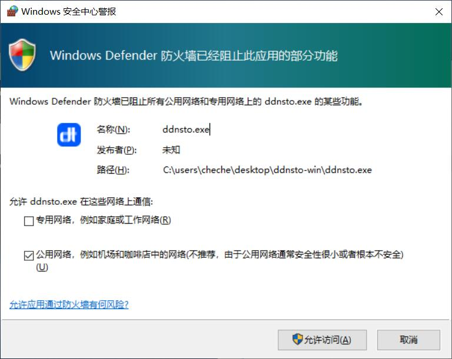
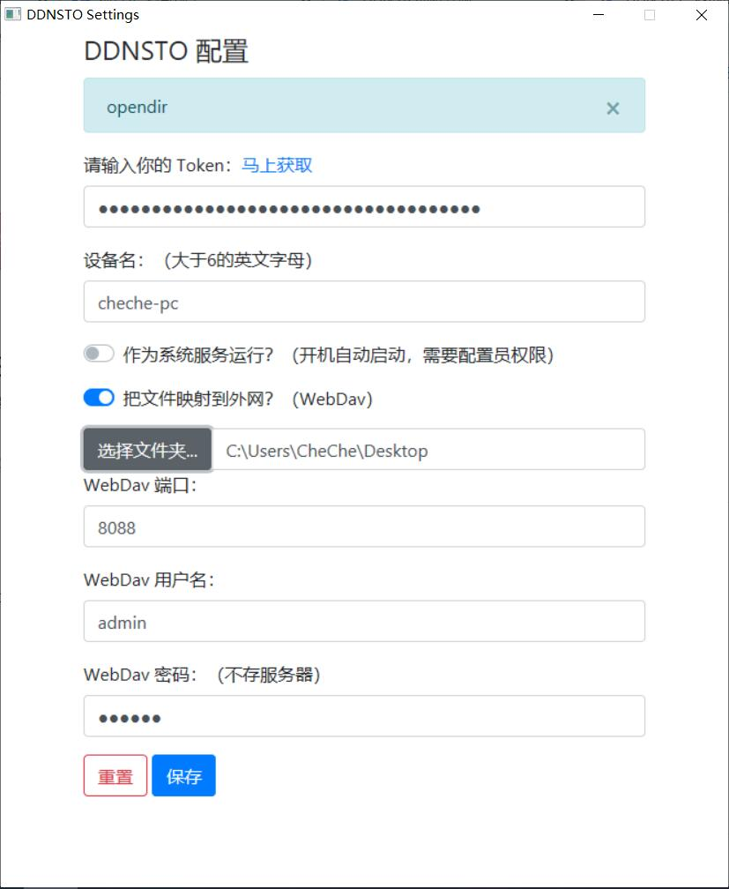

# Windows 安装指南

> ⏱️ 预计耗时：2 分钟  
> 📱 适用设备：Windows 电脑

---

## 安装步骤

### 1. 下载客户端

下载 Windows 客户端：[下载地址](http://fw.koolcenter.com/binary/ddnsto/pc/)

下载后解压，执行 `ddnsto.exe`

如果遇到网络警报，请允许访问：

---

### 2. 配置 DDNSTO

ddnsto 程序界面如图：

设置好 Token，按需开启 WebDAV，然后保存即可。

**注意：**
- WebDAV 启用后，访问地址为 `http://本机IP:8088/webdav`
- 目前 ddnsto 的 PC 客户端是绿色程序，点右上角的 `X` 就直接关闭了
- 若需要后台运行，点击 `—` 最小化

---

## 下一步

- 🔵 [配置远程文件管理](../../scenarios/file-management.md)
- 💻 [开发者 Webhook 测试](../../scenarios/developer-webhook.md)
