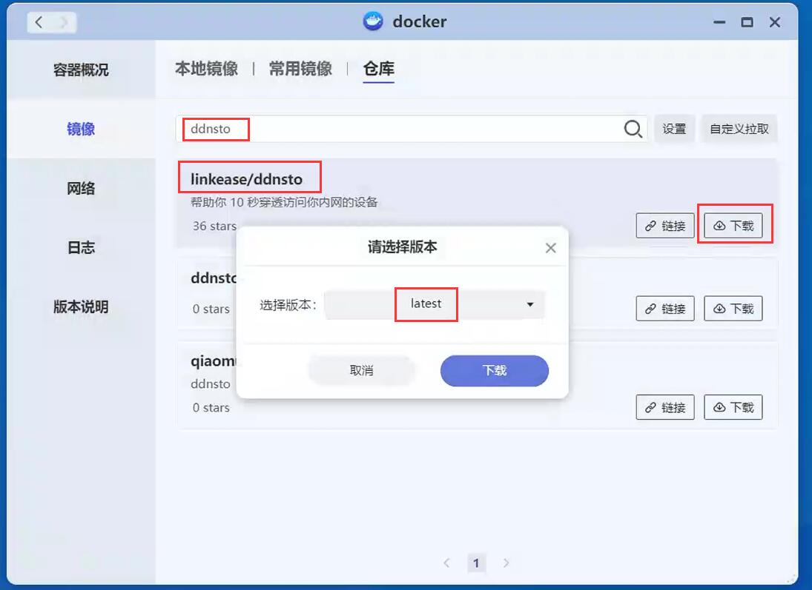
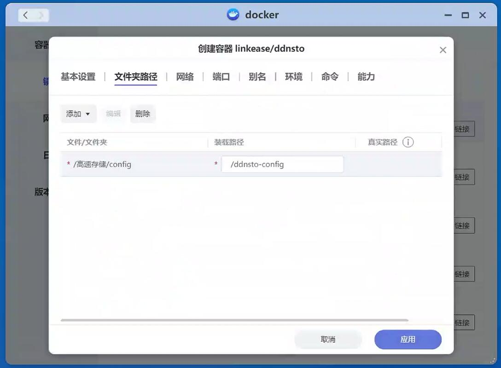
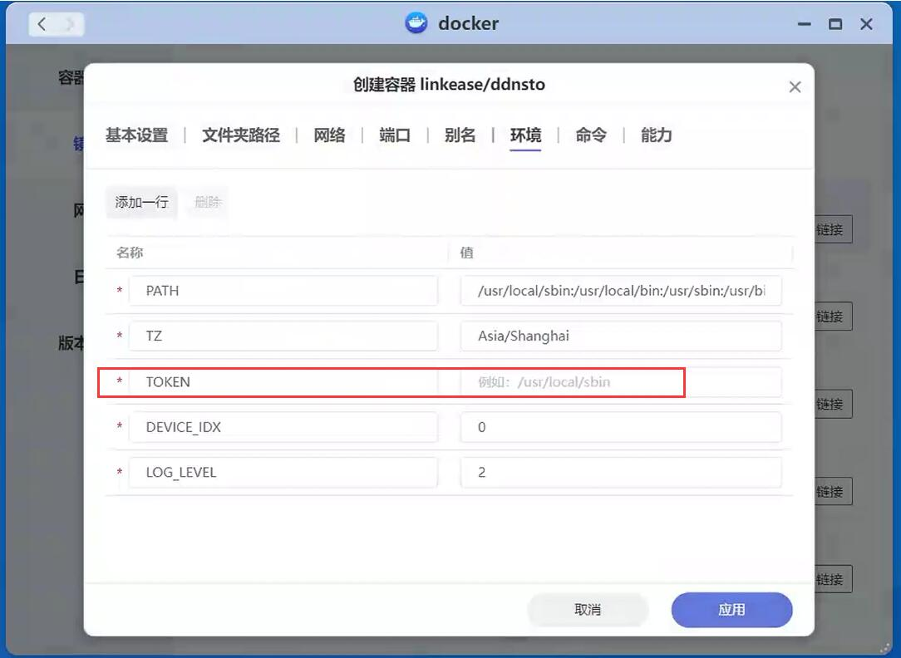

# 极空间 NAS 安装指南

> ⏱️ 预计耗时：5 分钟  
> 📱 适用设备：极空间 ZSpace NAS

---

## 安装步骤

### 1. 搜索 DDNSTO 镜像

在极空间系统中，打开 Docker，并搜索 "ddnsto"：



---

### 2. 下载镜像

找到 "ddnsto"，并下载，选择 "latest" 下载最新镜像。

---

### 3. 创建容器

下载完成后，创建 "ddnsto" 容器，配置文件夹路径：

```
装载路径：
/ddnsto-config

真实路径：(可以自定义，只要能映射装载路径就可以)
/高速存储/config/ddnsto-config
```



---

### 4. 配置环境变量

配置环境，TOKEN 处填入之前获取的 DDNSTO Token：



---

### 5. 启动容器

配置完成后，启动 "ddnsto" 容器。

---

## 视频教程

- [无法拉取易有云&DDNSTO Docker 镜像？](https://www.bilibili.com/video/BV1FnUUYeEn9/)
- [利用极空间对局域网内电脑进行远程桌面](https://www.bilibili.com/video/BV11CC1YpEW7/)

---

## 下一步

- 🔵 [配置远程文件管理](../../scenarios/file-management.md)
- 🔵 [设置远程下载](../../scenarios/remote-download.md)
