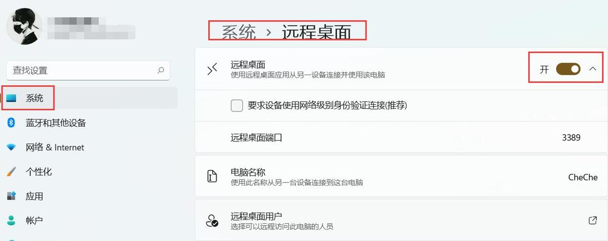
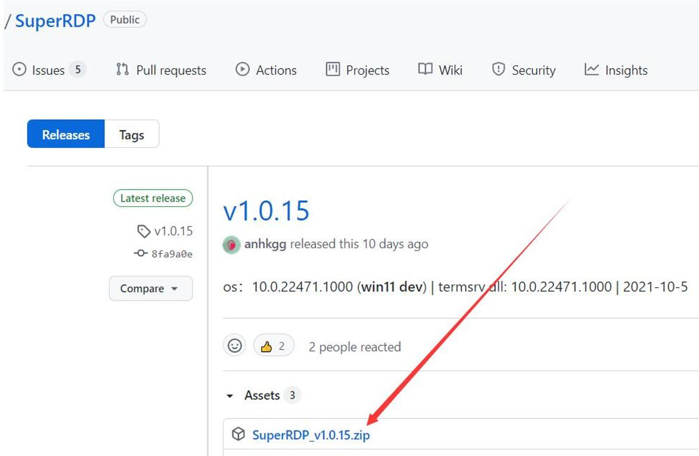
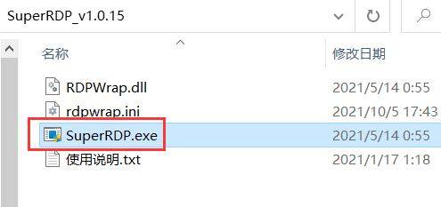
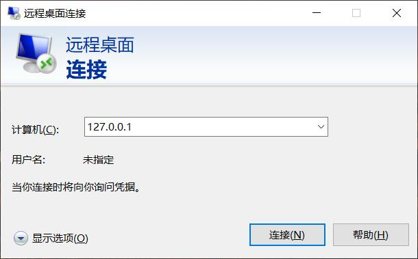
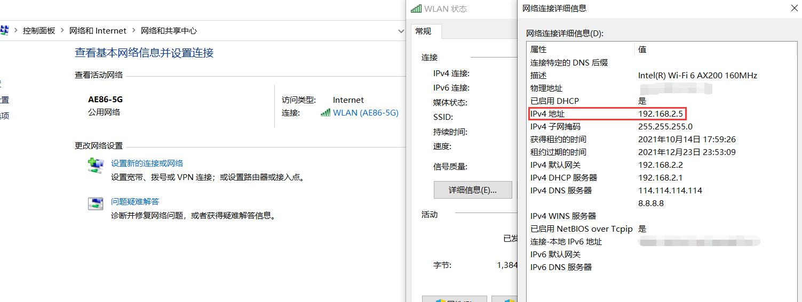
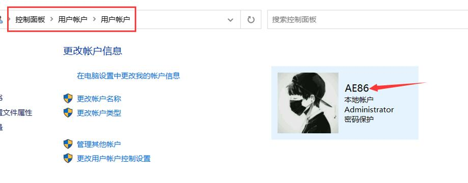

** 首先确保已正确安装ddnsto插件，并且在控制台能看到对应设备在线 [参考安装教程](/zh/guide/ddnsto/start.md) **

## Windows RDP远程桌面

### A.专业版开启RDP

**Windows专业版或者更高级的版本是有开关的，可以直接开启电脑的RDP。**

1.Win11：设置——系统——远程桌面——启用

  

2.Win10：设置——系统——远程桌面——启用远程桌面  

  

3.Win7：右键我的电脑——属性——左边侧栏高级系统设置——远程，在下方“远程桌面”方框下勾选“允许远程连接到此计算机”
  
  
  
  
### B.家庭版开启RDP

**Windows家庭版是无法直接开启电脑的RDP，所以需要借助工具。**

1.首先，需要安装SuperRDP
 [点击进入下载](https://github.com/anhkgg/SuperRDP/releases)；

  

2.下载后解压，运行SuperRDP.exe(需管理员权限)；

  
  
运行后，根据提示选择1(安装)即可。
  
  

3. 验证远程桌面服务是否成功。

* Win+R，输入 mstsc.exe 启动远程桌面程序；

* 输入127.0.0.1，连接成功基本验证服务启用成功。

  
  

### C.开始设置  
  
1.查看被控制的电脑的IP和用户名/密码。

* 查看IP：控制面板——网络和Internet——网络共享中心，点击“连接”，出来弹窗点击“详细信息”——IPv4地址。

ps：查看IP方法很多，不一定是这一种。

  

* 查看用户名：控制面板——用户账户——用户账户，能看到用户名，密码自己设定的。

PS：某些用户是用的微软帐号，没启用本地帐号，那么就使用微软帐号和密码。

或者简单点：电脑开机登录的时候，显示的用户名和要输入的密码。

    
 
2.在ddnsto可用应用列表中点击添加远程RDP，填入被控电脑的IP，用户名，密码等信息。

    
   
3.在已添加中找到刚添加的远程RDP，点击即可进入进入RDP，操控远程电脑。 

     
   
4.相关提醒：

* 被控电脑必须联网且是在设置好穿透(DDNSTO)的网络下；
  
ps：假如想远程朋友的电脑，朋友的电脑只是联网，没DDNSTO，那么是不可控的。
  
* 被控电脑必须是开机状态，且没进入休眠状态。
  
  
##  VNC远程桌面
1.VNC服务端下载、安装、配置。例如：[安装RealVNC](https://www.realvnc.com/en/connect/download/vnc/)

     

2.而DDNSTO的远程VNC，充当VNC Viewer，写好参数，就能远程了。
 
     

## 相关链接
- 如需更流畅、更快，或想使用windows远程桌面客户端，请使用易有云[异地互联](/zh/guide/linkease/remote.md)