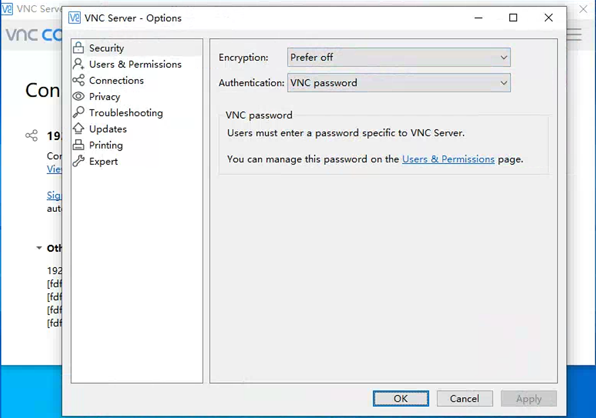

** 首先确保已正确安装ddnsto插件，并且在控制台能看到对应设备在线 [参考安装教程](/zh/guide/ddnsto/start.md) **

### [查看被控电脑如何开启远程桌面教程](/zh/guide/wiki/remote.md)
## RDP远程桌面

1.[如何查看被控电脑的用户名和密码教程](/zh/guide/wiki/remote.md#查看被控电脑的用户名和密码)
2.在ddnsto可用应用列表中点击添加远程RDP，填入被控电脑的IP，用户名，密码等信息。

    
   
3.在已添加中找到刚添加的远程RDP，点击即可进入进入RDP，操控远程电脑。 

   
   
**4.相关提醒：**

* 被控电脑必须联网且是在设置好穿透(DDNSTO)的网络下；
  
ps：假如想远程朋友的电脑，朋友的电脑只是联网，没DDNSTO，那么是不可控的。
  
* 被控电脑必须是开机状态，且没进入休眠状态。
  
  
## VNC远程桌面

DDNSTO的远程VNC，充当VNC Viewer，写好参数，就能远程了。
 

### VNC Server配置

如果你使用VNC Server提供服务， 需要在设置页面“Security”页面将 Encryption 选为“Prefer off”以及 Authentication选为“VNC password”

## 相关链接
- 如需更流畅、更快，或想使用windows远程桌面客户端，请使用易有云[异地互联](/zh/guide/linkease/function/remote_connects.html)。
