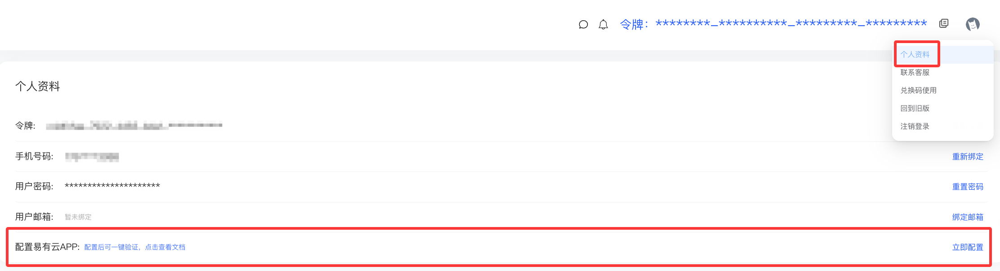
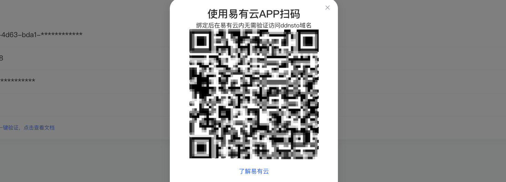
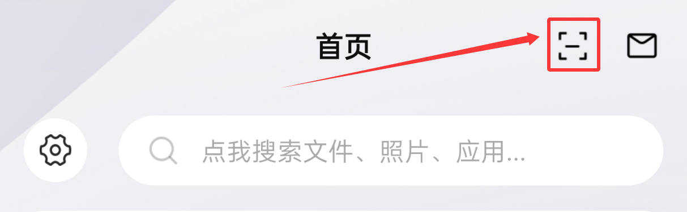
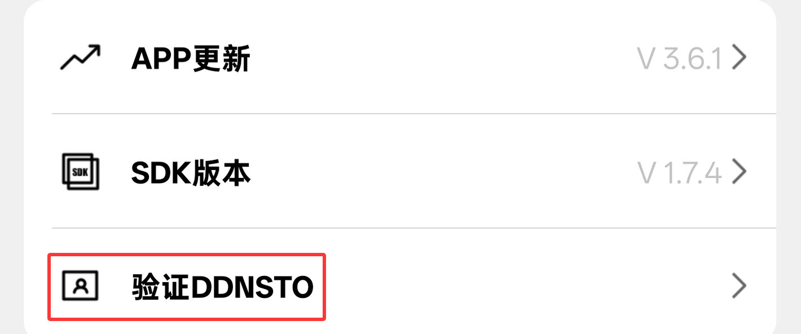
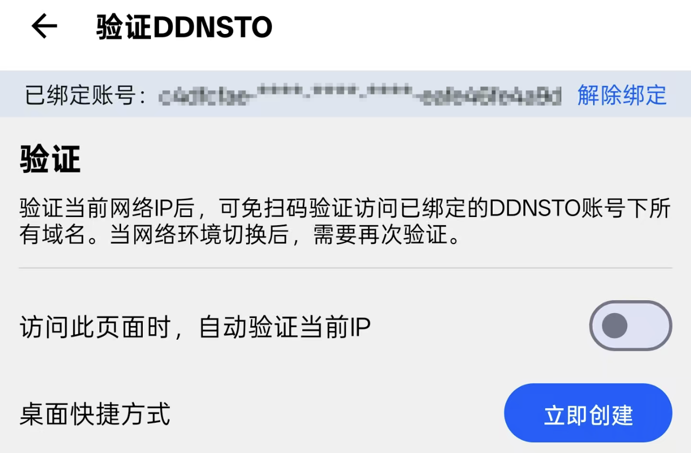
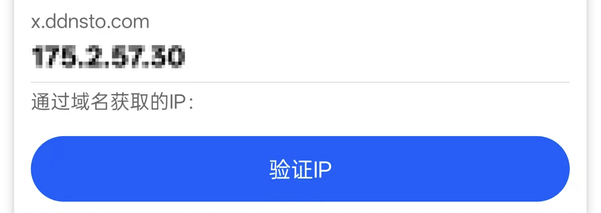

# 身份验证

---

## 什么是身份验证？为什么要验证？

DDNSTO在保护用户数据安全同时也要避免恶意分享不良内容带来的法律风险，所以我们对用户的域名访问都做了认证判断：服务器会判断用户当前IP是否已经过验证，如果没有就会跳转验证流程。

所以当你的第三方客户端使用DDNSTO时，需要先访问一遍对应域名进行身份验证。否则客户端可能会出现连接失败或假死等错误。

---

## 服务器判断验证逻辑

如果当前访问域名的请求的公网IP未经验证（或距离上一次验证已超过 48 小时），则需要用户进行验证。

---

## 验证方法

当需要进行验证时，访问穿透域名时会要求验证DDNSTO，DDNSTO验证页面，可以使用如下方式验证：

## 微信扫码/账号 → 验证DDNSTO

- 弹出的验证窗口直接微信(此微信已绑定DDNSTO)扫码验证，或者绑定了手机号的用户可以使用手机号码和登录密码验证。

- 如果使用手机浏览器，请截图二维码，在微信APP内选择截图扫码。

## 易有云APP → 验证DDNSTO

- #### 易有云APP需与访问穿透外网域名的设备处于同一网络环境。例如：用电脑浏览器访问该域名时，验证的手机必须和电脑连同一网络。 

- [易有云APP下载](https://doc.linkease.com/downloads/)，安装易有云APP后，先注册登录；

- 登录到DDNSTO控制台，右上角用户头像，选择「个人资料」 → 配置易有云APP → 立即配置，弹出一个二维码界面；

- 易有云APP → 「首页」 → 顶部「扫码」按钮 → 扫描此二维码，按照提示步骤，一步步完成绑定即可。

- 绑定成功后，需要DDNSTO验证时，易有云APP → 「我的」 → 「验证DDNSTO」 → 「验证IP」即可。

- 若需解除绑定，易有云APP → 「我的」 → 「验证DDNSTO」 → 「解除绑定」即可。
