# 新手学院

> ⚙️ DDNSTO 套餐、服务器、解绑等基础操作指南

---

## 购买套餐

1. 登录 DDNSTO 控制台 → 购买套餐 → 选择方案 → 购买

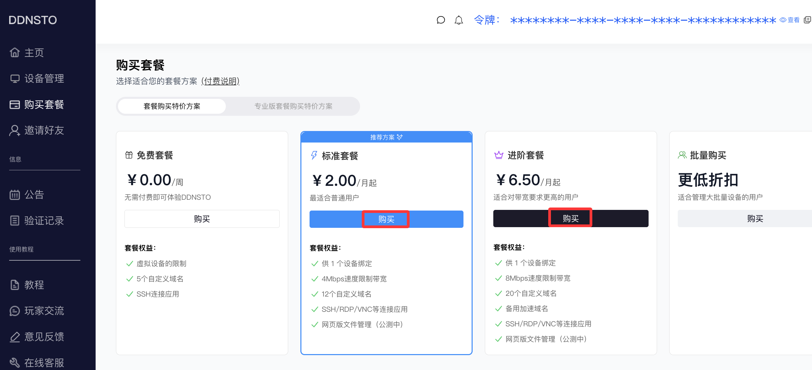

2. 选择设备

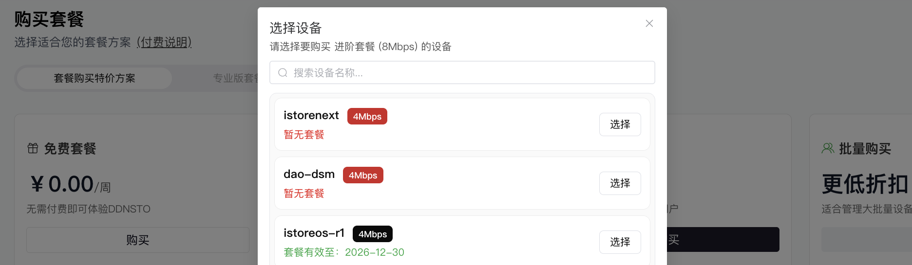

3. 选择适合自己的续费套餐，完成支付即可

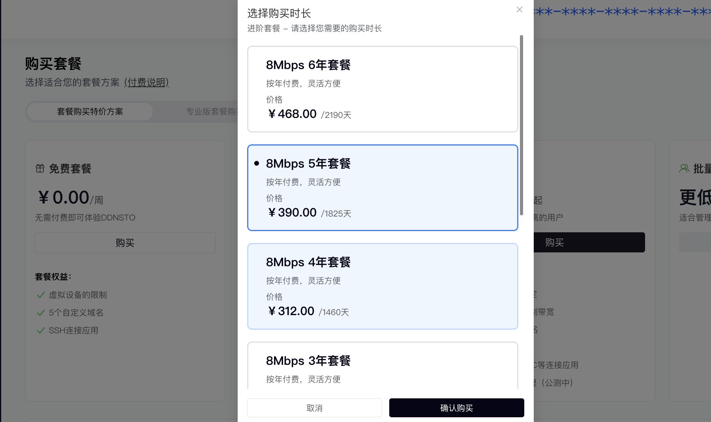

---

## 套餐绑定

登录 DDNSTO 控制台 → 设备管理 → 点击设备 → 套餐管理 → 「+套餐管理」 → 找到“未使用”的套餐 → “绑定至本机”

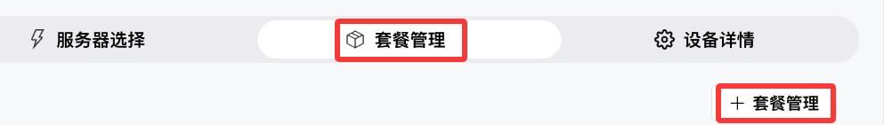

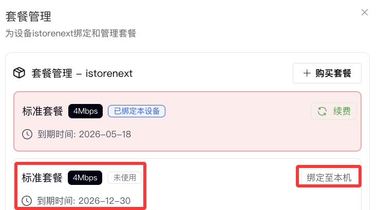

---

## 套餐解绑

1. 登录 DDNSTO 控制台 → 设备管理 → 点击设备 → 套餐管理 → 「解绑」

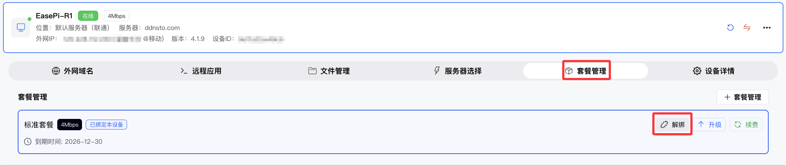

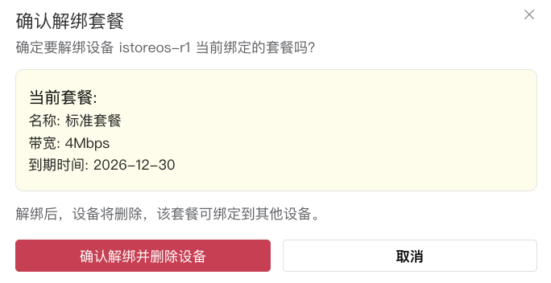

2. 解绑后的套餐可绑定到其他设备

---

## 切换服务器

1. 登录 DDNSTO 控制台 → 设备管理 → 点击设备 → 服务器选择
2. 选择目标服务器

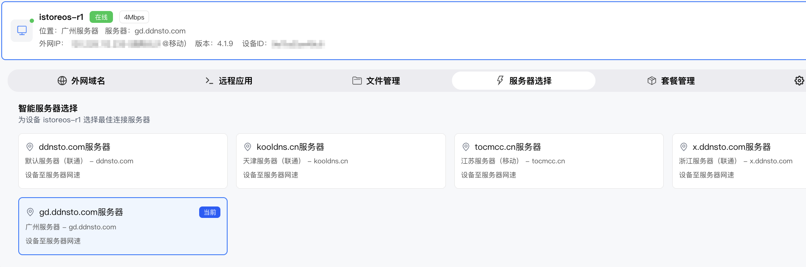

3. 服务器切换成功后，外网域名的域名地址也会变更

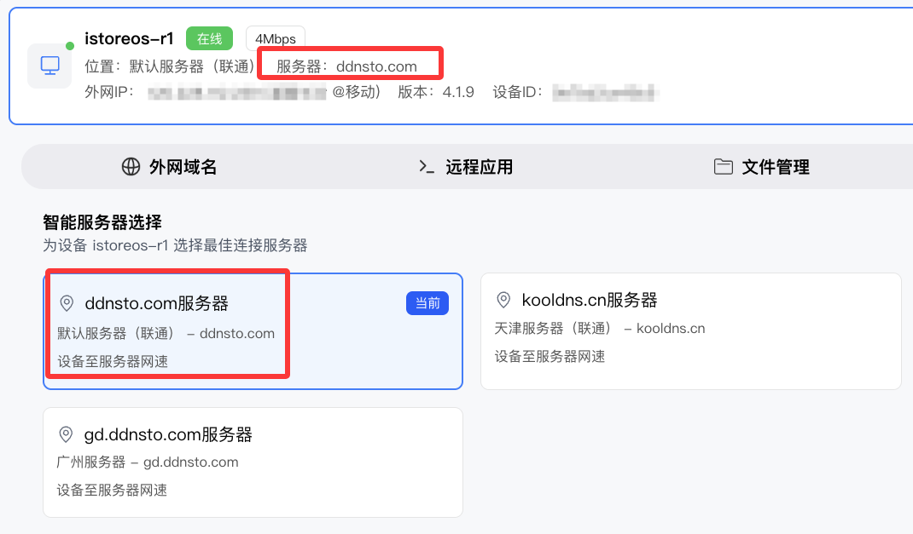

---

## 套餐续费

1. 登录 DDNSTO 控制台 → 设备管理 → 点击设备 → 套餐管理 → 「续费」

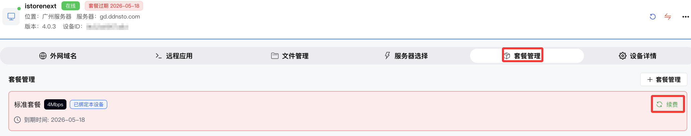

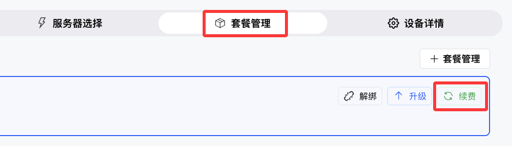

2. 选择适合自己的续费套餐，完成支付即可

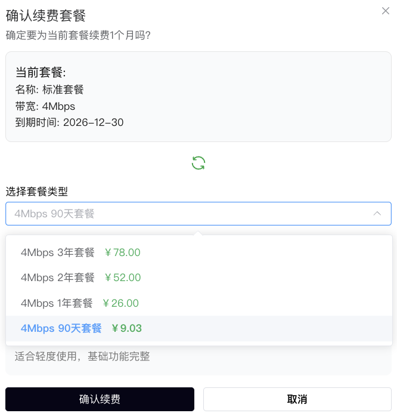

---

## 套餐升级

从低带宽套餐升级到高带宽套餐：

1. 登录 DDNSTO 控制台 → 设备管理 → 点击设备 → 套餐管理 → 「升级」

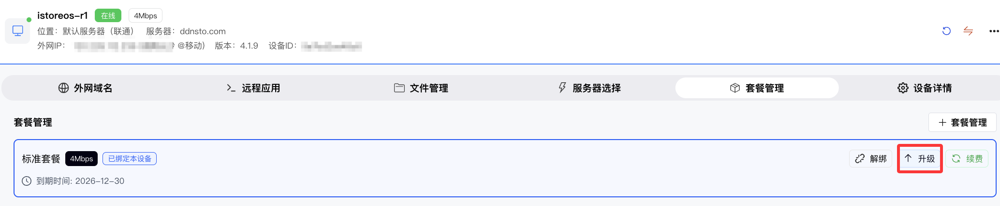

2. 选择适合自己的升级套餐，完成支付即可

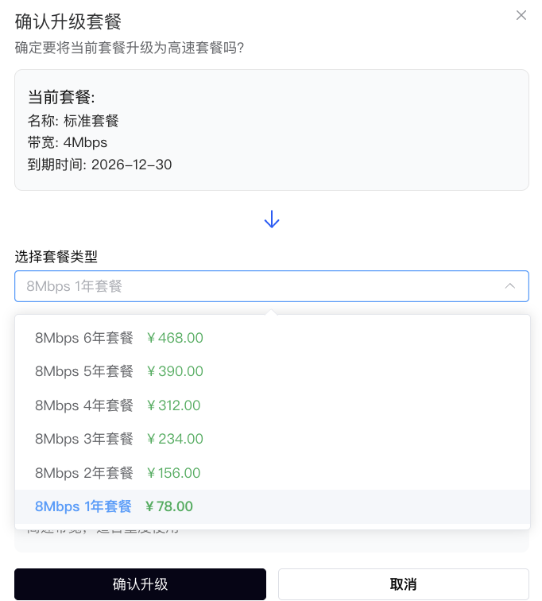

---

## 兑换码使用

1. 登录 DDNSTO 控制台 → 点击头像 → **"兑换码使用"**

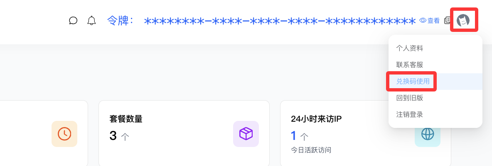

2. 输入兑换码激活

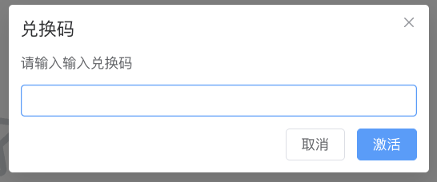

---

## 删除设备

1. 登录 DDNSTO 控制台 → 设备管理 → 点击设备 → 更多选项 → 「删除」

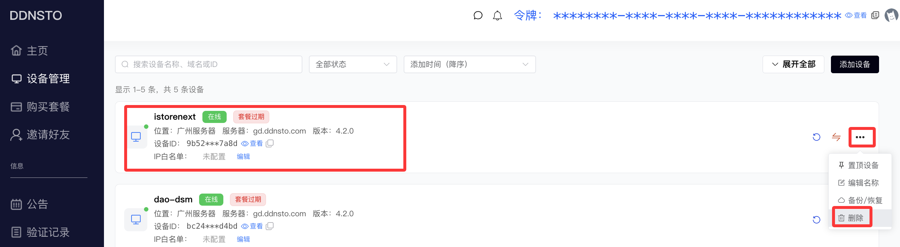

2. 输入要删除的设备的名称 → 确认删除

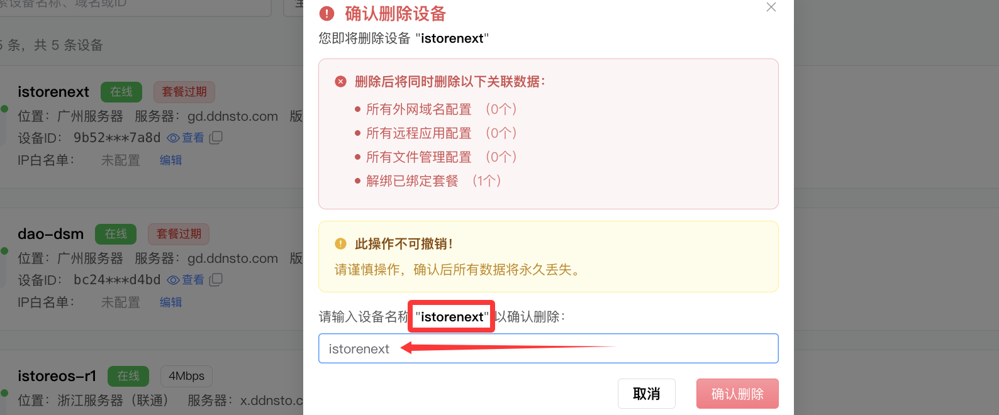

