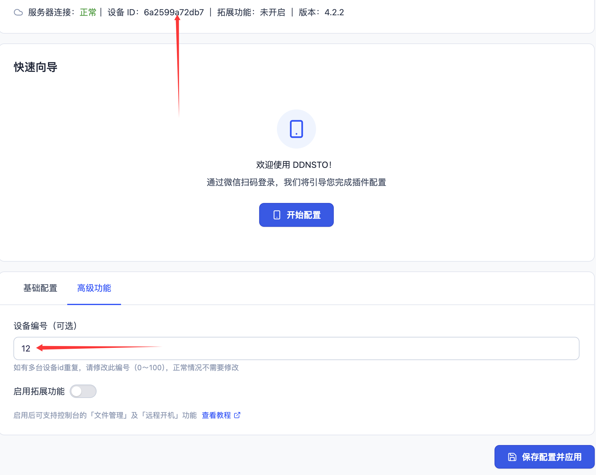
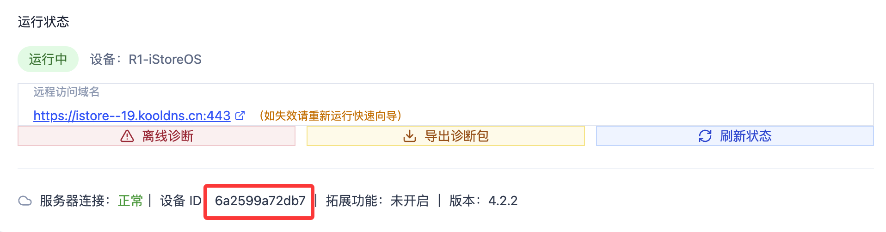
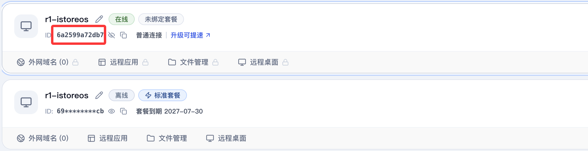
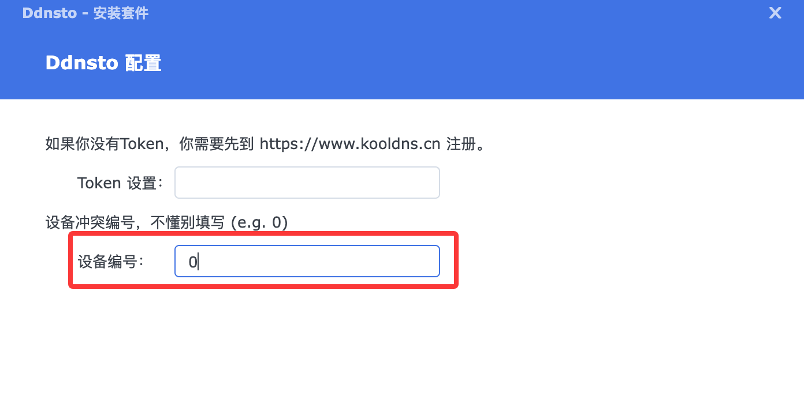

# 设备编号/ID

> 🏠 通过 ID 帮你分清多个 DDNSTO 设备

---

## 什么是设备编号/ID？

DDNSTO 绑定设备的唯一编号，但是如果你有多台设备，或者一台设备重复添加过，都可能导致 ID 重复，所以需要区分。

如果 ID 重复可能导致 DDNSTO 无法正常使用，那么怎么设置编号来区别各个设备呢？

---

## 如何设置不一样的编号？

### iStoreOS/OpenWrt 设置编号？

* DDNSTO ——> 高级功能 ——> 设备编号：如果多个设备，按照 0-100 区别，然后提交应用；



* 提交运行以后，DDNSTO 插件会显示重新生成的设备 ID，根据这个设备 ID 去 DDNSTO 控制台查看绑定设备的 ID， 就能确定设备。





---

### Docker 设置编号？

* 如果有多个 docker 容器，通过[Docker通用安装教程](../quickstart/install-guide/docker.md)中的 DEVICE_NAME 参数，让每个 Docker 的 ID 不一样。


```yaml
      - DEVICE_NAME=<自定义唯一设备名称ID>
```
- `<自定义唯一设备名称ID>`: 必须是英文字母、数字，不能为中文；比如：`abc9527`

---

### 群晖设置编号？

* 如果有多台群晖设备，通过[群晖安装教程](../quickstart/install-guide/synology.md)安装过程中，添加不一样的设备编号（按照 0-100 区别），让每台群晖设备的 ID 不一样。



