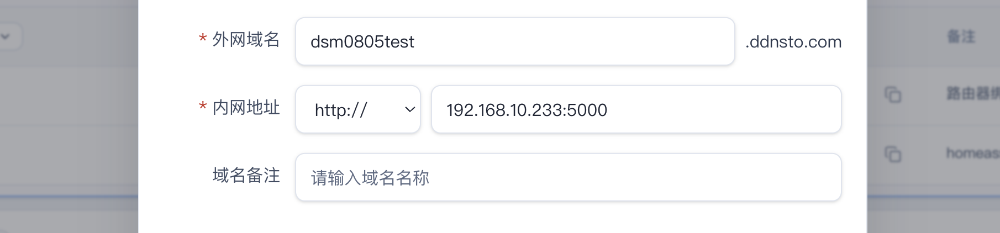
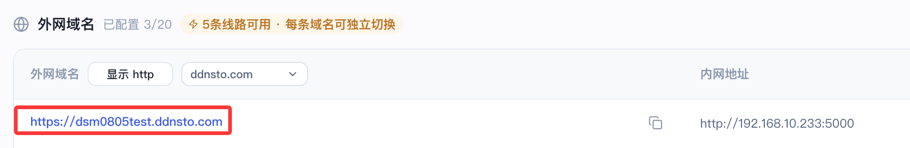
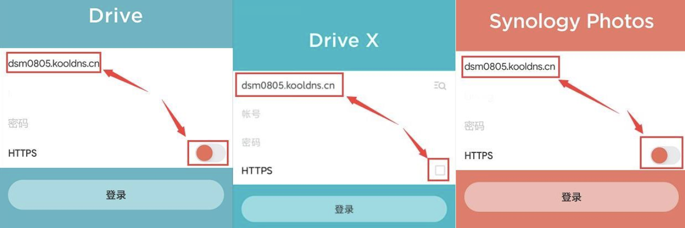
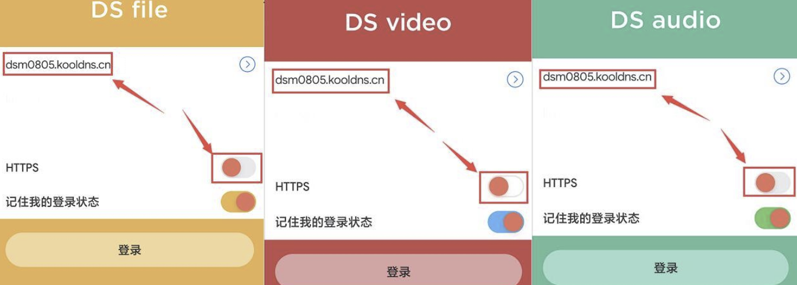
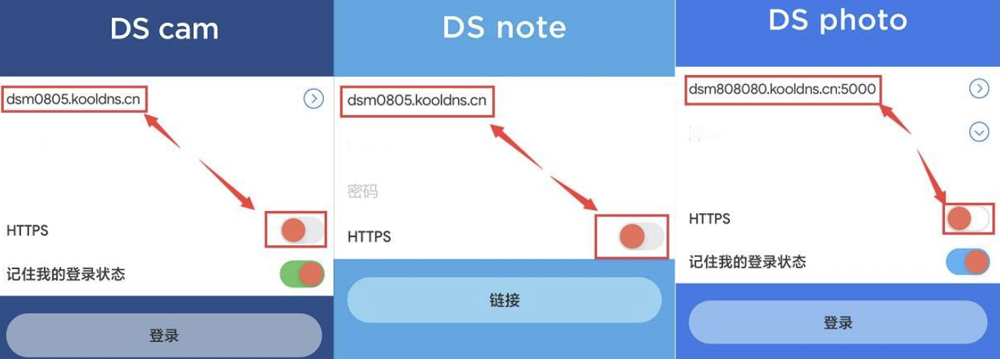
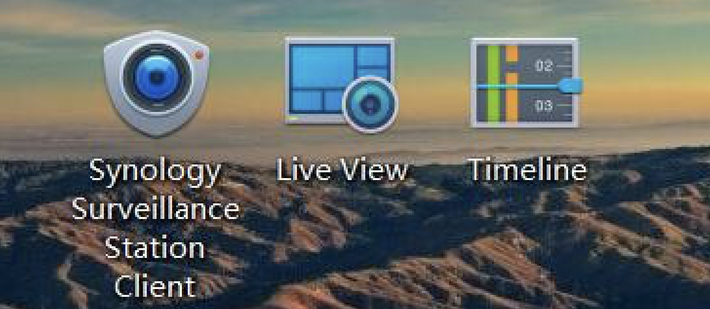
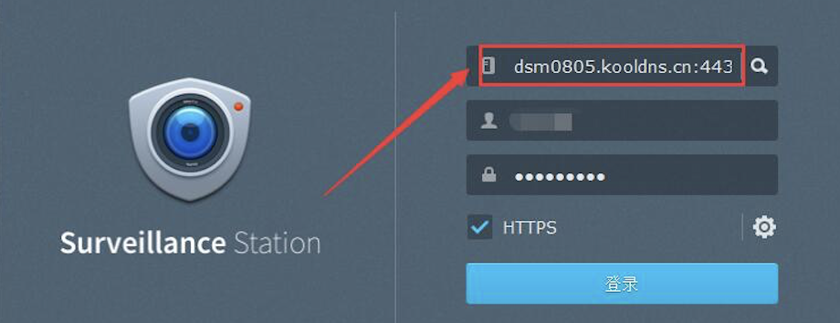

# 远程穿透群晖

> 🏠 DDNSTO 远程访问群晖 NAS

---
## 穿透 → 群晖WEB管理页

1、[群晖 NAS 安装 DDNTO](/zh/guide/ddnsto/quickstart/install-guide/synology.html#安装步骤) 

2、DDNSTO 控制台添加外网域名：

进入[DDNSTO 控制台](https://www.ddnsto.com/app/#/login) → 设备工作台 → 点击选择设备 → 「外网域名」 → **"+添加域名"** 





3、点击添加成功的外网域名，即可访问。

---

## 穿透 → 群晖APP

- 首先在手机端需要验证 DDNSTO，可用 [易有云 APP 验证 DDNSTO](/zh/guide/ddnsto/scenarios/authentication.html#_2%E3%80%81%E6%98%93%E6%9C%89%E4%BA%91app-%E2%86%92-%E9%AA%8C%E8%AF%81ddnsto) 

- 支持 Synology Drive、Drive X、Synology Photos、DS file、DS video、DS audio、DS cam、DS note、DS photo 等套件的配套手机 APP

- 安装这些 APP 并打开，地址栏填入已添加的外网域名（去掉```https://```和尾部```端口```，如 ```dsm0805.kooldns.cn```）

- 帐号和密码均为群晖登录帐号和密码，不勾选 HTTPS，即可登录。





ps：DS photo 需要带5000端口！



---

## 穿透 → 群晖电脑程序

- 电脑端支持 Synology Surveillance Station Client、Live View、Timeline 程序



- 三个程序设置都是一致：

打开Synology Surveillance Station Client，地址栏填入5000端口```去掉https://```的ddnsto外网域名（如 ```dsm0805.kooldns.cn:443```），帐号和密码均为群晖登录帐号和密码，登录就ok




- Synology Drive Client，ddnsto无法穿透。建议使用易有云的电脑端设备互联功能(异地组网)来实现。

[设备互联——远程网段教程](/zh/guide/linkease/tips/syno_drive.html)


---
