# 文件管理

> 📁 远程访问和管理 NAS、路由器上的文件
> ⏱️ 预计配置时间：10 分钟
> 📱 支持协议：Samba、SFTP、WebDAV

---

## 功能概述

DDNSTO 文件管理功能让你可以在浏览器中远程访问：

- 📂 NAS 上的共享文件夹（Samba）
- 🖥️ Linux 服务器的文件（SFTP）
- 🌐 WebDAV 服务

**使用条件：**
- ✅ 已购买会员套餐
- ✅ 设备已启用扩展功能
- ✅ 仅 **iStoreOS/OpenWrt/ASUSG改版固件** 支持拓展功能！
- ✅ 仅支持 PC 端浏览器

---

## 前置准备/启用本机WebDav服务

### 1. 启用扩展功能

1. iStoreOS/OpenWrt 进入 DDNSTO 插件 → 高级功能
2. 勾选 **"启用扩展功能"**
3. 设置 WebDAV 服务参数：
   - **端口**: 3033（可自行设置）
   - **用户名**: 自定义
   - **密码**: 自定义
   - **可访问的文件目录**: 选择要共享的目录
   - **保存配置并应用**: 应用更改

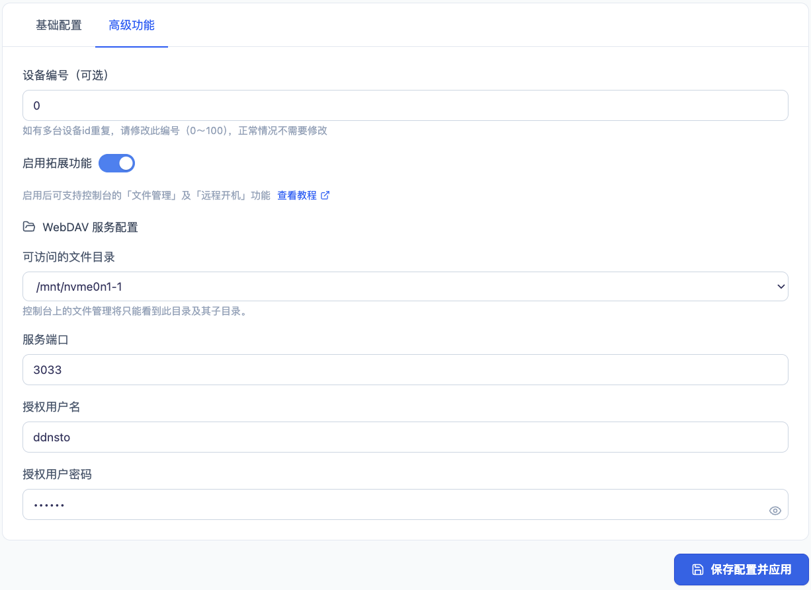

4. ASUSG改版固件进入 DDNSTO 插件 → ddnsto-扩展功能勾选 **"启用"**
5. 设置 WebDAV 服务参数：
   - **端口**: 3033（可自行设置）
   - **授权用户名**: 自定义
   - **授权密码**: 自定义
   - **共享磁盘**: 选择要共享的磁盘
   - ASUSGO改版固件设备，必须接入USB存储设备(U盘、移动硬盘等)
   - **提交**: 应用更改

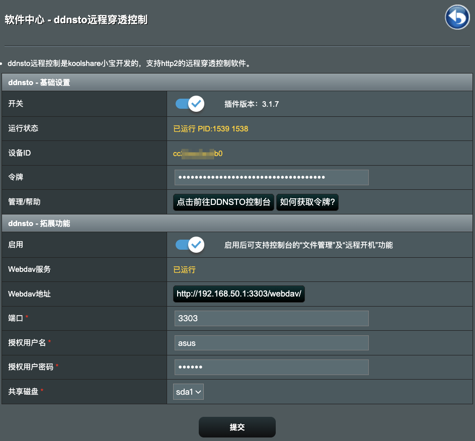

---

## 添加文件管理协议

DDNSTO 控制台 → 设备管理 → 选择已绑定设备：点击 **"文件管理"** → **"添加"**

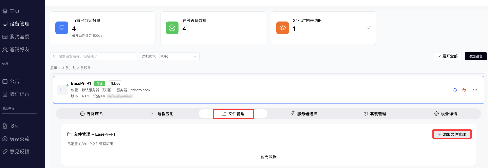

支持 webdav/samba/sftp 协议！

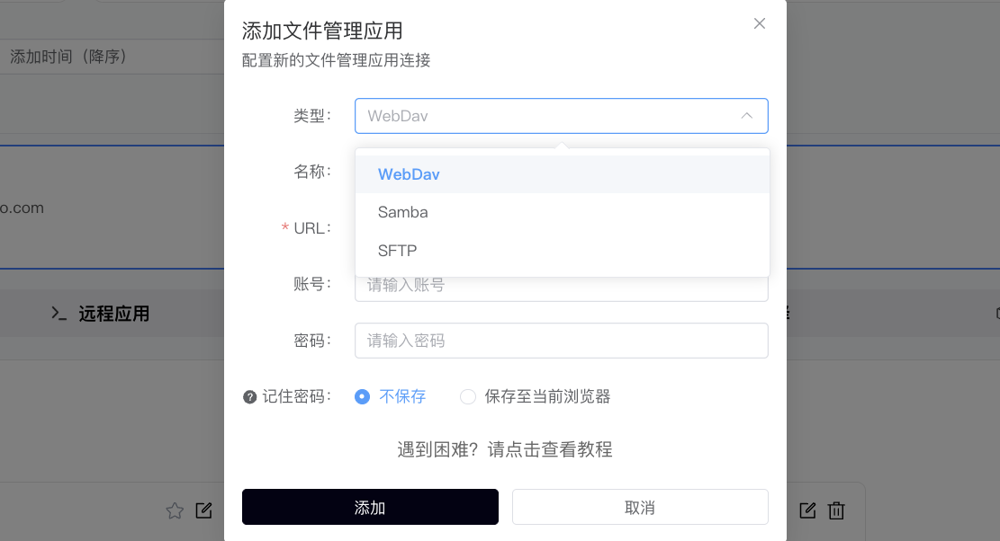

---

## 添加 WebDav 协议

| 配置项 | 值 | 说明 |
|-------|-----|------|
| 类型 | WebDav | 选择文件传输协议 |
| 名称 | 自定义 | 如"WebDav" |
| URL | WebDav地址 | 如 http://127.0.0.1:3033/webdav |
| 账号 | WebDav账号 | 如实填写；若用 DDNSTO 开启的 WebDAV，按设定填写。 |
| 密码 | WebDav密码 | 如实填写；若用 DDNSTO 开启的 WebDAV，按设定填写。 |

填写WebDav协议的账号和密码，并添加，可选将账号和密码保存到浏览器。

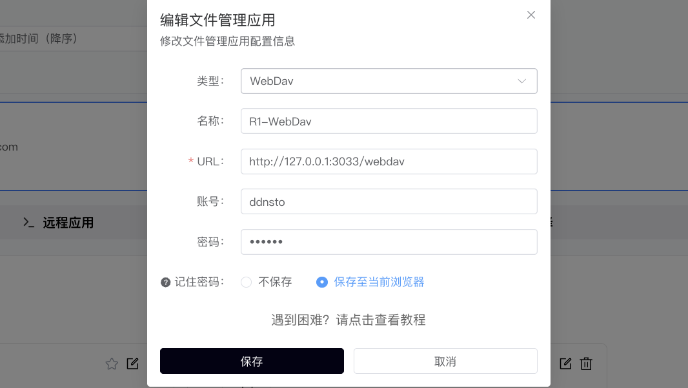

点击 WebDav 图标即可访问。

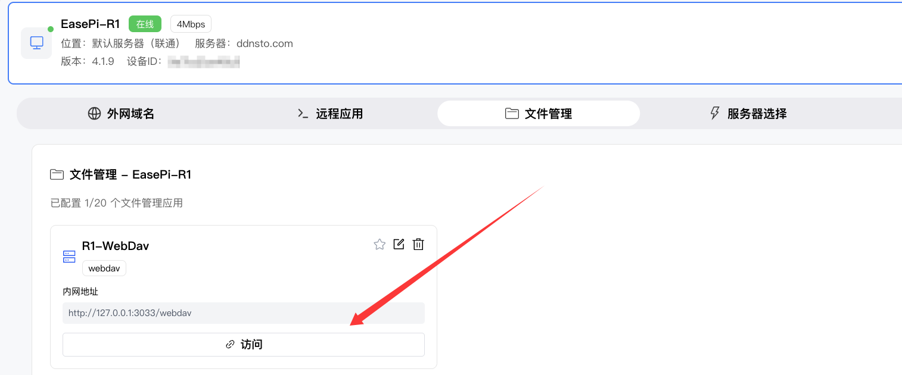

---

## 添加 Samba 协议

| 配置项 | 值 | 说明 |
|-------|-----|------|
| 类型 | Samba | 选择文件传输协议 |
| 名称 | 自定义 | 如"Samba" |
| IP | Samba地址 | 不要写 127.0.0.1，写实际 IP；如 192.168.50.99 |
| 端口 | 445 | 默认即可，自定义，自行更改 |
| 账号 | Samba账号 | 如实填写；如华硕路由器，默认是登录路由器的用户名和密码。 |
| 密码 | Samba密码 | 如实填写；如华硕路由器，默认是登录路由器的用户名和密码。 |
| 工作组 | 默认即可 | 自定义，自行更改 |
| 目标路径 | samba共享名称 | 不能写类似 /mnt/sda 的具体路径，一般填写共享“名称” |

### 关于目标路径： 

#### 比如：iStoreOS/OpenWrt设置samba共享，要填写共享“名称”；如图，目标路径就应该写“r1smb”。 

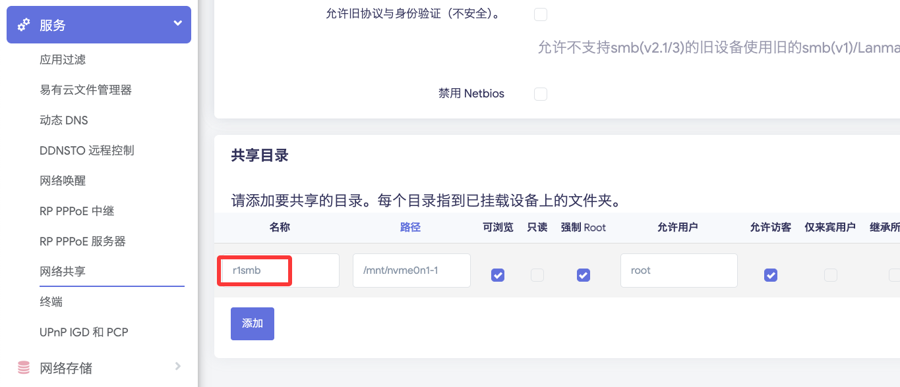

#### 比如：华硕路由器自身的Samba网络共享，要填写挂载路径下的末端文件夹名；如图，目标路径就应该写“tmp、DockRootBin、DockRootData”中的任一文件夹名。 

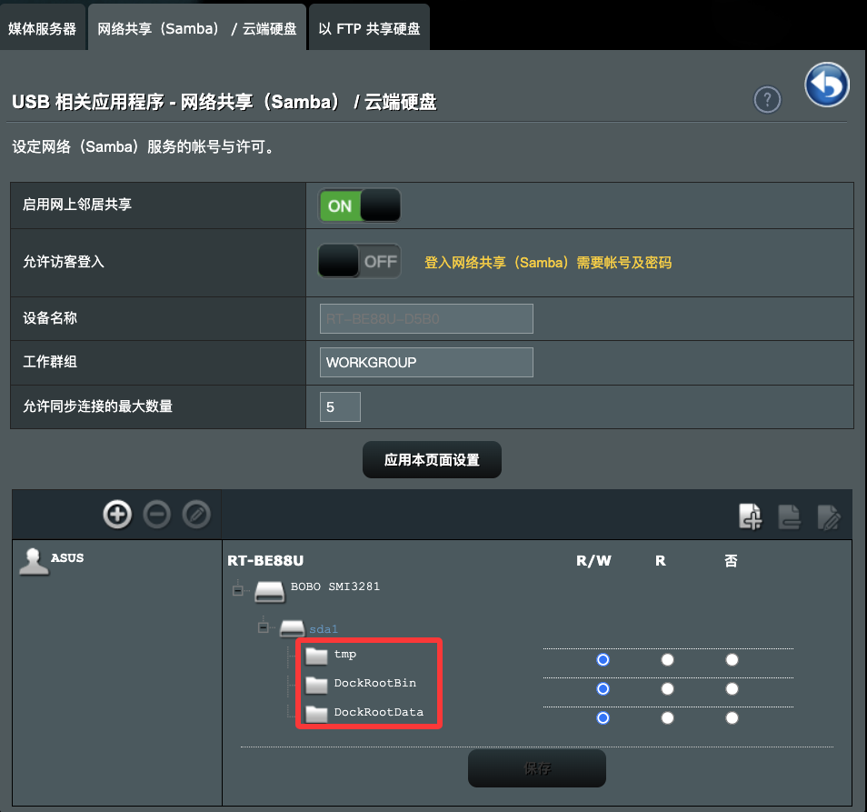

填写Samba协议的账号和密码，并添加，可选将账号和密码保存到浏览器。

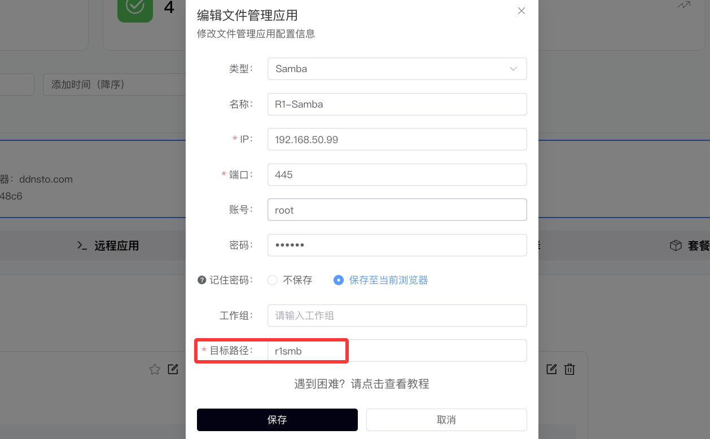

点击 Samba 图标即可访问。

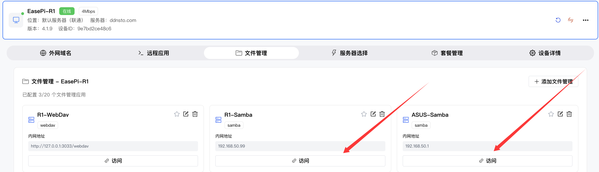

---

## 添加 Sftp 协议

| 配置项 | 值 | 说明 |
|-------|-----|------|
| 类型 | Sftp | 选择文件传输协议 |
| 名称 | 自定义 | 如"Sftp" |
| IP | Sftp地址 | 如 127.0.0.1 |
| 端口 | 22 | 默认即可，自定义，自行更改 |
| 账号 | Sftp账号 | 如实填写；如iStoreOS/OpenWrt，默认是登录路由器的用户名和密码。 |
| 密码 | Sftp密码 | 如实填写；如iStoreOS/OpenWrt，默认是登录路由器的用户名和密码。 |

填写Sftp协议的账号和密码，并添加，可选将账号和密码保存到浏览器。

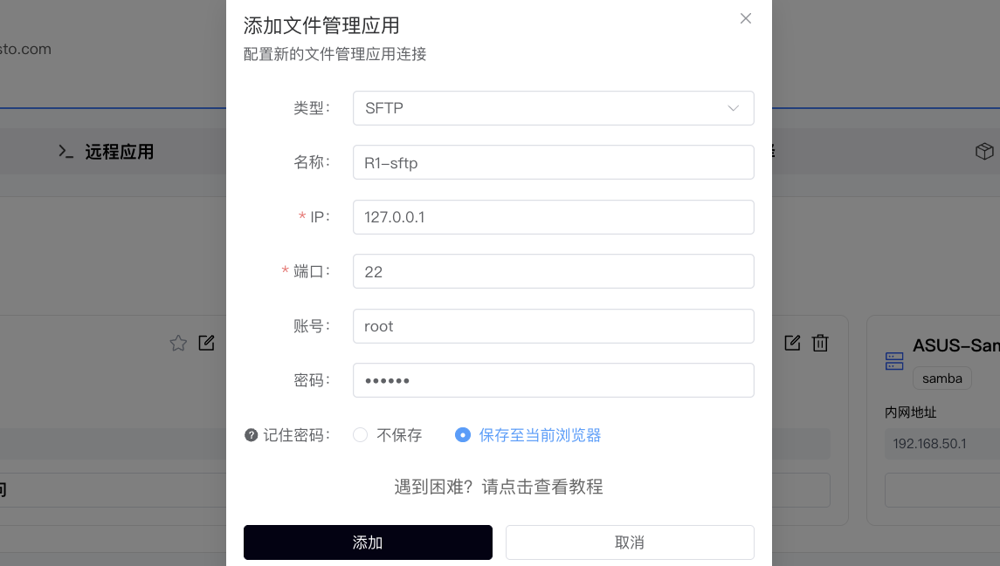

点击 Sftp 图标即可访问。

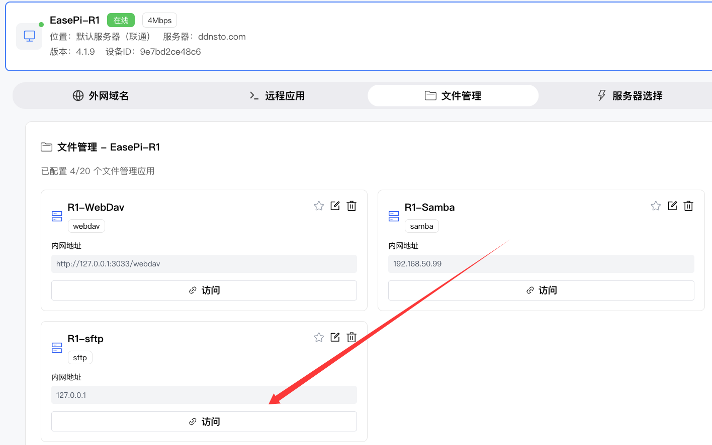

---

## 文件操作

### 支持的文件操作

- 📂 浏览文件夹
- 📥 下载文件
- 📤 上传文件
- 📝 新建文件夹
- 🗑️ 删除文件/文件夹
- ✏️ 重命名

### 文件传输限制

| 操作 | 限制说明 |
|------|---------|
| 单文件上传 | 取决于浏览器内存 |
| 单文件下载 | 无限制，但大文件建议用专业工具 |
| 批量操作 | 支持多选 |

---

## 常见问题

### Q: 提示"需要会员套餐"？
A: 文件管理是会员功能，请购买会员套餐并切换到会员服务器。

### Q: Samba 连接失败？
A: 检查：
- Samba 服务是否运行
- 用户名密码是否正确
- 目标路径是否填写共享名称（不是实际路径）
- 工作组是否匹配

### Q: SFTP 连接失败？
A: 检查：
- SSH 服务是否运行
- 用户名密码是否正确
- 端口是否正确（默认22）

### Q: 大文件传输失败？
A: 大文件传输建议：
- 使用专业 FTP/SFTP 客户端
- 或使用易有云进行同步

### Q: 文件管理支持手机吗？
A: 目前仅支持 PC 端浏览器访问。

---

## 下一步

- ⬇️ [设置远程下载](./remote-download.md) —— 远程控制下载任务
- ⚡ [配置远程开机](./remote-wol.md) —— 需要时远程唤醒设备
- 🖥️ [远程桌面](./remote-desktop.md) —— 远程管理文件更方便
