# 文件管理

> 📁 远程访问和管理 NAS、路由器上的文件
> ⏱️ 预计配置时间：10 分钟
> 📱 支持协议：Samba、SFTP、WebDAV

---

## 功能概述

DDNSTO 文件管理功能让你可以在浏览器中远程访问：

- 📂 NAS 上的共享文件夹（Samba）
- 🖥️ Linux 服务器的文件（SFTP）
- 🌐 WebDAV 服务

**使用条件：**
- ✅ 已购买会员套餐
- ✅ 设备已启用扩展功能
- ✅ 仅支持 PC 端浏览器

---

## 前置准备

### 1. 启用扩展功能

1. 进入 DDNSTO 插件 → 扩展功能
2. 勾选 **"启用扩展功能"**
3. 设置 WebDAV 服务参数：
   - **端口**: 3344（可自行设置）
   - **用户名**: 自定义
   - **密码**: 自定义
   - **共享磁盘**: 选择要共享的目录


4. 保存并应用

---

### 2. 切换到会员套餐

1. 登录 [DDNSTO 控制台](https://www.ddnsto.com/app/#/login)
2. 购买会员套餐
3. 将设备套餐切换为会员套餐


---

## 添加文件管理协议

1. 控制台点击 **"文件管理"** → **"添加"**

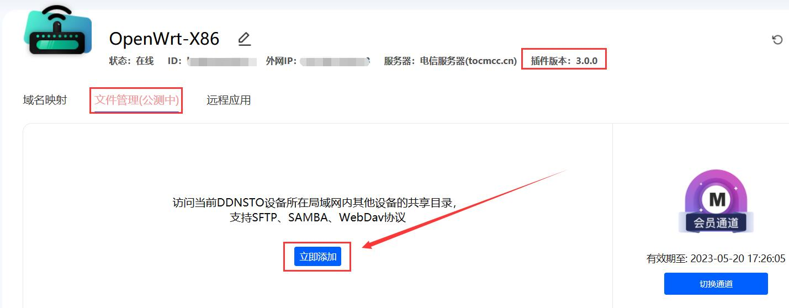

2. 选择 **"手动添加"**

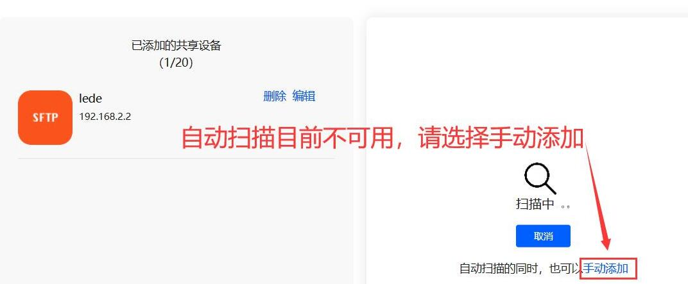

---

## Samba 协议配置

### 1. 确认 Samba 服务已开启

确保局域网内有设备开启了 Samba 共享，且能正常访问。

**OpenWrt/iStoreOS 开启 Samba：**
1. 服务 → 网络共享
2. 设置共享名称和路径
3. 启用

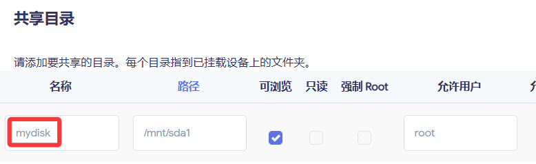

---

### 2. 添加 Samba 协议

| 配置项 | 值 | 说明 |
|-------|-----|------|
| 类型 | Samba | - |
| 名称 | 自定义 | 如"NAS共享" |
| IP | Samba服务器IP | 如 192.168.1.100 |
| 端口 | 445 | 默认即可 |
| 账号 | Samba用户名 | 如 root |
| 密码 | Samba密码 | - |
| 目标路径 | 共享名称 | 如 mydisk（不是/mnt/sda1）|

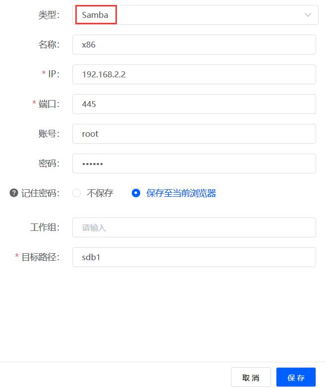

**注意：** 目标路径填写的是共享名称，不是实际路径！

---

### 3. 保存并验证

1. 点击右下角 **"保存"**
2. 系统会自动验证连接
3. 验证通过后显示在列表中

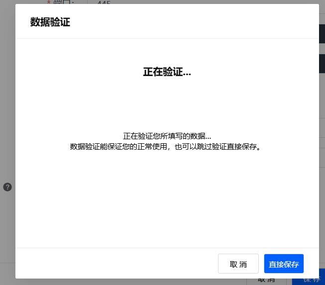

---

### 4. 访问文件

1. 点击 Samba 图标进入文件管理
2. 如需输入密码，填写 Samba 密码

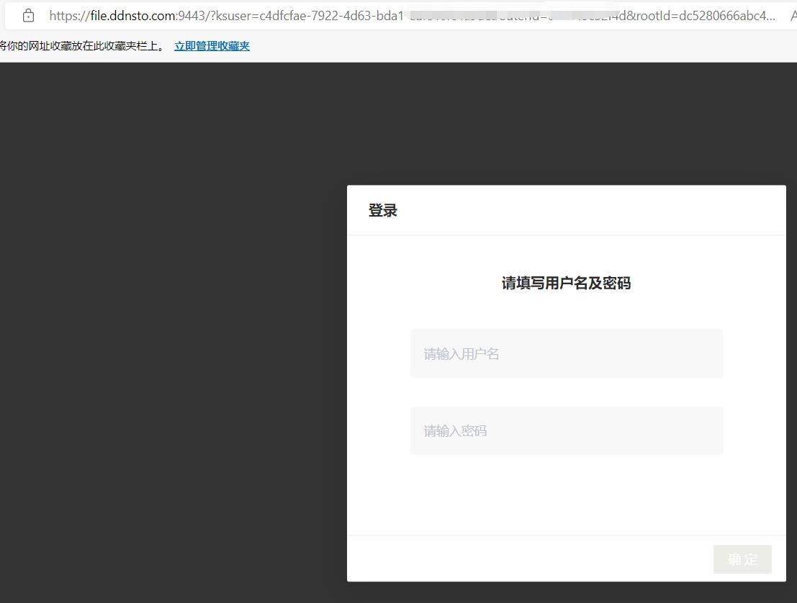

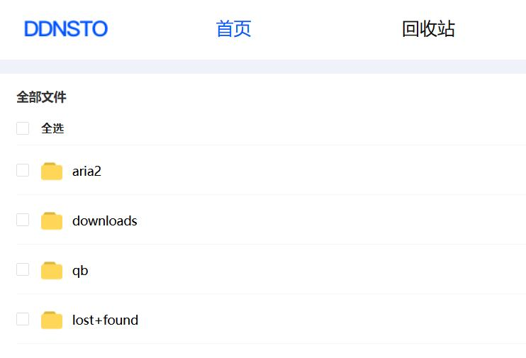

---

## SFTP 协议配置

### 1. 确认 SFTP 服务已开启

大多数 Linux 系统默认开启 SFTP（SSH 自带）。

---

### 2. 添加 SFTP 协议

| 配置项 | 值 | 说明 |
|-------|-----|------|
| 类型 | SFTP | - |
| 名称 | 自定义 | 如"Linux服务器" |
| IP | 服务器IP | 如 192.168.1.10 |
| 端口 | 22 | SSH默认端口 |
| 账号 | 系统用户名 | 如 root |
| 密码 | 系统密码 | - |

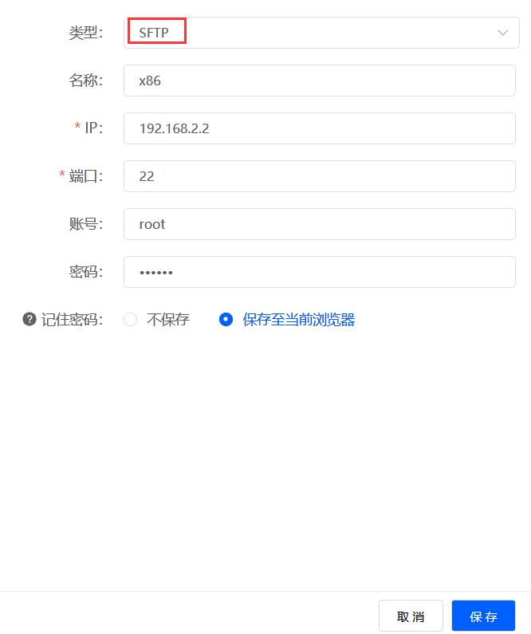

---

### 3. 访问文件

1. 点击 SFTP 图标
2. 输入密码后即可浏览文件

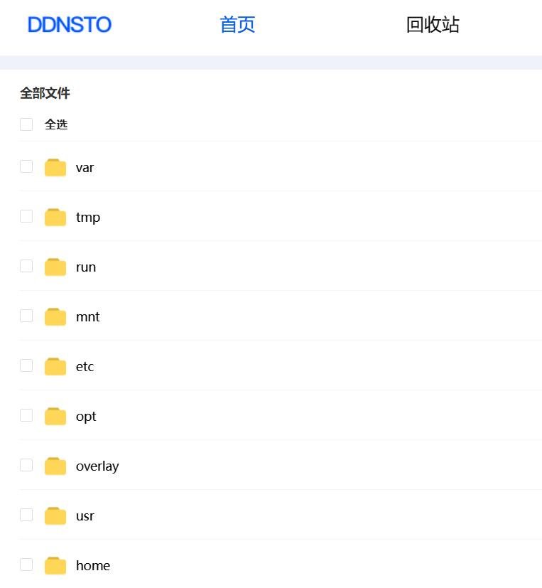

---

## WebDAV 协议配置

### 1. 确认 WebDAV 服务已开启

可以是 NAS 自带的 WebDAV，或其他设备开启的 WebDAV 服务。

---

### 2. 添加 WebDAV 协议

| 配置项 | 值 | 说明 |
|-------|-----|------|
| 类型 | WebDAV | - |
| 名称 | 自定义 | 如"WebDAV存储" |
| URL | WebDAV地址 | 如 http://192.168.1.100:5005 |
| 账号 | WebDAV用户名 | - |
| 密码 | WebDAV密码 | - |

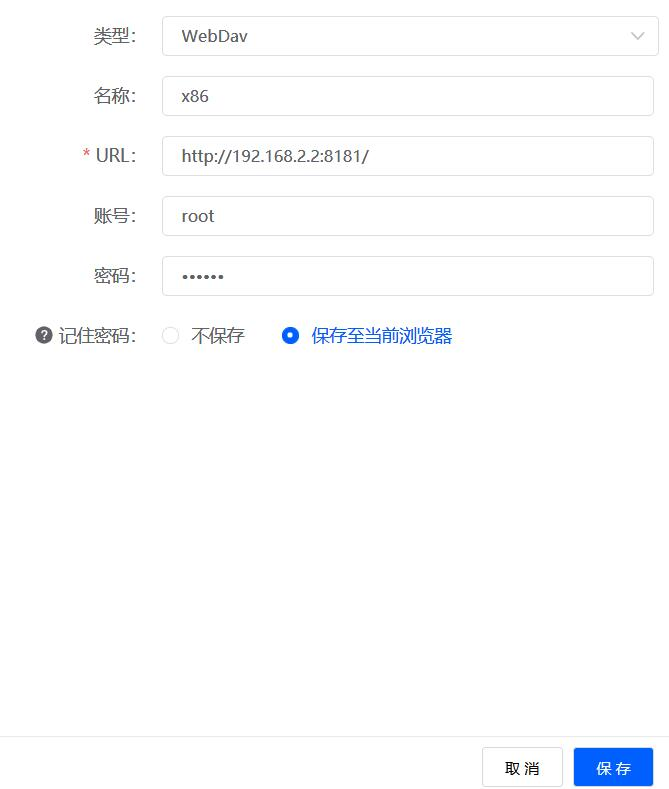

---

### 3. 访问文件

点击 WebDAV 图标即可访问。

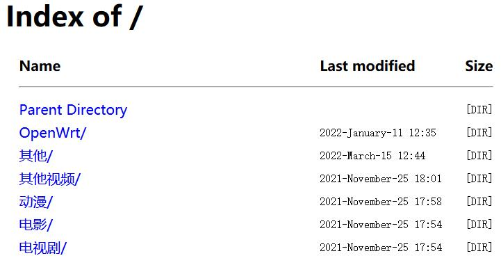

---

## 本机 WebDAV 服务

DDNSTO 扩展功能还可以在本机开启 WebDAV 服务，供局域网内其他设备访问。

### 配置方法

1. 启用扩展功能时设置：
   - **端口**: 3344
   - **用户名/密码**: 自定义
   - **共享磁盘**: 如 /mnt/sda1

2. 局域网内其他设备访问：
   ```
   http://DDNSTO设备IP:3344/webdav
   ```

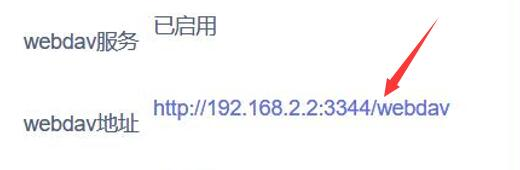

---

## 文件操作

### 支持的文件操作

- 📂 浏览文件夹
- 📥 下载文件
- 📤 上传文件
- 📝 新建文件夹
- 🗑️ 删除文件/文件夹
- ✏️ 重命名

### 文件传输限制

| 操作 | 限制说明 |
|------|---------|
| 单文件上传 | 取决于浏览器内存 |
| 单文件下载 | 无限制，但大文件建议用专业工具 |
| 批量操作 | 支持多选 |

---

## 常见问题

### Q: 提示"需要会员套餐"？
A: 文件管理是会员功能，请购买会员套餐并切换到会员服务器。

### Q: Samba 连接失败？
A: 检查：
- Samba 服务是否运行
- 用户名密码是否正确
- 目标路径是否填写共享名称（不是实际路径）
- 工作组是否匹配

### Q: SFTP 连接失败？
A: 检查：
- SSH 服务是否运行
- 用户名密码是否正确
- 端口是否正确（默认22）

### Q: 大文件传输失败？
A: 大文件传输建议：
- 使用专业 FTP/SFTP 客户端
- 或使用易有云进行同步

### Q: 文件管理支持手机吗？
A: 目前仅支持 PC 端浏览器访问。

---

## 下一步

- ⬇️ [设置远程下载](./remote-download.md) —— 远程控制下载任务
- ⚡ [配置远程开机](./remote-wol.md) —— 需要时远程唤醒设备
- 🖥️ [远程桌面](./remote-desktop.md) —— 远程管理文件更方便
