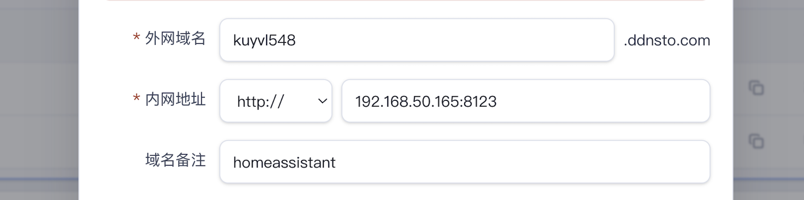
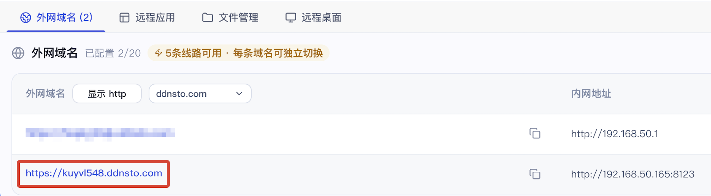
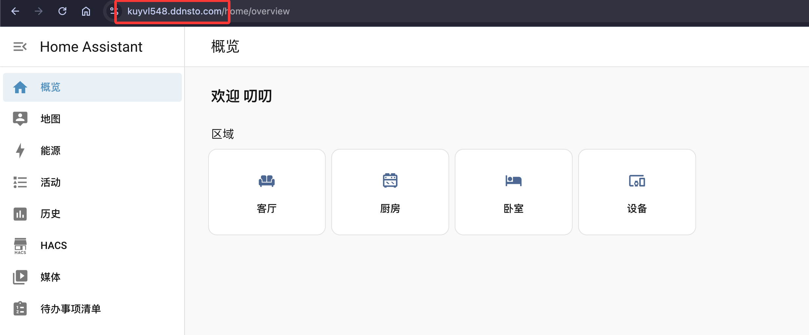
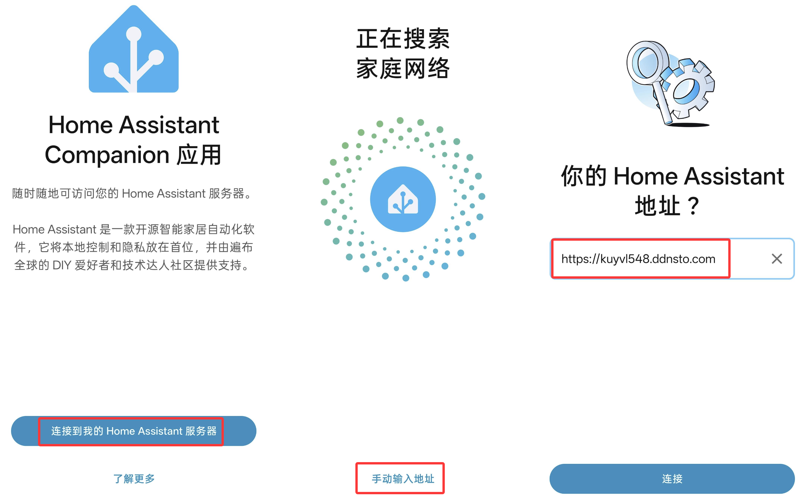
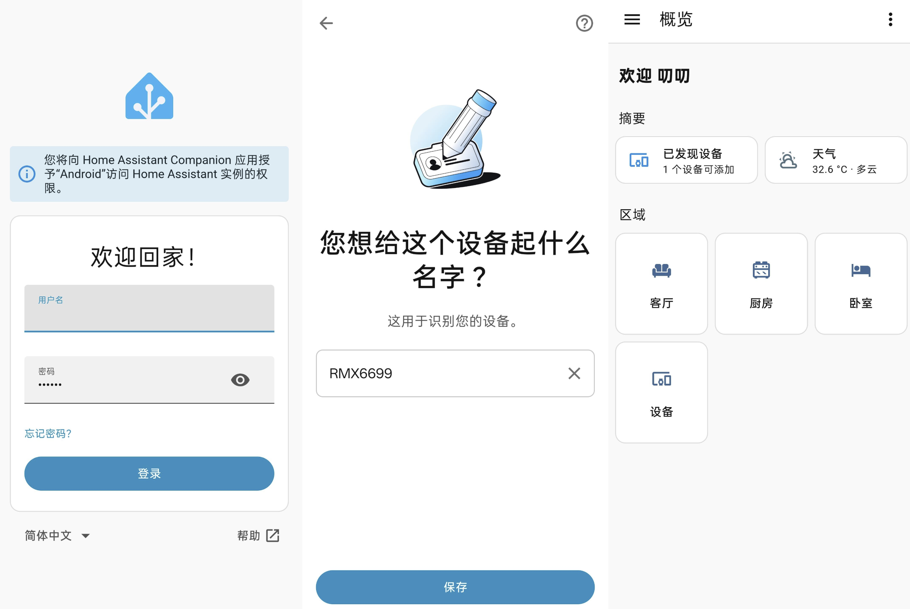

# 远程 HomeAssistant

> 🏠 DDNSTO 远程访问 HomeAssistant

---
## 穿透 → HomeAssistant WEB管理页

1、HomeAssistant 已部署，且能正常访问；

2、DDNSTO 控制台添加外网域名：

进入[DDNSTO 控制台](https://www.ddnsto.com/app/#/login) → 设备工作台 → 点击选择设备 → 「外网域名」 → **"+添加域名"** 

3、点击添加成功的外网域名，即可访问。

---

## 穿透 → HomeAssistant APP

- 首先在手机端需要验证 DDNSTO，可用 [易有云 APP 验证 DDNSTO](/zh/guide/ddnsto/scenarios/authentication.html#_2%E3%80%81%E6%98%93%E6%9C%89%E4%BA%91app-%E2%86%92-%E9%AA%8C%E8%AF%81ddnsto) 

- 安装 HomeAssistant APP 并打开 → 连接服务器 → 手动输入地址 → 填入已添加的外网域名 → 连接：

- 填写 HomeAssistant 的登陆用户名和密码，登陆后一步步继续，即可访问。

