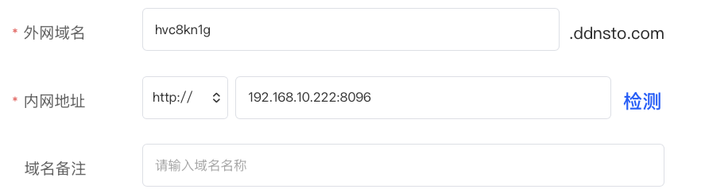
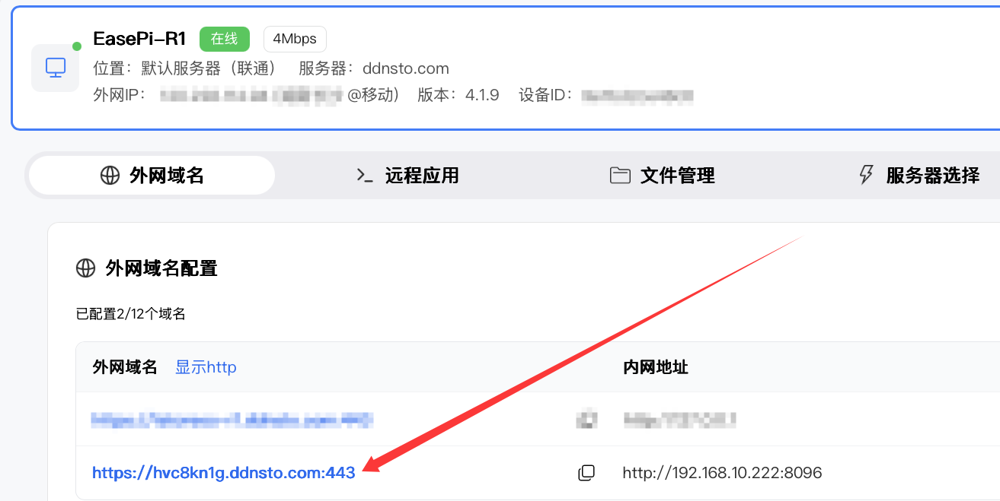
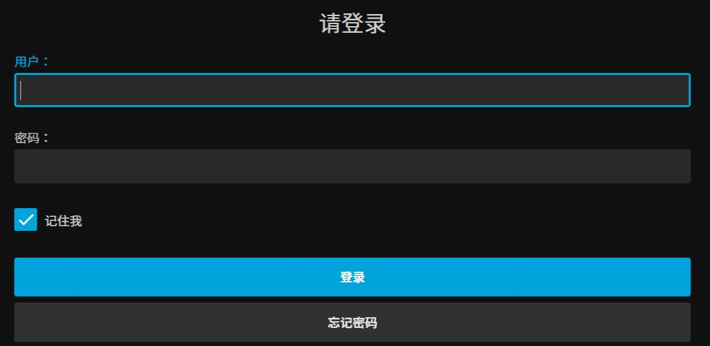
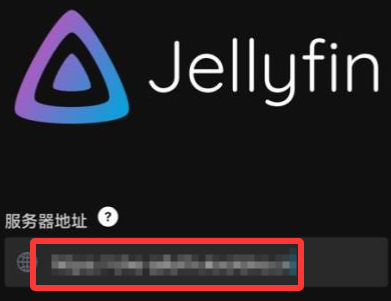

# Jellyfin 影音服务器远程访问

> 🎬 随时随地远程观看 NAS 上的影片

> ⏱️ 预计配置时间：5 分钟

> 📱 支持：网页端 + 手机 APP

---

## 什么是 Jellyfin？

Jellyfin 是一个自由的软件媒体系统，用于控制和管理媒体和流媒体。它是 Emby 和 Plex 的开源替代品，让你可以：

- 🎥 打造个人影音中心
- 📺 整理电影、电视剧、音乐
- 🌐 远程串流播放
- 📱 多客户端支持（Web/iOS/Android/TV）

---

## 配置步骤

### 1. 确认 Jellyfin 已部署

确保你的 NAS 或服务器上已经安装并运行了 Jellyfin，且能在内网正常访问。

**常见部署方式：**
- 群晖/威联通套件
- Docker 部署
- 独立服务器安装

**默认端口：** 8096（HTTP）或 8920（HTTPS）

---

### 2. DDNSTO 添加外网域名

1. 登录 [DDNSTO 控制台](https://www.ddnsto.com/app/#/login)
2. 外网域名，点击 **"+添加域名"** 

| 配置项 | 值 | 说明 |
|-------|-----|------|
| 外网域名 | 自定义 | 如 `jellyfin` |
| 内网地址 | `http://NAS_IP:8096` | Jellyfin 内网地址 |



- 因所选服务器不同，最终域名后缀也不同；可在「服务器选择」中选择适合自己的服务器。



**注意：**
- 如果 Jellyfin 配置了 HTTPS，请使用 `https://NAS_IP:8920`
- 确保端口正确（默认 8096）

---

### 3. 访问 Jellyfin

等待 1 分钟浏览器访问 `https://jellyfin.ddnsto.com` 进入 Jellyfin 登录界面（首次访问需验证）



---

## Jellyfin APP 远程访问

### 手机 APP 配置

1. 下载 Jellyfin APP（iOS/Android）
2. **先进行 DDNSTO 身份验证：**
   - 在外网环境下，浏览器访问你的 Jellyfin 域名，完成验证
3. 打开 Jellyfin APP
4. 输入 DDNSTO 域名（**去掉尾部端口号**）
```
https://jellyfin.ddnsto.com
```



5. 登录 Jellyfin 账号即可观看

---

## 播放优化建议

### 转码设置

为了获得更好的远程播放体验，建议开启硬件转码：

1. 进入 Jellyfin 管理后台
2. 播放 → 转码
3. 启用硬件加速（根据你的 CPU/GPU 选择）

### 带宽要求

| 视频质量 | 推荐带宽 |
|---------|---------|
| 720p | 4Mbps+ |
| 1080p | 8Mbps+ |
| 4K | 25Mbps+ |

**提示：** 如果带宽不足，可以：
- 降低播放质量
- 开启转码降低码率
- 升级 DDNSTO 套餐

---

## 常见问题

### Q: 网页能访问，APP 连不上？

A: 确保：
- APP 中输入的地址不带端口号
- 已完成 DDNSTO 身份验证
- 使用 HTTPS 访问

### Q: 播放卡顿？

A: 优化方案：
- 开启 Jellyfin 硬件转码
- 降低播放质量
- 检查 NAS 上行带宽
- 升级 DDNSTO 套餐带宽

### Q: 提示"无法连接服务器"？

A: 检查：
- DDNSTO 域名是否能正常访问
- Jellyfin 服务是否运行
- 端口是否正确

### Q: 如何在外网使用 HTTPS？

A: DDNSTO 自动提供 HTTPS，访问地址为 `https://前缀.ddnsto.com`

---

## 其他影音软件

类似配置方法也适用于：

| 软件 | 默认端口 | 说明 |
|------|---------|------|
| Plex | 32400 | 商业软件，功能丰富 |
| Emby | 8096 | Jellyfin 的前身 |
| Kodi | - | 本地播放器，需配合插件 |

---

## 下一步

- 🖥️ [配置远程桌面](./remote-desktop.md) —— 远程管理 Jellyfin 服务器
- 📁 [文件管理](./file-management.md) —— 远程管理媒体文件
- ⬇️ [远程下载](./remote-download.md) —— 远程下载影片到 NAS
