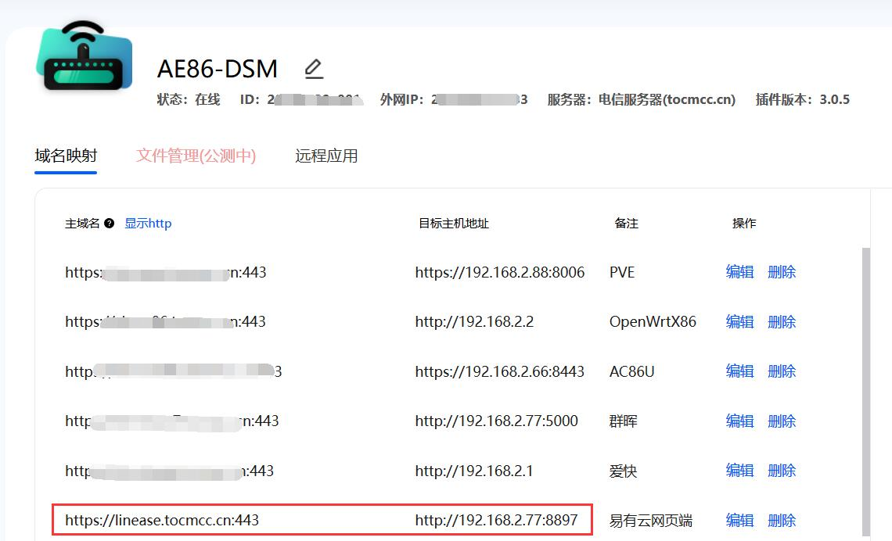
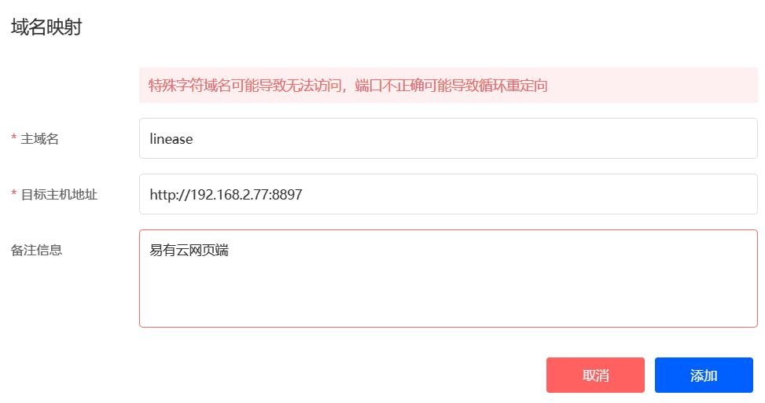

# NAS 远程访问

> 🏠 让家里的 NAS 随时随地可访问  
> ⏱️ 预计配置时间：5 分钟

---

## 支持设备

| 设备类型 | 支持程度 | 扩展功能 |
|---------|---------|---------|
| 群晖 DSM | ⭐⭐⭐ 完全支持 | 文件管理 |
| 威联通 QTS | ⭐⭐⭐ 完全支持 | 文件管理 |
| 极空间 | ⭐⭐⭐ 完全支持 | 文件管理 |
| 绿联 NAS | ⭐⭐⭐ 完全支持 | 文件管理 |
| 飞牛 OS | ⭐⭐⭐ 完全支持 | 文件管理 |
| 铁威马 | ⭐⭐⭐ 完全支持 | 文件管理 |
| Unraid | ⭐⭐⭐ 完全支持 | 文件管理 |

---

## 配置步骤

### 1. 在 NAS 上安装 DDNSTO

根据你的 NAS 类型选择安装方式：

#### 群晖 DSM

1. 下载对应 DSM 版本的 [DDNSTO 套件](https://fw.koolcenter.com/binary/ddnsto/synology/)
2. 套件中心 → 手动安装 → 选择下载的 `.spk` 文件
3. 安装后打开 DDNSTO，填入 Token

[详细安装教程 →](../quickstart/install-guide/synology.md)

#### 威联通 QTS

1. 下载 [DDNSTO QPKG](https://fw.koolcenter.com/binary/ddnsto/qnap/)
2. App Center → 安装 → 手动安装
3. 安装后配置 Token

#### 其他 NAS（Docker 方式）

```bash
docker run -d \
    --name ddnsto \
    --restart always \
    --net host \
    -e TOKEN=你的Token \
    linkease/ddnsto
```

---

### 2. 添加 NAS 域名映射

1. 登录 [DDNSTO 控制台](https://www.ddnsto.com/app/#/login)
2. 等待 NAS 设备上线
3. 点击设备右侧的 **"+"** 添加映射

#### 群晖 DSM 映射

| 配置项 | 值 | 说明 |
|-------|-----|------|
| 域名前缀 | `mynas` | 自定义 |
| 目标主机 | `http://127.0.0.1:5000` | DSM 默认端口 |



#### 威联通 QTS 映射

| 配置项 | 值 | 说明 |
|-------|-----|------|
| 域名前缀 | `myqnap` | 自定义 |
| 目标主机 | `http://127.0.0.1:8080` | QTS 默认端口 |

#### 极空间映射

| 配置项 | 值 | 说明 |
|-------|-----|------|
| 域名前缀 | `myzspace` | 自定义 |
| 目标主机 | `http://127.0.0.1:5055` | 极空间默认端口 |

---

### 3. 访问 NAS

1. 等待 1 分钟让配置生效
2. 浏览器访问 `https://你的前缀.ddnsto.com`
3. 首次访问需要微信验证
4. 进入 NAS 登录界面，输入 NAS 账号密码



---

## 高级配置

### 配置 HTTPS（推荐）

DDNSTO 自动提供 HTTPS 证书，无需额外配置：
- 访问地址自动为 `https://前缀.ddnsto.com`
- 数据全程加密传输

### 多 NAS 管理

如果你有多个 NAS，可以为每个 NAS 配置不同的域名：
- `nas1.ddnsto.com` → 主 NAS
- `nas2.ddnsto.com` → 备用 NAS
- `qnap.ddnsto.com` → 威联通

### 配合易有云使用

如果你同时使用易有云，可以通过 DDNSTO 穿透易有云网页端：

1. 确保 DDNSTO 和易有云在同一网络
2. 添加映射：目标主机 `http://NAS_IP:8897`
3. 通过域名远程访问易有云

---

## 常见问题

### Q: 访问 NAS 提示不安全？
A: DDNSTO 自动提供 HTTPS，如果提示不安全，请确认访问的是 `https://` 开头。

### Q: DSM 7 无法安装套件？
A: 请下载 DSM 7 专用版本的 DDNSTO 套件。

### Q: 访问速度慢？
A: 考虑升级到付费套餐获得更高带宽；检查 NAS 所在网络的上行带宽。

### Q: 文件上传/下载大文件失败？
A: 大文件传输建议配合文件管理功能使用，或直接使用易有云。

---

## 下一步

- 📁 [配置文件管理](./file-management.md) —— 远程管理 NAS 文件
- ⬇️ [设置远程下载](./remote-download.md) —— 远程控制下载任务
- 🎬 [穿透 Jellyfin](./jellyfin.md) —— 远程观看 NAS 影片
