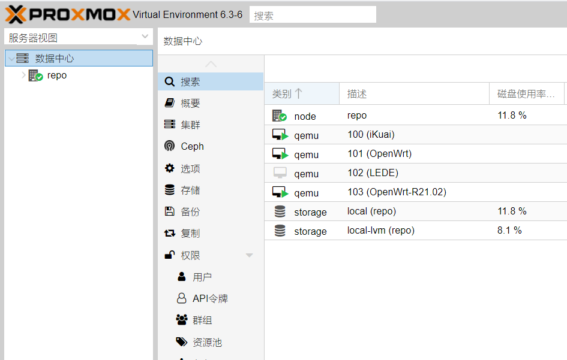
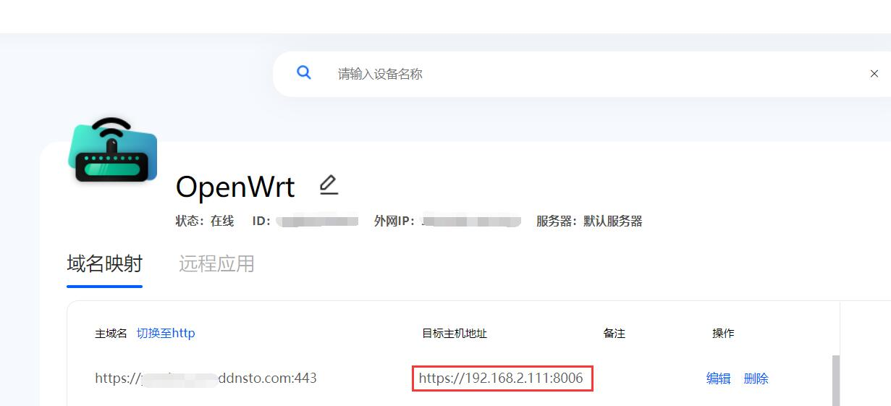
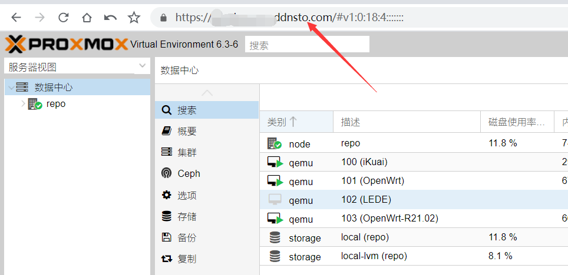

# PVE/ESXi 虚拟化管理

> 🖥️ 远程管理 Proxmox VE / VMware ESXi 虚拟化平台
> ⏱️ 预计配置时间：5 分钟
> 📱 支持：完整 Web 管理界面

---

## 适用场景

- 远程管理家庭/办公室的虚拟化服务器
- 远程开关虚拟机
- 远程查看虚拟机状态和资源使用
- 远程维护虚拟化平台

---

## Proxmox VE (PVE) 远程访问

### 1. 确认 PVE 已部署

确保 PVE 已安装并能在内网通过 Web 界面访问。

**默认访问地址：** `https://PVE_IP:8006`

**注意：** PVE 默认使用 HTTPS 和 8006 端口

---

### 2. DDNSTO 添加域名映射

1. 登录 [DDNSTO 控制台](https://www.ddnsto.com/app/#/login)
2. 找到你的设备，点击 **"+"** 添加映射

| 配置项 | 值 | 说明 |
|-------|-----|------|
| 域名前缀 | 自定义 | 如 `pve` |
| 目标主机 | `https://PVE_IP:8006` | **必须是 https** |

**⚠️ 重要：**
- PVE 必须使用 `https://`，使用 http 会失败
- 端口必须是 8006（PVE 默认 Web 端口）

---

### 3. 访问 PVE 管理界面

1. 等待 1 分钟让配置生效
2. 浏览器访问 `https://pve.ddnsto.com`
3. 首次访问需要微信验证
4. 进入 PVE 登录界面

5. 输入 PVE 用户名密码（默认 root）

---

### 4. 远程操作虚拟机

通过 DDNSTO 远程访问 PVE，你可以：

- 📊 查看所有虚拟机状态
- 🔄 启动/停止/重启虚拟机
- 💻 打开虚拟机控制台（VNC）
- 📈 查看资源使用情况
- ⚙️ 修改虚拟机配置

---

## VMware ESXi 远程访问

### 1. 确认 ESXi 已部署

确保 ESXi 已安装并能在内网通过 Web 界面访问。

**默认访问地址：** `https://ESXi_IP`

**注意：** ESXi 默认使用 HTTPS

---

### 2. DDNSTO 添加域名映射

| 配置项 | 值 | 说明 |
|-------|-----|------|
| 域名前缀 | 自定义 | 如 `esxi` |
| 目标主机 | `https://ESXi_IP` | **必须是 https** |

**⚠️ 注意：**
- ESXi 必须使用 `https://`
- 默认端口是 443，可以省略

---

### 3. 访问 ESXi 管理界面

1. 浏览器访问 `https://esxi.ddnsto.com`
2. 完成微信验证
3. 输入 ESXi 用户名密码登录

---

## 常见问题

### Q: PVE/ESXi 页面无法打开？

A: 检查：
- 是否使用了 `https://` 而不是 `http://`
- 端口是否正确（PVE 是 8006）
- PVE/ESXi 服务是否正常运行

### Q: 提示证书错误？

A: PVE/ESXi 使用自签名证书，浏览器会提示不安全，这是正常的。点击"高级"→"继续访问"即可。

### Q: VNC 控制台无法打开？

A: PVE 的 VNC 控制台可能需要额外配置。如果无法打开：
- 使用 SPICE 客户端代替
- 或在远程桌面中操作 PVE

### Q: 访问速度慢？

A: 虚拟化管理界面不需要高带宽，但如果感觉慢：
- 升级 DDNSTO 套餐
- 减少同时显示的虚拟机数量

---

## 安全建议

### 1. 使用强密码

PVE/ESXi 管理员账号（root）必须使用强密码。

### 2. 限制访问

如有固定公网 IP，可在 DDNSTO 中设置 IP 白名单。

### 3. 及时更新

保持 PVE/ESXi 系统更新，修复安全漏洞。

---

## 其他虚拟化平台

类似配置方法也适用于：

| 平台 | 默认端口 | 协议 |
|------|---------|------|
| VMware vCenter | 443 | HTTPS |
| oVirt | 443 | HTTPS |
| OpenStack Horizon | 80/443 | HTTP/HTTPS |
| Xen Orchestra | 443 | HTTPS |

---

## 下一步

- 🖥️ [SSH远程管理](./remote-ssh.md) —— 通过 SSH 管理虚拟化服务器
- ⚡ [远程开机](./remote-wol.md) —— 远程唤醒虚拟化物理机
- 📁 [文件管理](./file-management.md) —— 管理虚拟机镜像文件
