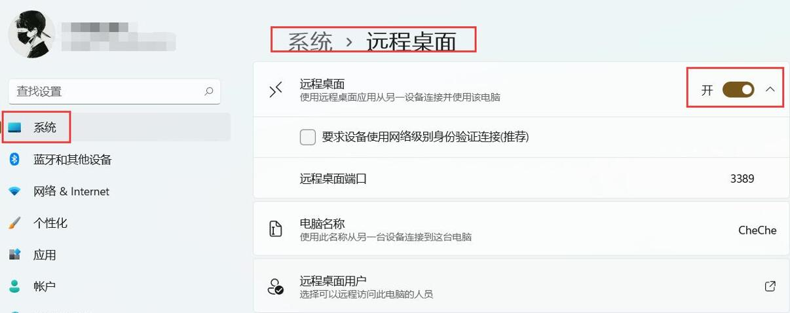
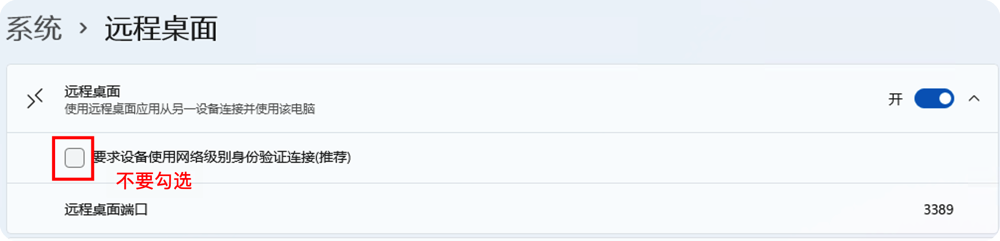
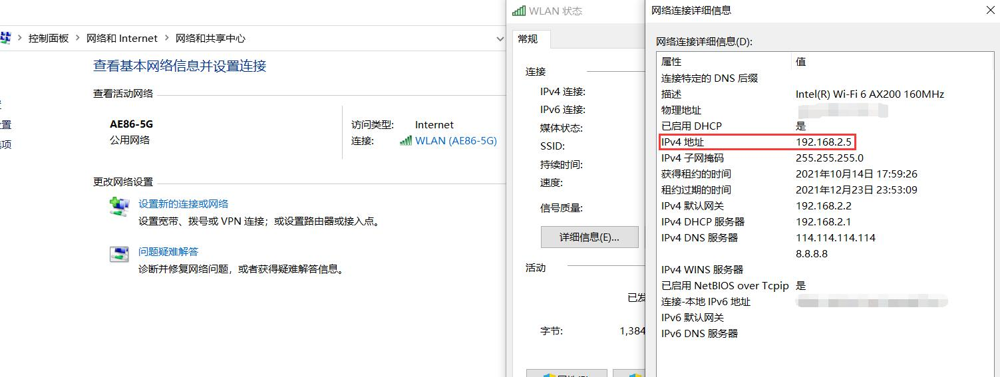
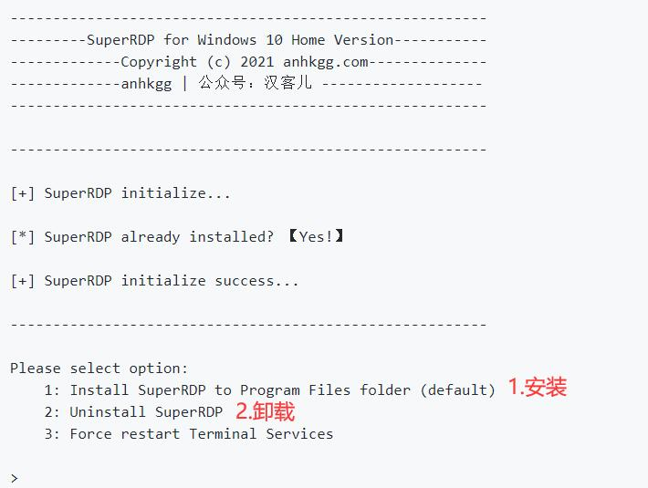
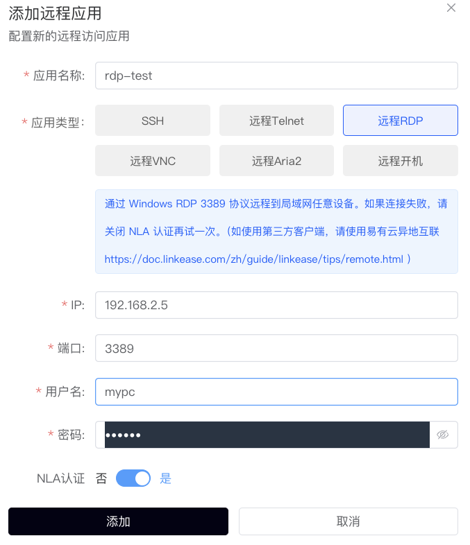
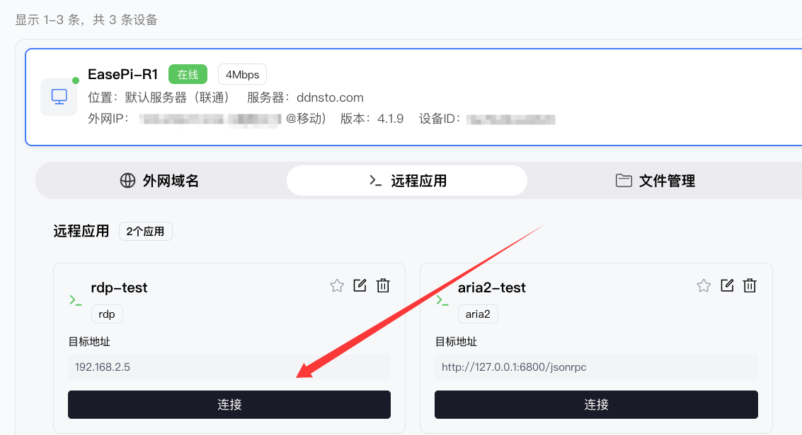
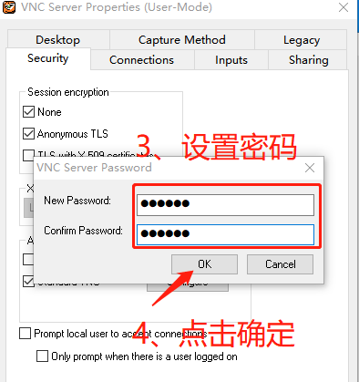
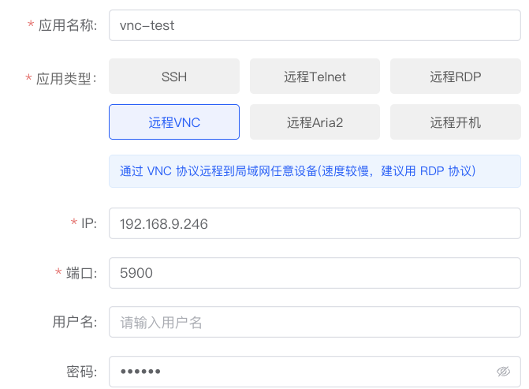
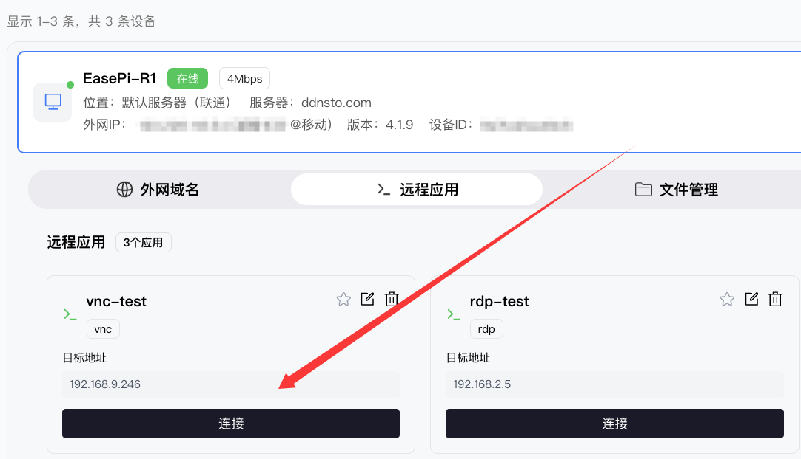

# 远程桌面

> 🖥️ 随时随地远程控制家里/公司的电脑

> ⏱️ 预计配置时间：15 分钟

> 📱 支持：Windows RDP、VNC

---

## 方案对比

| 方案 | 适用系统 | 画质 | 延迟 | 推荐场景 |
|------|---------|------|------|---------|
| Windows RDP | Windows | ⭐⭐⭐ | ⭐⭐⭐ | Windows 远程办公 |
| VNC | 全平台 | ⭐⭐ | ⭐⭐ | 跨平台、简单控制 |

---

## Windows RDP 远程桌面

### 1. 被控端准备（Windows 电脑）

#### Windows 专业版/企业版

1. **开启远程桌面**
   - Win11: 设置 → 系统 → 远程桌面 → 启用
   - Win10: 设置 → 系统 → 远程桌面 → 启用远程桌面
   - Win7: 右键"我的电脑" → 属性 → 远程设置 → 允许远程连接

2. **关闭网络级别身份验证**（重要！）

3. **记录电脑信息**
   - IP 地址: `控制面板 → 网络和共享中心 → 连接 → 详细信息 → IPv4 地址`
   - 用户名: `控制面板 → 用户账户` 中显示的用户名
   - 密码: 登录密码

#### Windows 家庭版

家庭版默认不支持 RDP，需要借助 [SuperRDP](https://github.com/anhkgg/SuperRDP/releases) 工具：

1. 下载 SuperRDP
2. 以管理员身份运行 `SuperRDP.exe`
3. 输入 `1` 安装
4. 验证：Win+R 输入 `mstsc.exe`，连接 `127.0.0.1` 测试

---

### 2. 配置 DDNSTO 远程 RDP

1. 登录 [DDNSTO 控制台](https://www.ddnsto.com/app/#/login)
2. 设备管理 → 设备 → 远程应用 → 点击 "+添加应用" → 选择 **"远程RDP"**

   - **应用名称**: 自定义，如 "家里电脑"
   - **IP**: 被控电脑的局域网 IP
   - **端口**: 3389（RDP 默认端口）
   - **用户名**: Windows 登录用户名
   - **密码**: Windows 登录密码

3. 填写完成后添加

---

### 3. 开始远程控制

**"添加完成"** 后 → 远程应用 → 点击刚添加的 **"RDP应用"** 即可进入

---

## VNC 远程桌面

### 1. 被控端安装 VNC Server

推荐使用 [TigerVNC](https://tigervnc.org/)（免费）：

1. 下载 [TigerVNC](https://github.com/TigerVNC/tigervnc/releases)
2. 安装并运行
3. 点击 `Properties` → `Configure`
4. 设置 VNC 密码

---

### 2. 配置 DDNSTO 远程 VNC

1. 登录 DDNSTO 控制台
2. 设备管理 → 设备 → 远程应用 → 点击 "+添加应用" → 选择 **"远程VNC"**

   - **应用名称**: 自定义
   - **IP**: 被控电脑 IP
   - **端口**: 5900（VNC 默认端口）
   - **用户名**: 若未设置就留空
   - **密码**: 前面设置的 VNC 密码

3. 填写完成后添加

---

### 3. 开始远程控制

  - **"添加完成"** 后 → 远程应用 → 点击刚添加的 **"VNC应用"** 即可进入

---

## 注意事项

### 被控电脑要求

- ✅ 必须开机且联网
- ✅ 必须连接网线（WiFi可能无法连接）
- ✅ 关闭休眠/睡眠模式
- ✅ 已安装并运行 DDNSTO

### 安全建议

- 设置强密码
- 启用 IP 白名单（如有固定公网 IP）
- 不使用时关闭远程桌面功能
- 考虑配合 [远程开机](./remote-wol.md) 使用，需要时再开机

---

## 常见问题

### Q: 连接失败，提示无法连接？
A: 检查：
- 被控电脑是否开机且联网
- IP 地址是否正确
- 远程桌面/VNC 服务是否启用
- Windows 防火墙是否允许远程桌面

### Q: 连接后黑屏？
A: 尝试：
- 降低显示分辨率
- 关闭被控电脑的睡眠/休眠
- 检查显卡驱动

### Q: 连接很卡？
A: 优化建议：
- 降低远程桌面颜色质量
- 关闭被控端桌面背景
- 升级 DDNSTO 套餐获得更高带宽

---

## 下一步

- ⚡ [配置远程开机](./remote-wol.md) —— 远程唤醒关机状态的电脑
- 🖥️ [SSH 远程管理](./remote-ssh.md) —— 远程管理 Linux 服务器
- 📁 [文件管理](./file-management.md) —— 远程传输文件
