# 远程下载

> ⬇️ 随时随地控制家里的下载任务  
> ⏱️ 预计配置时间：10 分钟  
> 📱 支持：Aria2、qBittorrent、Transmission、百度云

---

## 支持方案对比

| 下载工具 | 适用场景 | 难度 | 推荐度 |
|---------|---------|------|--------|
| Aria2 | 通用下载、HTTP/BT/磁力 | ⭐⭐⭐ | ⭐⭐⭐ |
| qBittorrent | BT 下载首选 | ⭐⭐ | ⭐⭐⭐ |
| Transmission | 轻量级 BT | ⭐⭐ | ⭐⭐ |
| BaiduPCS | 百度云下载 | ⭐⭐ | ⭐⭐ |

---

## Aria2 远程下载

### 1. 安装 Aria2

#### OpenWrt/iStoreOS

1. 软件中心/iStore 搜索安装 Aria2
2. 启用 Aria2，设置 RPC 认证令牌
3. 设置下载目录

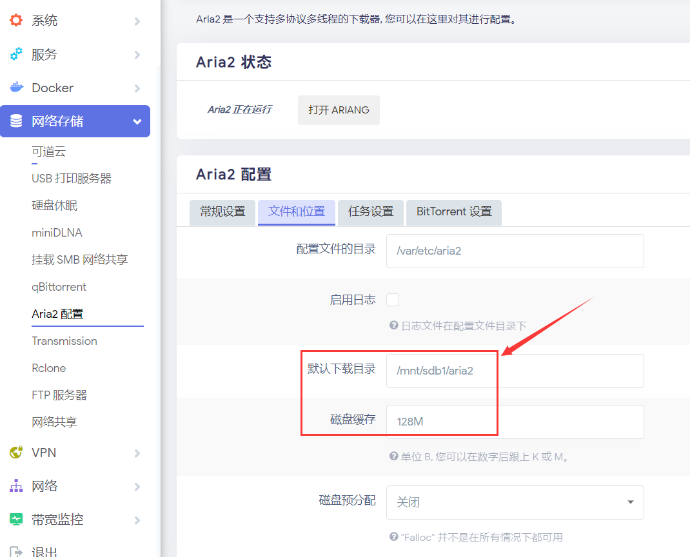

#### Docker 安装（通用）

```bash
docker run -d \
    --name aria2-pro \
    --restart unless-stopped \
    --network host \
    -e PUID=$UID \
    -e PGID=$GID \
    -e RPC_SECRET=你的令牌 \
    -e RPC_PORT=6880 \
    -v $PWD/aria2-config:/config \
    -v $PWD/downloads:/downloads \
    p3terx/aria2-pro
```

**参数说明：**
- `RPC_SECRET`: 设置 RPC 密码，记住后面要用
- `RPC_PORT`: RPC 端口，默认 6880
- `/downloads`: 下载目录映射

---

### 2. 配置 AriaNg（Web 管理界面）

1. 确保 Aria2 已启动
2. 访问 AriaNg 控制台（OpenWrt 通常在服务菜单中）
3. 配置 RPC 连接：
   - **地址**: `http://路由器IP:6880/jsonrpc`
   - **密钥**: 上一步设置的 `RPC_SECRET`

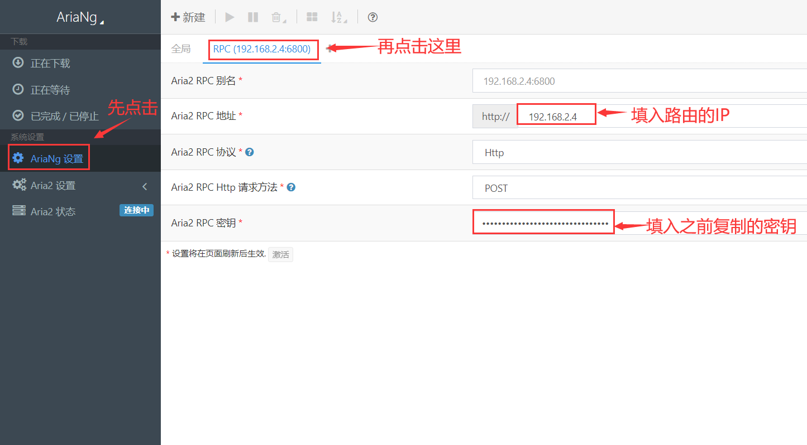

4. 重载后显示已连接

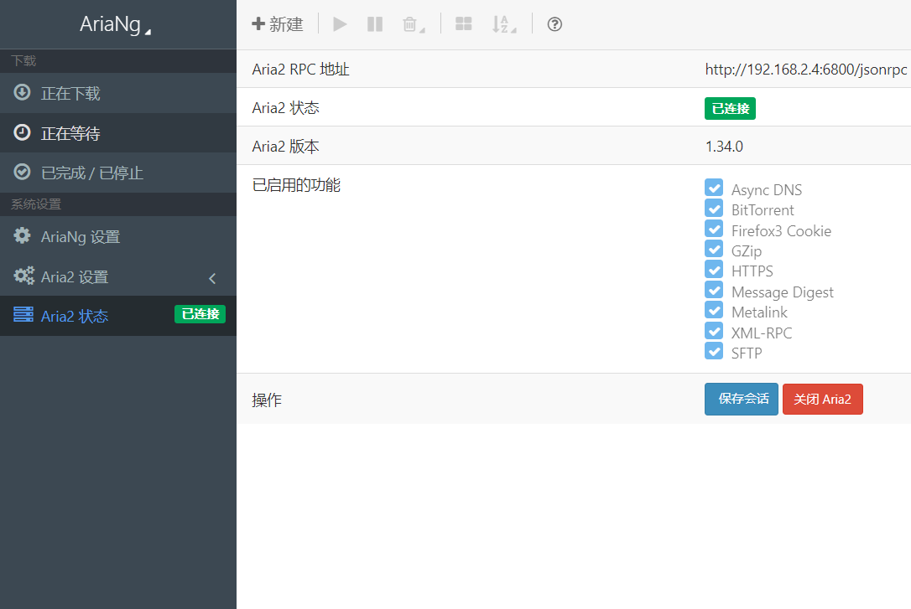

---

### 3. 配置 DDNSTO 远程下载

1. 登录 [DDNSTO 控制台](https://www.ddnsto.com/app/#/login)
2. 点击 **"远程应用"** → **"+"** 添加应用
3. 选择 **"Aria2 远程下载"**

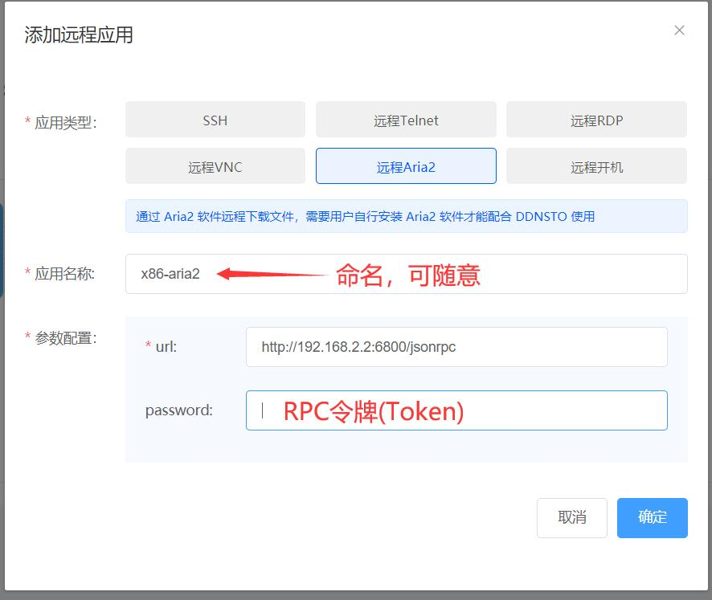

4. 填写配置：
   - **应用名称**: 自定义，如 "家中下载"
   - **RPC 地址**: `http://路由器IP:6880/jsonrpc`
   - **密码**: 前面设置的 RPC_SECRET

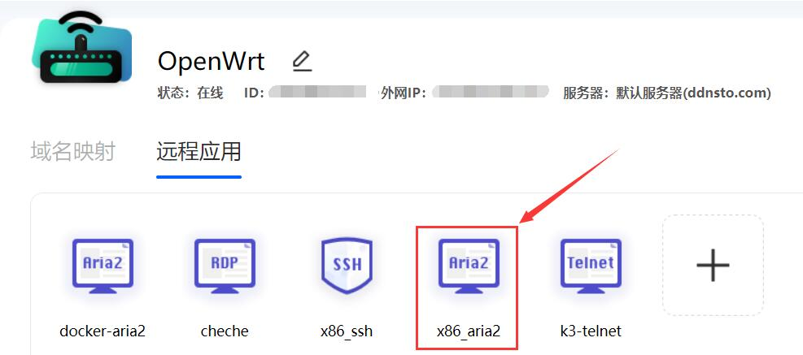

5. 保存后在已添加列表中点击即可进入

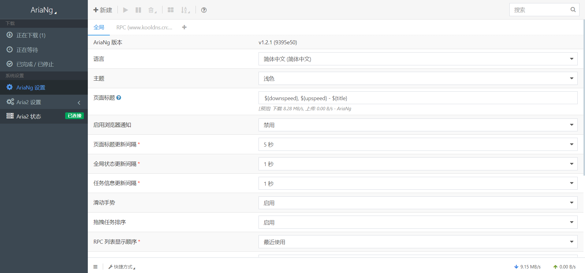

---

### 4. 开始下载

1. 进入远程 Aria2 界面
2. 点击 **"新建"**
3. 粘贴下载链接（HTTP/BT/磁力链接）
4. 点击开始下载

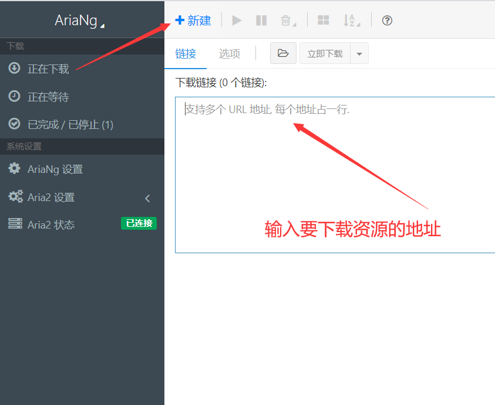

---

## qBittorrent 远程下载

### 1. 安装 qBittorrent

在 Docker 或 NAS 上安装 qBittorrent，注意记录 WebUI 端口（默认 8080）。

### 2. 配置 qBittorrent

1. 进入 qBittorrent WebUI 设置
2. **关闭 CSRF 保护**（必须！否则 DDNSTO 无法访问）

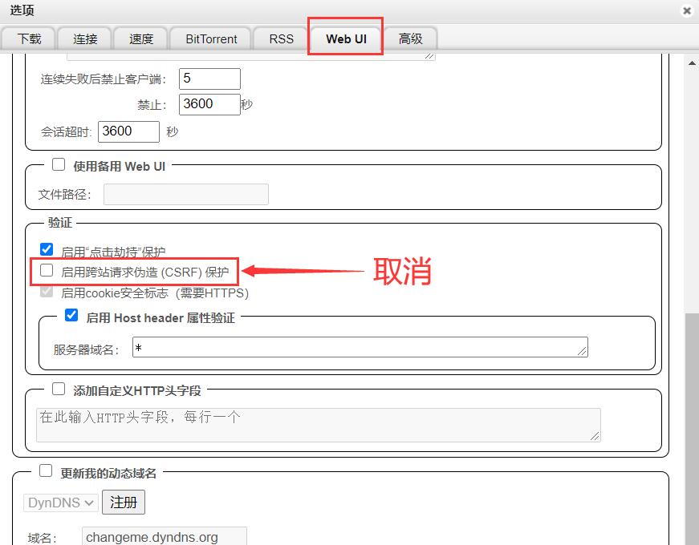

### 3. 配置 DDNSTO 映射

1. 添加域名映射：
   - **域名前缀**: `qb`
   - **目标主机**: `http://NAS_IP:8080`

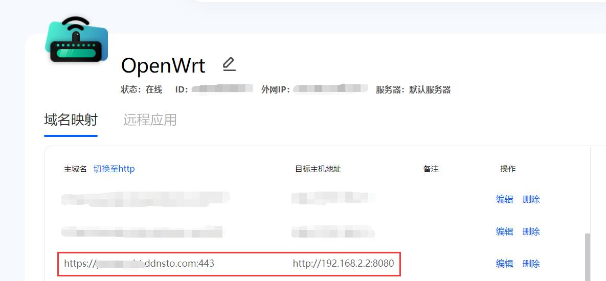

2. 访问 `https://qb.ddnsto.com` 即可远程管理

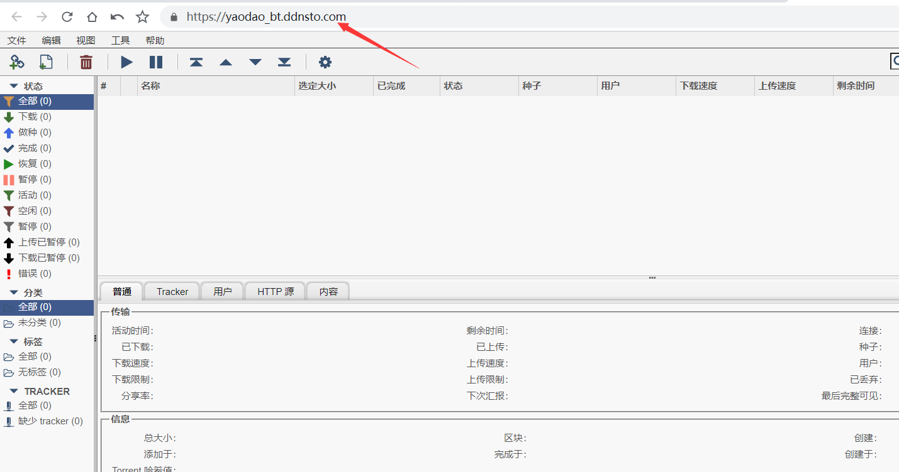

---

## Transmission 远程下载

### 配置步骤

1. 安装 Transmission 并启用 WebUI
2. 记录 RPC 端口（默认 9091）
3. DDNSTO 添加映射：
   - **域名前缀**: `tr`
   - **目标主机**: `http://NAS_IP:9091`

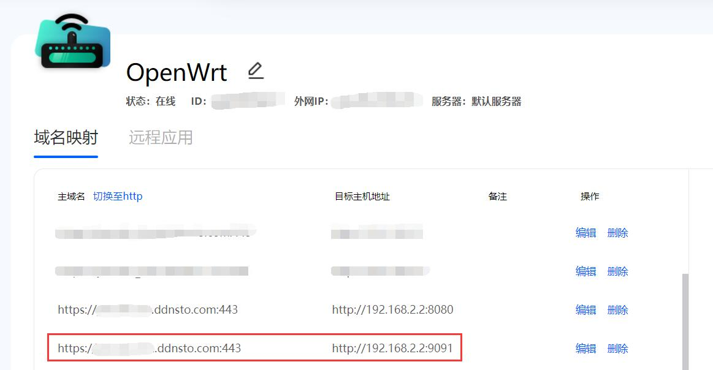

---

## 百度云远程下载

使用 BaiduPCS-Web 实现百度云远程下载：

1. Docker 部署 BaiduPCS-Web
2. DDNSTO 添加映射到 BaiduPCS-Web 端口
3. 远程登录百度账号，添加下载任务

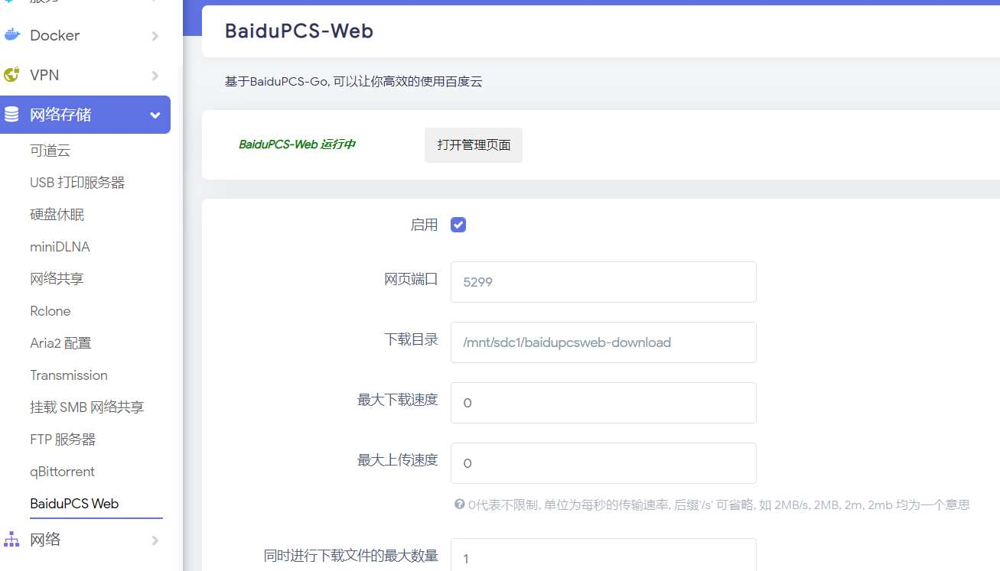

---

## 常见问题

### Q: Aria2 显示未连接？
A: 检查：
- RPC 地址和端口是否正确
- RPC 密钥是否匹配
- Aria2 服务是否正常运行

### Q: qBittorrent 显示 Forbidden？
A: 必须在 qBittorrent 设置中**关闭 CSRF 保护**。

### Q: 下载速度慢？
A: 检查：
- 种子/链接的健康度
- NAS 所在网络的上行带宽
- DDNSTO 套餐带宽限制

### Q: 下载完成如何取回文件？
A: 建议配合 [文件管理](./file-management.md) 使用，或配合易有云同步。

---

## 下一步

- 📁 [配置文件管理](./file-management.md) —— 远程管理下载的文件
- ⚡ [设置远程开机](./remote-wol.md) —— 下载前远程唤醒 NAS
- 🖥️ [远程桌面](./remote-desktop.md) —— 远程管理下载软件
