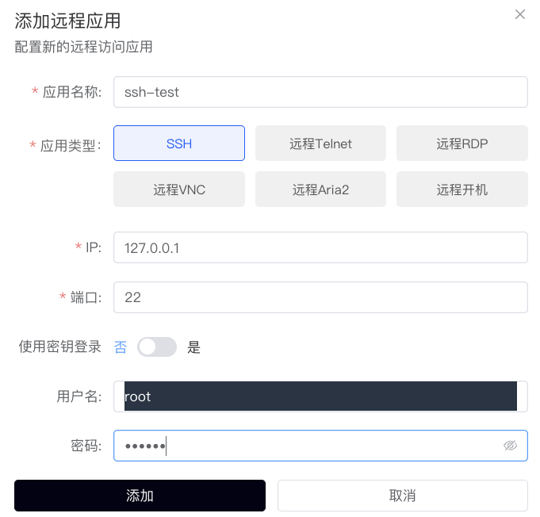
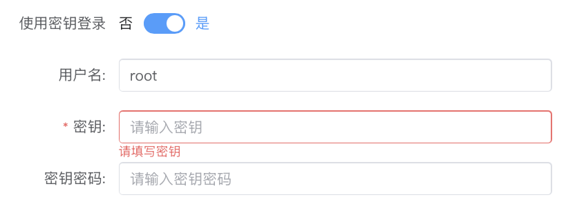
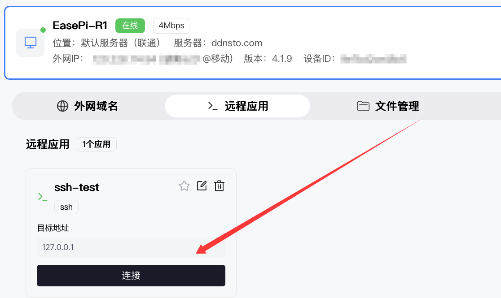
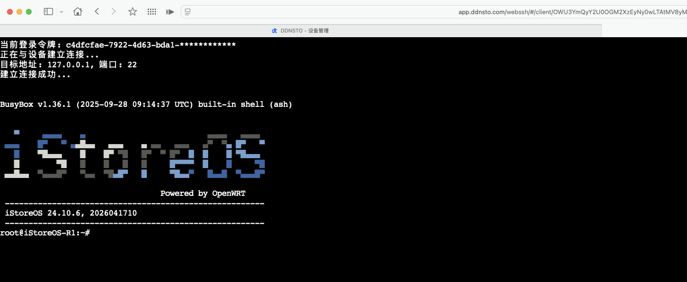
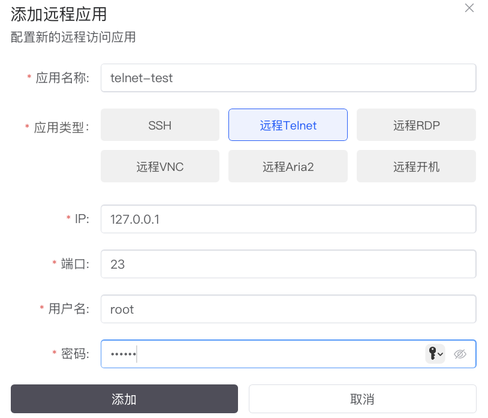
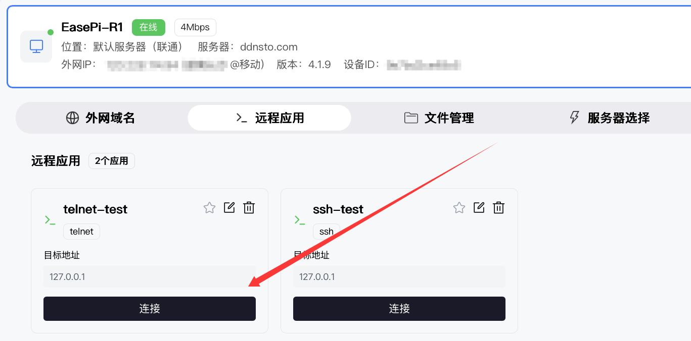

# SSH 远程管理

> 🖥️ 通过浏览器远程 SSH 登录服务器

> ⏱️ 预计配置时间：5 分钟

> 📱 无需安装 SSH 客户端，浏览器即可完成

---

## 适用场景

- 远程管理 Linux 服务器
- 远程维护路由器/OpenWrt
- 远程执行命令和脚本
- 远程查看日志和状态

---

## 配置步骤

### 1. 确认 SSH 服务已开启

确保目标设备已开启 SSH 服务：

**OpenWrt/iStoreOS：**
- 系统 → 管理权 → 启用 SSH

**Linux 服务器：**
```bash
# 检查 SSH 服务状态
systemctl status sshd

# 如未启动，启动 SSH 服务
systemctl start sshd
systemctl enable sshd
```

**默认端口：** 22

---

### 2. DDNSTO 添加远程 SSH

1. 登录 [DDNSTO 控制台](https://www.ddnsto.com/app/#/login)
2. 设备管理 → 设备 → 远程应用 → 点击 "+添加应用" → 选择 **"SSH"**

| 配置项 | 值 | 说明 |
|-------|-----|------|
| 应用名称 | 自定义 | 如 "SSH" |
| IP | 设备 IP | 如 192.168.1.1 |
| 端口 | 22 | SSH 默认端口 |
| 用户名 | 登录用户名 | 如 root |
| 密码 | 登录密码 | 自行填写 |




**注意：** 如果设备使用密钥认证，☑️「密钥登录」，输入密钥即可。



---

### 3. 开始远程 SSH

1.   - **"添加完成"** 后 → 远程应用 → 点击刚添加的 **"SSH应用"** 即可进入



2. 浏览器中会打开 SSH 终端界面



3. 如配置了密码，会自动登录；否则手动输入密码

---

## 常用操作示例

### OpenWrt/iStoreOS 常用命令

```bash
# 查看系统信息
uname -a

# 查看网络状态
ifconfig

# 查看连接设备
cat /tmp/dhcp.leases

# 查看系统日志
logread

# 查看实时日志
logread -f

# 重启网络
/etc/init.d/network restart

# 重启设备
reboot
```

### Linux 服务器常用命令

```bash
# 查看系统负载
top
htop

# 查看磁盘使用
df -h

# 查看内存使用
free -h

# 查看进程
ps aux

# 查看系统日志
journalctl -xe

# 查看实时日志
journalctl -f
```

---

## 远程 Telnet

对于不支持 SSH 的老旧设备，可以使用远程 Telnet：

### 配置步骤

1. 设备管理 → 设备 → 远程应用 → 点击 "+添加应用" → 选择 **"远程Telnet"**



2. 填写配置（类似 SSH）
3. 点击刚添加的 **"Telnet应用"** 即可通过 Telnet 连接



**注意：** Telnet 传输不加密，建议优先使用 SSH。

---

## ESXi SSH 特殊配置

ESXi 默认关闭密码认证，需要手动开启：

1. ESXi 控制台 → 故障排除选项
2. 启用 ESXi Shell 和 SSH
3. SSH 登录后编辑配置：
   ```bash
   vi /etc/ssh/sshd_config
   ```
4. 修改：
   ```
   PasswordAuthentication yes
   ```
5. 重启 SSH 服务：
   ```bash
   /etc/init.d/SSH restart
   ```

---

## 常见问题

### Q: 连接失败，提示 Connection Refused？

A: 检查：
- SSH 服务是否运行
- 端口是否正确（默认 22）
- 防火墙是否放行 SSH 端口

### Q: 提示 Authentication Failed？

A: 检查：
- 用户名是否正确
- 密码是否正确
- 设备是否使用密钥认证（远程 SSH 不支持密钥）

### Q: 连接后显示乱码？

A: 尝试：
- 修改终端编码为 UTF-8
- 检查设备语言设置

### Q: 如何复制粘贴？

A: 浏览器 SSH 终端通常支持：
- 复制：选中文字自动复制
- 粘贴：右键粘贴或使用 Ctrl+Shift+V

### Q: 支持 SFTP 文件传输吗？

A: 远程 SSH 不支持文件传输，请使用：
- [文件管理](./file-management.md) 功能
- 或专业 SFTP 客户端配合 DDNSTO 域名

---

## 安全建议

### 1. 使用强密码

SSH 账号必须使用强密码，避免被暴力破解。

### 2. 修改默认端口

将 SSH 端口从默认 22 改为其他端口，减少被扫描的风险：

```bash
# 编辑 SSH 配置
vi /etc/ssh/sshd_config

# 修改端口
Port 2222

# 重启 SSH
systemctl restart sshd
```

### 3. 禁用 root 登录

创建普通用户用于日常管理，禁止 root 直接登录：

```bash
# /etc/ssh/sshd_config
PermitRootLogin no
```

### 4. 使用密钥认证（本地）

虽然 DDNSTO 远程 SSH 需要密码，但本地 SSH 建议使用密钥认证：

```bash
# 生成密钥
ssh-keygen

# 复制公钥到服务器
ssh-copy-id user@server
```

---

## 下一步

- 🖥️ [远程桌面](./remote-desktop.md) —— 需要图形界面时使用
- 📁 [文件管理](./file-management.md) —— 传输文件
- ⚡ [远程开机](./remote-wol.md) —— 远程唤醒关机状态的服务器
