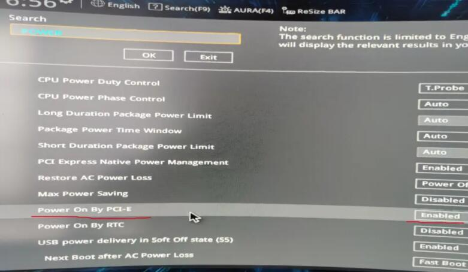
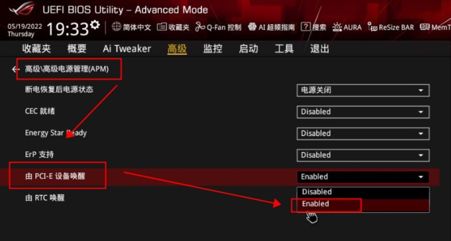
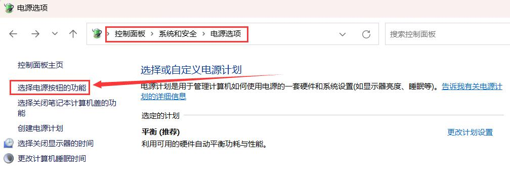
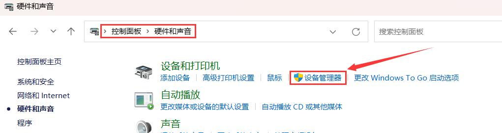
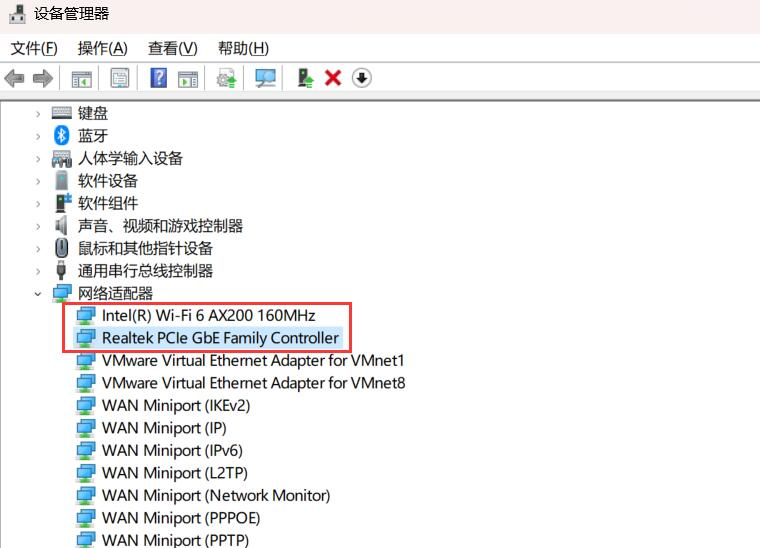
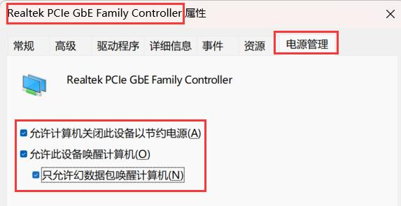
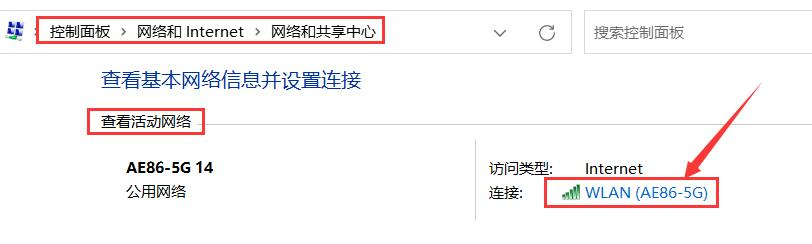
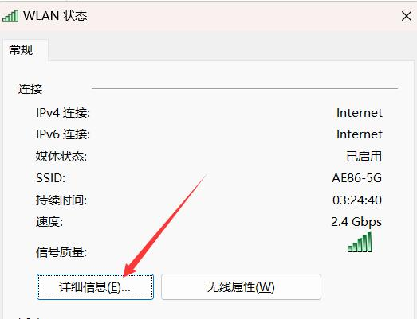
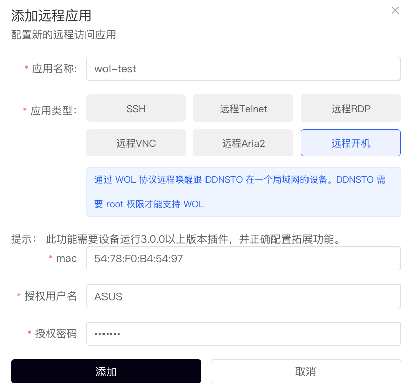
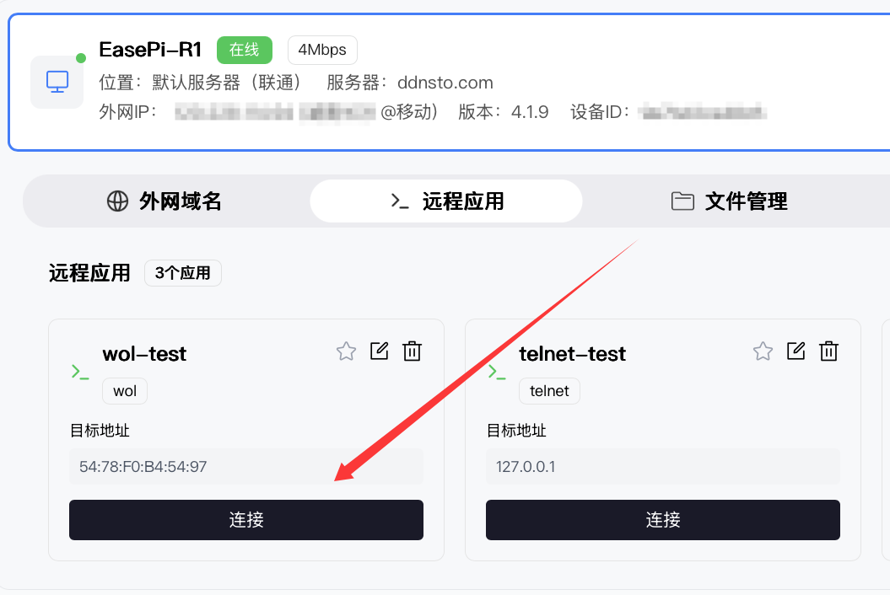

# 远程开机

> ⚡ 远程唤醒关机状态的电脑

> ⏱️ 预计配置时间：15 分钟

> 📱 要求：电脑需支持 Wake On LAN (WOL)

---

## 工作原理

远程开机通过网络发送 "魔术包" (Magic Packet) 唤醒关机状态的电脑：

```
手机/电脑 → DDNSTO控制台 → DDNSTO设备 → 魔术包 → 目标电脑开机
```

**必要条件：**
- ✅ 电脑通过网线连接到网络（WiFi 不支持 WOL）
- ✅ 电脑主板支持并开启 Wake On LAN
- ✅ 电脑网卡支持网络唤醒
- ✅ DDNSTO 设备与电脑在同一局域网

---

## 电脑端配置

### 1. BIOS 设置

开机时按 `Del`/`F2`/`F10` 进入 BIOS：

1. 找到电源管理或网络设置选项
2. 启用 **Wake On LAN**（可能有不同名称）

**常见名称：**
- Wake on LAN
- Power On By PCI-E
- Resume By LAN
- 由 PCI-E 设备唤醒
- 网络唤醒





---

### 2. Windows 设置

#### 关闭快速启动

1. 控制面板 → 系统和安全 → 电源选项
2. 左侧 "选择电源按钮的功能"
3. 点击 "更改当前不可用的设置"
4. **取消勾选** "启用快速启动"




---

#### 配置网卡唤醒

1. 控制面板 → 硬件和声音 → 设备管理器
2. 展开 "网络适配器"
3. 双击网卡名称 → 电源管理





4. 勾选以下选项：
   - ☑️ 允许计算机关闭此设备以节约电源
   - ☑️ 允许此设备唤醒计算机
   - ☑️ 只允许幻数据包唤醒计算机



**注意：** 如果有多块网卡，都需要这样设置！

---

### 3. 获取 MAC 地址

记录需要远程开机的电脑的 MAC 地址：

1. 控制面板 → 网络和 Internet → 网络和共享中心
2. 点击 "连接" → "详细信息"
3. 找到 **物理地址**（如 `AA-BB-CC-DD-EE-FF`）





4. 将格式转换为 `AA:BB:CC:DD:EE:FF`（用冒号分隔）备用

---

## DDNSTO 端配置

### 1. 启用扩展功能

1. 进入 DDNSTO 插件 → 扩展功能
2. 勾选 **"启用扩展功能"**
3. 设置 WebDAV 用户名和密码（远程开机需要用到）
4. 保存并应用


---

### 2. 添加远程开机

1. 登录 [DDNSTO 控制台](https://www.ddnsto.com/app/#/login)
2. 设备管理 → 设备 → 远程应用 → 点击 "+添加应用" → 选择 **"远程开机"**

   - **应用名称**: 自定义，如 "家中电脑"
   - **mac**: 电脑的 MAC 地址（格式 `AA:BB:CC:DD:EE:FF`）
   - **授权用户名**: 扩展功能设置的 WebDAV 用户名
   - **授权密码**: 扩展功能设置的 WebDAV 密码



---

### 3. 测试远程开机

1. 将目标电脑关机
2. 确保网线保持连接
3. 远程应用 → 点击刚添加的 **"WOL应用"** 即可



4. 电脑应该会在几秒钟内开机


---

## 进阶配置

### 跨网段唤醒

如果电脑和 DDNSTO 设备不在同一网段：

1. 在路由器上配置 **定向广播** (Directed Broadcast)
2. 或使用支持 WOL 的中继设备

### 定时开机

配合路由器的定时任务功能：

```bash
# OpenWrt/iStoreOS 定时任务示例
0 8 * * * /usr/bin/wol AA:BB:CC:DD:EE:FF
```

---

## 常见问题

### Q: 远程开机没有反应？

**检查清单：**
- [ ] 电脑是否通过网线连接（WiFi 不支持）
- [ ] BIOS 是否开启 Wake On LAN
- [ ] Windows 是否关闭快速启动
- [ ] 网卡电源管理是否配置正确
- [ ] MAC 地址是否填写正确
- [ ] DDNSTO 扩展功能是否启用

### Q: 只有部分时间能开机？

可能原因：
- 电脑进入深度休眠（S4/S5 状态）
- 某些主板在长时间关机后无法唤醒
- 解决方法：关闭休眠，只使用睡眠

### Q: 能开机但无法远程控制？

远程开机只是开机，远程控制需要：
1. 电脑开机后自动登录（可选）
2. 配置 [远程桌面](./remote-desktop.md) 或 [SSH](./remote-ssh.md)

### Q: 如何远程关机？

DDNSTO 不支持远程关机，建议：
- 使用远程桌面登录后手动关机
- 或使用 SSH 执行关机命令：`shutdown /s /t 0`

### Q: 支持手机开机吗？

支持！只要手机能访问 DDNSTO 控制台，点击远程开机图标即可。

---

## 完整使用流程

```
1. 远程开机（DDNSTO控制台）
   ↓ 等待电脑启动
2. 远程桌面/SSH（DDNSTO远程应用）
   ↓ 使用完毕
3. 手动关机（远程桌面内操作）
```

---

## 下一步

- 🖥️ [配置远程桌面](./remote-desktop.md) —— 开机后远程控制电脑
- 🖥️ [SSH远程管理](./remote-ssh.md) —— 远程管理 Linux 服务器
- ⬇️ [设置远程下载](./remote-download.md) —— 远程控制下载任务
