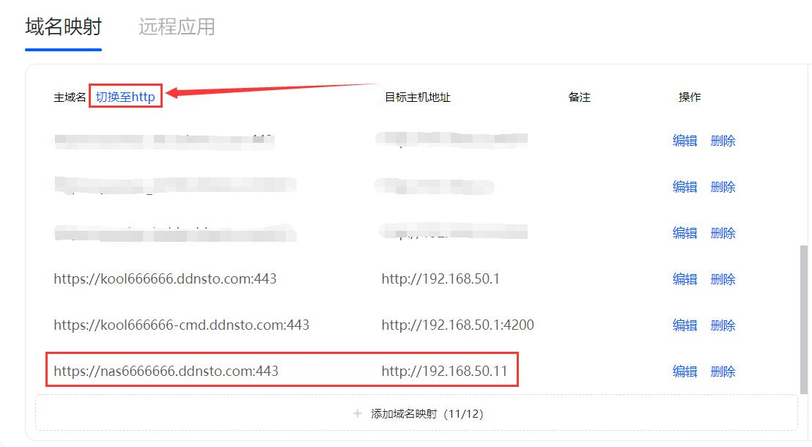

# 域名访问问题排查

> 解决域名无法访问、访问异常等问题

---

## 域名无法访问

### 症状
- 浏览器提示无法打开页面
- 提示连接超时
- 提示拒绝连接

### 排查步骤

#### 1. 确认插件在线

**检查：**
- 登录 DDNSTO 控制台
- 确认设备状态显示"在线"
- 如离线，参考 [连接问题排查](./connection-issues.md)

---

#### 2. 确认配置已生效

**问题：** 刚添加或修改域名，配置尚未生效

**解决：**
- 添加/修改域名后等待 1 分钟
- 刷新页面后再次尝试访问

---

#### 3. 检查目标主机配置

**常见问题：**

| 错误配置 | 正确配置 | 说明 |
|---------|---------|------|
| `http://127.0.0.1:5000` | `http://192.168.1.100:5000` | 使用局域网 IP，不要用 127.0.0.1 |
| `http://192.168.1.100` | `http://192.168.1.100:5000` | 非 80 端口必须指定端口 |
| `https://192.168.1.100:5000` | `http://192.168.1.100:5000` | 内网通常用 HTTP |

**错误提示：**
```
Forbidden Rejected request from RFC1918 IP to public server address
```
表示使用了 127.0.0.1，请改用局域网 IP。

---

#### 4. 测试内网访问

**步骤：**
1. 在 DDNSTO 所在设备上，尝试访问目标地址
2. 例如：`curl http://192.168.1.100:5000`
3. 如果内网都无法访问，说明目标服务有问题

---

#### 5. 检查端口是否正确

**常见服务默认端口：**

| 服务 | 默认端口 | 示例 |
|------|---------|------|
| 群晖 DSM | 5000 | `http://IP:5000` |
| 威联通 QTS | 8080 | `http://IP:8080` |
| PVE | 8006 | `https://IP:8006` |
| OpenWrt | 80 | `http://IP` |
| Aria2 RPC | 6800 | `http://IP:6800` |
| qBittorrent | 8080 | `http://IP:8080` |
| RDP | 3389 | 远程应用配置 |
| SSH | 22 | 远程应用配置 |

---

## HTTPS/HTTP 切换问题

### 症状
- HTTPS 访问失败，HTTP 正常
- HTTP 访问被重定向到 HTTPS
- 提示证书错误

### 解决

#### 切换访问协议

1. 登录 DDNSTO 控制台
2. 找到对应域名
3. 点击"显示 HTTP/HTTPS"切换



#### 同时访问 HTTP 和 HTTPS

DDNSTO 支持同时访问，端口不同：
- HTTPS: `https://前缀.ddnsto.com`
- HTTP: `http://前缀.ddnsto.com:5000`

---

## 特定服务访问异常

### OpenWrt 页面显示异常

**症状：** 菜单不显示、样式错乱

**解决：**
1. 使用 HTTPS 访问
2. 或手动添加路径：
   ```
   https://前缀.ddnsto.com/cgi-bin/luci/admin/status/overview
   ```

### WordPress 跳转问题

**症状：** 访问时跳转到 www.ddnsto.com

**解决：**
在 WordPress 设置中，将站点地址改为 DDNSTO 域名。

### Nextcloud 跳转问题

**症状：** 访问时跳转到 www.ddnsto.com

**解决：**
访问时手动添加路径 `/apps/dashboard/`：
```
https://前缀.ddnsto.com/apps/dashboard/
```

### qBittorrent 显示 Forbidden

**症状：** 页面显示 Forbidden 或无法访问

**解决：**
在 qBittorrent 设置中，**关闭 CSRF 保护**。

---

## 域名类 FAQ

### Q: 可以用自己的域名吗？

A: 不可以，DDNSTO 不提供 CNAME 支持，请使用分配的 ddnsto.com 域名。

### Q: 域名可以修改吗？

A: 可以，删除后重新添加即可。

### Q: 一个设备可以绑定多个域名吗？

A: 可以，根据套餐不同，可绑定不同数量的域名。

### Q: 域名有访问次数限制吗？

A: 没有次数限制，但有带宽限制（根据套餐）。

---

## 快速诊断清单

- [ ] 设备在线状态正常
- [ ] 域名配置已保存 1 分钟以上
- [ ] 目标主机使用局域网 IP（非 127.0.0.1）
- [ ] 端口填写正确
- [ ] 内网可以正常访问目标服务
- [ ] 尝试切换 HTTP/HTTPS
- [ ] 清除浏览器缓存
- [ ] 更换浏览器测试
