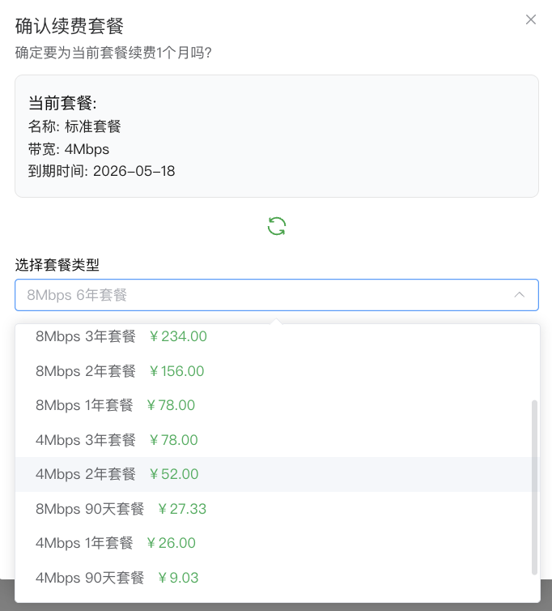

# 套餐问题排查

> 解决套餐购买、绑定、续费等问题

---

## 套餐不显示

### 症状
- 已购买套餐但控制台不显示
- 套餐列表为空

### 可能原因

#### 1. 套餐已过期
过期的套餐不会继续显示在列表中。

**解决：**
- 购买新套餐
- 或在过期前续费

#### 2. 购买了易有云套餐
易有云和 DDNSTO 是两个独立的产品，套餐不通用。

**解决：**
- 确认购买的是 DDNSTO 套餐
- 如买错，联系客服处理

---

## 套餐绑定问题

### 症状
- 无法绑定套餐到设备
- 提示套餐已被绑定

### 解决

#### 绑定新设备

1. 登录 DDNSTO 控制台
2. 设备管理 → 找到旧设备 → 套餐管理 → 「解绑」

3. 新设备 → 套餐管理 → 「+套餐管理」 → 找到“未使用”的套餐 → “绑定至本机”

---

## 切换服务器

### 操作步骤

1. 登录 DDNSTO 控制台
2. 设备管理 → 找到设备 → 服务器选择
3. 选择目标服务器

4. 服务器切换成功后，外网域名的域名地址也会变更

---

## 套餐续费

### 续费流程

#### 套餐未过期

1. 设备管理 → 点击设备 → 套餐管理 → 「续费」

2. 选择适合自己的续费套餐，完成支付即可

#### 套餐已过期

1. 设备管理 → 点击设备 → 套餐管理 → 「续费」

2. 选择适合自己的续费套餐，完成支付即可

---

## 套餐升级

从低带宽套餐升级到高带宽套餐：

1. 设备管理 → 点击设备 → 套餐管理 → 「升级」

2. 选择适合自己的升级套餐，完成支付即可

---

## 兑换码使用

1. 登录 DDNSTO 控制台
2. 点击头像 → **"兑换码使用"**

3. 输入兑换码激活

---

## 常见问题

### Q: 已购买套餐的设备不小心删除了怎么办？

A: 即使删除了设备，套餐依然还在。重新添加设备后就可以绑定已购买套餐。

### Q: 套餐可以退款吗？

A: 虚拟商品一经售出，原则上不支持退款。如有特殊情况，请联系客服。

### Q: 套餐可以转让吗？

A: 不可以，套餐绑定到账号，不支持转让。

### Q: 免费套餐有什么限制？

A: 免费套餐通常有：
- 带宽限制（如 1Mbps）
- 域名数量限制（如 1 个）
- 功能限制（如不支持远程应用）

---

## 套餐对比

| 功能 | 免费版 | 基础版 | 高级版 |
|------|--------|--------|--------|
| 带宽 | 1Mbps | 4Mbps | 8Mbps |
| 域名数量 | 1 个 | 4 个 | 8 个 |
| 远程应用 | ❌ | ✅ | ✅ |
| 文件管理 | ❌ | ✅ | ✅ |
| 技术支持 | 社区 | 邮件 | 优先 |

---

## 获取帮助

如遇到套餐问题无法解决：

1. 准备好购买凭证（订单号）
2. 记录 Token 前 5 位
3. [联系我们](https://www.linkease.com/about)

## 产品退款的规则说明
- 请发送邮件至 support@linkease.com 进行退款申请，并附带账号及微信付款截图信息，如信息不全将无法退款； ；
- 仅接受付款14天内的订单，逾期不接受申请；
- 退款申请批准后可能最多需要 7 天的处理时间，退还款项将原支付路径返还。
- 不接受如下退款原因： 不支持 TCP、 无法取消 ip验证
- 收到邮件后将在 7 个工作日内处理
