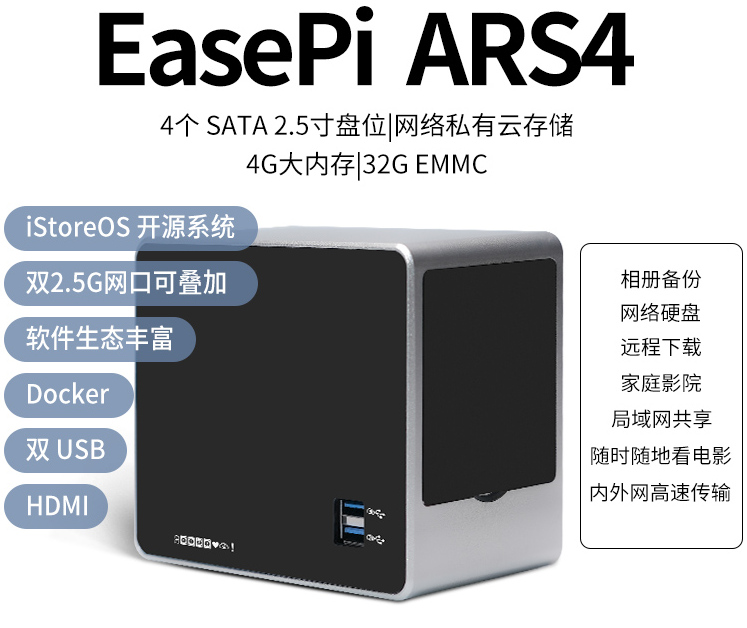

EasePi 由是易有云团队专为家庭智能网关、轻 NAS 设计的硬件产品系列。

 

## 快速开始

| 标题 | 文字教程 | 视频教程 | 描述 |
| :----: | :----: | :----: | :----: |
| ARS4产品优势 | TODO | TODO | TODO |
| 硬件快速上手 | TODO | TODO | TODO |
| 软件快速上手 | TODO | TODO | TODO |
| 问题快速解决 | TODO | TODO | TODO |
| 硬件产品详情 | TODO | TODO | TODO |

## 数据快速备份

| 标题 | 文字教程 | 视频教程 | 描述 |
| :----: | :----: | :----: | :----: |
| 相册快速备份 | TODO | TODO | TODO |
| 电脑快速备份 | TODO | TODO | TODO |
| 网盘数据备份 | TODO | TODO | TODO |
| 数据多盘备份 | TODO | TODO | TODO |
| 磁盘阵列建议 | TODO | TODO | TODO |

## 远程解决方案

| 标题 | 文字教程 | 视频教程 | 描述 |
| :----: | :----: | :----: | :----: |
| 易有云异地组网 | TODO | TODO | TODO |
| DDNSTO远程域名 | TODO | TODO | TODO |
| IPv6 动态域名 | TODO | TODO | TODO |
| RustDesk远程桌面 | TODO | TODO | TODO |

## 家庭影音解决方案

| 标题 | 文字教程 | 视频教程 | 描述 |
| :----: | :----: | :----: | :----: |
| Jellyfin | TODO | TODO | TODO |
| VidHub | TODO | TODO | TODO |
| Alist | TODO | TODO | TODO |
| 大屏端建议 | TODO | TODO | TODO |

## 下载以及远程下载

| 标题 | 文字教程 | 视频教程 | 描述 |
| :----: | :----: | :----: | :----: |
| qBittorent | TODO | 无 | TODO |
| Aria2 | TODO | TODO | 无 |
| transmission | TODO | 无 | TODO |

## HomeAssistant 智能家居玩法

| 标题 | 文字教程 | 视频教程 | 描述 |
| :----: | :----: | :----: | :----: |
| TODO | TODO | TODO | TODO |

## Docker 玩法建议

| 标题 | 文字教程 | 视频教程 | 描述 |
| :----: | :----: | :----: | :----: |
| TODO | TODO | TODO | TODO |

## 高级玩法

| 标题 | 文字教程 | 视频教程 | 描述 |
| :----: | :----: | :----: | :----: |
| 多款皮肤选择 | TODO | TODO | TODO |
| 开启桌面系统 | TODO | TODO | TODO |
| HDMI播放视频 | TODO | TODO | TODO |
| 虚拟机 | TODO | TODO | TODO |
 

